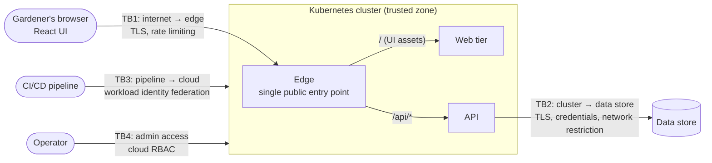

# ADR-0001: Security — authentication, session handling, authorization and defence in depth

| | |
|---|---|
| **Status** | Proposed |
| **Date** | 2026-09-29 |
| **Decision area** | Quality Attributes → **Security** (first architectural decision) |
| **Method** | Attribute-Driven Design (drivers → tactics → instantiation); analysed with ATAM concepts (sensitivity points, trade-offs, risks, non-risks) |
| **Related** | `docs/requirements.md`: Q1, Q7, Q8, NFR-5, NFR-6, NFR-10, A4, A5, A6, A10, BR-4, C-1 to C-6 |

> **Scope.** This ADR decides security **tactics and patterns** in technology-neutral terms. The specific frameworks, libraries, cloud services and routing mechanisms are chosen under *Technology & Tooling*, *Communication & Interaction* and *Deployment & Operations*. Appendix A shows how the tactics would be realised with the candidate stack; it is **illustrative and conditional** on those later decisions.

---

## 1. Context

### 1.1 Drivers for this decision

| Driver | Summary | Priority |
|---|---|---|
| **Q1** Security (isolation) | A signed-in user must never read or change another user's items; cross-user access must look identical to "not found" | H/H |
| **Q8** Security (authentication) | Unauthenticated, expired or invalid credentials are rejected for every Todo operation | H/L |
| **NFR-5** Security baseline | No secrets in source control; credentials stored securely; least privilege; short-lived automation credentials; injection-safe | Must |
| **NFR-6** Observability | Logs never contain credentials or tokens | Must |
| **A4 / A6 / A10** | Multi-user from day one; users are pre-seeded; sign-in credentials are issued by the application; an external identity provider is deferred | Assumptions |
| **Q7** Scalability | The API scales out by adding instances, so session handling must not tie a user to one instance | H/L |
| **Q5** Modifiability | Security machinery must be simple enough to explain and change live | M/L |

### 1.2 What is fixed, and what is not

Only the constraints and assumptions below are fixed. Everything else is open.

| Fixed by | Element |
|---|---|
| C-1, A5 | A **web UI written in React**, running in the browser. The React framework or build tooling is *not* fixed |
| C-2, C-3 | An **API backend** in one of the allowed languages (the choice is open, A0), providing CRUD over HTTP |
| C-6 | Hosted on **Kubernetes** |
| C-4 | On **AWS or Azure** (open) |
| C-5, C-7 | Provisioned with Terraform; deployed with Helm |
| FR, BR | **Persistent storage** for users and items (the storage technology is open) |

Security is decided before the other areas because Q1 is the only high-importance, high-risk scenario and the most expensive to retrofit. The tactics below hold **whichever** stack is chosen.

### 1.3 Logical structure and trust boundaries

Security reasoning starts from **trust boundaries**: the places where data crosses from a less-trusted zone into a more-trusted one. Every boundary needs a control. The elements are logical; their technologies are decided elsewhere.



The browser sees **one origin**: the UI and the API are served behind the same public entry point, and requests are routed by path. This is **not** a requirement from the brief. It is a *derived design constraint* that follows from this ADR's own choices, the `SameSite=Strict` cookie and disabled CORS (§4.3). A cross-origin setup with a CORS allow-list would also be possible, but it adds configuration and weakens the CSRF protection (S4). Whether the routing happens at the edge or in the web tier is decided under *Communication & Interaction*.

### 1.4 Questions this ADR answers

1. How do users prove who they are? (credential type)
2. How is a signed-in session carried between the browser and the API? (cookie and/or JWT)
3. How is "only my items" enforced? (authorization)
4. Which additional layers protect the system if any one control fails? (defence in depth)

---

## 2. Decision summary

1. **Credentials:** the application manages username and password credentials for pre-seeded users. Passwords are stored only as **salted hashes from a slow, vetted algorithm** (PBKDF2, bcrypt or Argon2), using the framework's built-in implementation, never hand-rolled code.
2. **Token:** after a successful sign-in, the API issues a **short-lived, signed JWT**. The API acts as a standard **bearer-token resource server**.
3. **Transport:** for the browser, the JWT is carried in an **`HttpOnly`, `Secure`, `SameSite=Strict` cookie**, and is never readable by JavaScript. Non-browser clients (tests, a future mobile app) send the same JWT in the `Authorization: Bearer` header. The API accepts either.
4. **Same origin (derived constraint):** as a consequence of decision 3, the UI and API share one public origin, with path-based routing. There is **no CORS**. The API has no public entry point of its own.
5. **Authorization:** the API is **deny by default**. Ownership is enforced **in the data-access layer** by an owner filter applied to every query. The owner is always taken from the token, never from the request. Cross-user access returns "not found".
6. **Defence in depth:** eight layers, from the network edge to the supply chain (section 4.5).
7. **HTTPS becomes a requirement.** Once authentication is in scope, deferring TLS is no longer acceptable (section 8).
8. **The federation path is designed in.** An external identity provider can later replace the token issuer with configuration changes in the API; only the sign-in UI changes.

---

## 3. Options considered

### 3.1 How users prove who they are

| Option | Pros | Cons | Verdict |
|---|---|---|---|
| **A. App-managed username + password (pre-seeded users)** | Fully under our control; no external dependency during the demo; trivial to create test users for Q1 (e.g. `alice` and `bob`); easy to explain and test | We own password storage and brute-force protection; no MFA; no password reset | **Chosen for the MVP** |
| B. Federated sign-in via an external IdP, using OIDC Authorization Code + PKCE | No passwords held by us; MFA, lockout and reset come built in; industry standard | Tenant setup and app registration; redirect URIs need a stable HTTPS domain; external dependency during a live demo; harder to write automated tests; time cost is disproportionate (A6) | **Deferred**, with the path designed in (section 6) |
| C. A framework's built-in identity endpoint bundle | Less code to write | Often issues proprietary (non-JWT) tokens, which weakens the federation path; tends to bring registration and reset endpoints that conflict with A10; larger attack surface | Rejected |
| D. Passwordless (magic link, passkeys) | Strong UX and security | Needs email delivery or WebAuthn setup; out of proportion for the MVP | Rejected |
| E. HTTP Basic auth / API keys | Very simple | Credentials sent on every request; no session concept; unsuitable for end users | Rejected |

> **Terminology note:** "federated credential" means two different things in this project. **User federation** (option B) is deferred. **Workload identity federation**, where the CI/CD pipeline signs in to the cloud with OIDC and no stored secret, **is** adopted (section 4.5, layer 8).

### 3.2 How the session is carried

| Option | Pros | Cons | Verdict |
|---|---|---|---|
| 1. JWT in browser storage (`localStorage`), sent as a bearer header | Simple; common in tutorials | **Any XSS can steal the token** and use it elsewhere until it expires | Rejected |
| 2. Server-side session with an opaque session-ID cookie | Immediately revocable; mature | A shared session store or shared keys are needed across replicas (Q7); a second mechanism would be needed for non-browser clients; moving to an IdP means rework | Rejected |
| **3. JWT inside an `HttpOnly` cookie, plus the bearer header for non-browser clients** | JavaScript can't read the token (no exfiltration through XSS); stateless, so any replica can validate it (Q7); one validation mechanism for every client; the API is already a standard resource server, ready for an IdP | CSRF must be handled (section 4.3); no immediate revocation (R1); the API must look for the token in two places | **Chosen** |
| 4. Backend-for-Frontend (BFF): a server-side web component holds the session, and the API receives bearer tokens server-to-server | Tokens never reach the browser at all; the best fit once an external IdP issues refresh tokens | Requires a server-side web tier plus session storage; with an `HttpOnly` cookie, it adds little extra security at this scope; more code to change live (Q5) | **Deferred.** This is the target pattern when federating (section 6) |

**Why "cookie *and* JWT" rather than one or the other:** the JWT is the *credential format*, meaning what the API validates. The cookie is the *browser transport*, meaning how the credential travels safely. Using both gives the security of cookies in the browser and the portability of JWTs everywhere else.

---

## 4. Decision details

### 4.1 Sign-in flow

```mermaid
sequenceDiagram
    participant B as Browser (React UI)
    participant E as Edge (same origin)
    participant A as API
    participant D as Data store
    B->>E: POST /api/auth/login {username, password}
    E->>A: route /api/* → API
    A->>A: rate limit check (per IP)
    A->>D: find user by username
    A->>A: verify hash (a dummy hash if the user is unknown, to equalise timing)
    A-->>B: 200 + Set-Cookie: session=<JWT>; HttpOnly; Secure; SameSite=Strict; Path=/
    B->>E: GET /api/todos (cookie sent automatically)
    E->>A: route (cookie forwarded)
    A->>A: validate JWT → user id from `sub` claim
    A->>D: query items WHERE owner = sub
    A-->>B: 200 [my items only]
```

- **Endpoints:** `POST /auth/login` and the health endpoints are anonymous. `POST /auth/logout` expires the cookie. `GET /auth/me` returns the current user, for display in the UI.
- **Errors:** every failed sign-in returns the same message ("invalid username or password"), so the response doesn't reveal which usernames exist.
- **Seeding:** users are created at deployment from secrets, never from passwords committed to code or migrations. The demo seeds at least two users, which makes Q1 demonstrable live.

### 4.2 Token

| Property | Value | Reason |
|---|---|---|
| Format | JWT (JWS) | Standard; the same format an external IdP would issue |
| Signing | HMAC-SHA256 (HS256) with a random key of at least 256 bits, from a secret | One service both issues and validates. Asymmetric keys add value only when the issuer is separate (it will be, after federation) |
| Claims | `sub` (user id), `name`, `iat`, `exp`, `iss`, `aud` | Minimum needed; no personal data beyond the username |
| Validation | Issuer, audience, lifetime, signature; algorithm pinned to HS256; clock skew of 1 minute | Prevents algorithm-confusion attacks and tokens meant for other systems |
| Lifetime | **8 hours** (configurable); no refresh token | One working day, with no mid-shift re-login for a gardener. This is a trade-off (T5) |

### 4.3 Cookie and CSRF protection

| Setting | Value | Protects against |
|---|---|---|
| `HttpOnly` | true | Token theft by XSS |
| `Secure` | true (relaxed only for local development on `localhost`) | Token sent over plain HTTP |
| `SameSite` | `Strict` | Cross-site request forgery; cookie not sent on cross-site requests |
| `Path` | `/` | — |
| Name prefix | `__Host-` when served over HTTPS | Cookie being overwritten from a subdomain |

**CSRF uses two independent layers:**
1. `SameSite=Strict`.
2. Every state-changing endpoint accepts only `application/json` (or uses PUT or DELETE), and **CORS is disabled**. Browsers therefore send a pre-flight check for any cross-origin attempt, and the API refuses it. A plain HTML form cannot forge these requests.

### 4.4 Authorization

| Control | Tactic | Why |
|---|---|---|
| Deny by default | Every endpoint requires an authenticated user unless explicitly marked anonymous (only login and health) | Forgetting to protect a new endpoint fails safe |
| Owner from the token only | Request models have **no owner field**. The owner is set on create from the token's `sub` claim | Prevents mass assignment ("create as someone else") |
| Owner filter in the data-access layer | One central mechanism restricts every item query to the current user. It is not repeated per endpoint, and bypassing it is banned outside tests (S3) | Q1 holds even if an endpoint forgets to check ownership |
| Not found, not forbidden | Another user's item is simply not found by the filtered query, so the API returns the same response as for a non-existent id | Doesn't reveal that the item exists (Q1) |
| UI checks are UX only | The UI redirects unauthenticated users to the sign-in page | Convenience. **The API is the only enforcement point** |

### 4.5 Defence in depth

Every layer assumes the ones outside it might fail.

| # | Layer | Tactics | MVP |
|---|---|---|---|
| 1 | **Network edge** | A single public entry point; TLS terminated at the edge (NFR-10, promoted); HSTS. The API and data store have no public entry of their own | ✅ |
| 2 | **In-cluster network** | Network policies: the API accepts traffic only from the edge (and web tier, if relevant); only the API can reach the data store | ✅ (Should) |
| 3 | **Transport to data** | Data-store connections require TLS | ✅ |
| 4 | **Application edge** | Rate limiting on sign-in; security headers on UI responses (CSP, `X-Content-Type-Options`, `Referrer-Policy`, `frame-ancestors 'none'`); request size limits | ✅ |
| 5 | **Identity** | Token validation (section 4.2); hashed passwords; generic sign-in errors; equalised timing | ✅ |
| 6 | **Authorization and data** | Deny by default; the owner filter on every query; server-side validation; parameterised queries only (no string-built SQL) | ✅ |
| 7 | **Secrets and runtime** | The signing key, data-store password and seed passwords come from the platform's secret store, populated by the pipeline, never from git or images. Containers run as non-root, with a read-only root filesystem, dropped capabilities and resource limits | ✅. A managed secrets vault is deferred |
| 8 | **Supply chain and delivery** | The pipeline authenticates to the cloud via **workload identity federation** (OIDC; no stored cloud secret); dependency vulnerability checks; pinned base images; image scanning; secret scanning | ✅ except image scanning (Should) |
| — | **Detection** | Structured logs of sign-in successes and failures (username, IP, outcome), never passwords or tokens (NFR-6) | ✅ |

---

## 5. ATAM analysis

### 5.1 Sensitivity points

These are decisions that one or more quality attributes depend on heavily.

| # | Sensitivity point | Attributes affected |
|---|---|---|
| S1 | **The JWT signing key.** Whoever has it can impersonate any user. All API replicas must share it | Security, Scalability (Q7) |
| S2 | **Token lifetime.** It sets the window during which a stolen token can be used | Security vs Usability |
| S3 | **The central owner filter.** Q1 depends on it being applied and never bypassed | Security (Q1), Correctness |
| S4 | **Same-origin routing.** CSRF protection and cookie behaviour depend on the UI and API sharing an origin. Separate origins would reopen the CORS and SameSite decisions | Security, Modifiability |
| S5 | **Presence of TLS.** `Secure` cookies and password confidentiality depend on it | Security, Availability (an expired certificate breaks access) |
| S6 | **Rate-limiter scope.** If limits are per instance, their strength depends on the replica count | Security, Scalability |
| S7 | **Health endpoints must stay anonymous.** Deny by default would otherwise fail the Kubernetes probes | Security vs Availability (Q4) |

### 5.2 Trade-offs

These are decisions that help one attribute at the cost of another.

| # | Trade-off | Chosen side | Accepted cost |
|---|---|---|---|
| T1 | App-managed credentials vs an external IdP | Simplicity, testability, no demo dependency | We own password storage; no MFA or reset (R2) |
| T2 | Stateless JWT vs server-side session | Scalability (Q7), simplicity, IdP readiness | No immediate revocation (R1) |
| T3 | Cookie transport vs bearer header in the browser | Resistance to token theft by XSS | CSRF must be handled; tokens extracted from two places |
| T4 | "Not found" vs "forbidden" for other users' items | Confidentiality (Q1) | Slightly harder support and debugging |
| T5 | 8-hour token vs short-lived token plus refresh | Usability for a working day; less code | A longer exposure window if a token is stolen |
| T6 | Deny by default vs allow by default | Fail-safe security | Anonymous endpoints must be explicit, or probes fail (S7) |
| T7 | Symmetric (HS256) vs asymmetric (RS256) signing | Simplicity; one service issues and validates | The key must be kept secret by every validator (fine while that is one service) |

### 5.3 Risks

| # | Risk | Mitigation now | Resolution later |
|---|---|---|---|
| R1 | A stolen token stays valid until it expires (up to 8 hours); logout only clears the browser's copy | `HttpOnly` cookie; TLS; emergency revocation by rotating the signing key (signs everyone out) | A short access token plus refresh via a BFF, or IdP-managed sessions |
| R2 | We own password handling: no MFA, lockout or reset | Only pre-seeded test users; strong hashing; rate limiting | External IdP (section 6) |
| R3 | Traffic inside the cluster is unencrypted | Network policies limit who can talk to whom | mTLS (e.g. a service mesh), if warranted |
| R4 | Platform-native secrets may only be encoded, not encrypted, depending on the platform setup | Access limited by RBAC; never committed to git | A managed secrets vault, accessed with workload identity |
| R5 | The managed data store may be reachable more broadly than necessary in the MVP network setup | TLS required; strong generated password | Private network access only |
| R6 | The app may connect to the data store as a highly privileged user | — | Separate least-privilege users for migrations and runtime |

### 5.4 Non-risks

These are decisions judged sound for this context.

| # | Non-risk | Because |
|---|---|---|
| N1 | SQL injection | Parameterised queries only; no SQL built from strings |
| N2 | Token exfiltration by XSS | The token is `HttpOnly`, and scripts cannot read it |
| N3 | CSRF | `SameSite=Strict`, JSON-only or non-simple methods, and no CORS |
| N4 | Creating or moving items as another user | The owner comes only from the token; request models have no owner field |
| N5 | Account enumeration through the sign-in response | Generic error message and equalised timing |

---

## 6. Evolution path: federated sign-in

The decision is designed to be **cheap to reverse at the API**:

1. Register the application with an external IdP.
2. **API:** point bearer-token validation at the IdP's issuer and audience, and remove the self-issued sign-in endpoint. Authorization, the owner filter and the tests stay the same. The `sub` claim is still the owner key, via a mapping from external subject to user.
3. **Web:** adopt the BFF pattern (option 4). A server-side web component becomes a confidential OIDC client using Authorization Code + PKCE, keeps tokens server-side, and gives the browser a session cookie. **Note:** this introduces a server-side web tier. The *Technology & Tooling* choice of frontend framework should weigh how easily each candidate supports it.

---

## 7. Impacts on other decision areas

This ADR decides tactics. The areas below choose the mechanisms, and must honour these constraints or explicitly supersede this ADR.

| Decision area | Constraint or input from this decision | Key refs |
|---|---|---|
| **Inside vs. outside the system** | Trust boundaries TB1–TB4; external actors: gardener, operator, CI/CD pipeline, a future IdP. The edge is the only outside-facing element | §1.3 |
| **Data architecture** | A `User` concept with a password hash (never readable); every item has an owner set from the token; a central owner filter on every query; tokens carry no personal data beyond the username; data-store connections use TLS; separate migration and runtime users later (R6) | §4.4, S3, R6 |
| **Deployment & operations** | TLS at the edge (NFR-10 now Must); no public entry to the API or data store; network-policy enforcement enabled on the cluster; the pipeline supplies three secrets (signing key, data-store password, seed passwords); a documented signing-key rotation procedure for emergency revocation | §4.5, S1, S5, R1 |
| **Component & structural** | An auth component in the API (login, logout, me); one current-user abstraction used by the data layer's owner filter; the UI's route guard is for UX only | §4.1, §4.4 |
| **Communication & interaction** | Same-origin path routing (`/api/*` to the API); no CORS; JSON-only state-changing requests; the API accepts a cookie **or** a bearer token; status semantics: 401 (not authenticated), 404 (not found *or* not yours), 429 (rate limited) | §4.3, S4 |
| **Cross-cutting concerns** | Authentication and authorization middleware; deny-by-default policy; rate limiting; security headers; log redaction (no passwords or tokens) | §4.4, §4.5 |
| **Technology & tooling** | The chosen stack must provide: a vetted password hasher; JWT issue and validation with algorithm pinning; rate limiting; a central query-filter mechanism; security-header support in the UI hosting; dependency and secret scanning. A frontend framework that can later host a BFF is an advantage (§6) | §2, §6, Appendix A |
| **Evolution & extensibility** | Federation through an external IdP plus a BFF; mobile clients via bearer tokens; a managed secrets vault; short-lived tokens with refresh | §6, §10 |
| **Other quality attributes** | *Scalability:* stateless tokens, with a shared signing key (S1). *Availability:* health endpoints stay anonymous (S7). *Testability:* integration tests use real tokens issued by the sign-in endpoint, so the real pipeline is exercised. *Maintainability:* security configuration kept in one place | S1, S7 |

---

## 8. Consequences

**Positive**
- Q1 and Q8 are enforced at the API and the data layer, independent of the UI.
- Stateless validation means any replica serves any user (Q7).
- There is one validation mechanism for browsers, tests and future mobile clients.
- The tactics hold whichever frontend framework, backend language or cloud is chosen.
- The federation path requires no redesign.

**Negative / follow-ups**
- **Requirements change: NFR-10 (HTTPS) moves from *Could (deferred)* to *Must*.** Authentication cookies and passwords must not travel over plain HTTP; without TLS, `Secure` cookies are not even sent. `requirements.md` must be updated, and the related plain-HTTP risk in section 11 removed.
- **Deployment & operations** must choose the edge and TLS-termination mechanism, and enable network-policy enforcement on the cluster.
- **Technology & tooling** must confirm that the chosen stack satisfies the capabilities listed in section 7.

---

## 9. Verification

| Check | Type | Driver |
|---|---|---|
| No credentials, expired token, tampered signature, wrong issuer or audience, or `alg: none` → 401 | API integration tests | Q8 |
| `bob` gets, updates or deletes `alice`'s item → 404, and `alice`'s item is unchanged; `bob`'s list excludes it | API integration tests | Q1 |
| Creating an item with an extra `ownerId` field in the body → the owner is still the caller | API integration test | N4 |
| Wrong password and unknown user return the same response | API integration test | N5 |
| Exceeding the sign-in rate limit → 429 | API integration test | Layer 4 |
| The response cookie has `HttpOnly`, `Secure` and `SameSite=Strict` set | API integration test | T3 |
| Health endpoints respond without authentication | API integration test | S7 |
| No secrets in the repository | Pipeline secret scan and review | NFR-5 |
| Logs contain no passwords or tokens | Review of the running logs | NFR-6 |

## 10. Revisit when

- The app is used beyond the assessment, or real customer data is stored. At that point, federate (section 6) and move secrets to a managed vault.
- A mobile client is added. Bearer support already exists; re-check the token lifetime and add refresh.
- The UI and API need to be served from different origins, since S4 would change.

---

## Appendix A: Illustrative realisation (conditional)

> **Not part of the decision.** This shows that the tactics can be realised with the *candidate* stack in ADR-0002 (still Proposed). The authoritative mechanism choices are made in the relevant ADRs, and this appendix is updated or removed when they are accepted.

| Tactic | Candidate mechanism (.NET API) | Alternative if another allowed backend is chosen |
|---|---|---|
| Password hashing | ASP.NET Core `PasswordHasher<T>` (PBKDF2) | Spring Security `Argon2PasswordEncoder`; `bcrypt` for Node/Python |
| JWT issue and validation | `JsonWebTokenHandler`; JWT bearer authentication, reading the token from the cookie or the header | Spring Security resource server; `jose` / `PyJWT` |
| Deny by default | An authorization fallback policy requiring an authenticated user | Equivalent global security configuration |
| Central owner filter | An EF Core global query filter bound to the current user | A Hibernate filter; a repository base class |
| Rate limiting | The built-in ASP.NET Core rate limiter | A framework middleware, or rate limiting at the edge |

| Tactic | Frontend options (both satisfy C-1) |
|---|---|
| Same-origin routing | **React SPA** (static build): the edge routes `/` to static assets and `/api/*` to the API. **React framework with a server** (e.g. Next.js): the same edge routing, or the framework's own rewrites |
| Security headers | SPA: set by the static file server or the edge. Server framework: set in its configuration |
| Route guard (UX only) | SPA: a client-side router guard. Server framework: its middleware |
| Future BFF (§6) | SPA: needs an additional small server component. Server framework: can host it directly |
