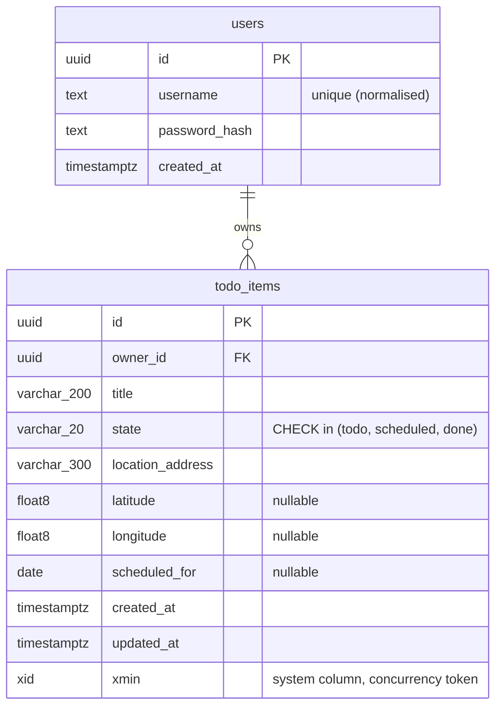

# ADR-0006: Data architecture — data access, schema management, physical model and data lifecycle

| | |
|---|---|
| **Status** | Proposed |
| **Date** | 2026-09-29 |
| **Decision area** | **Data Architecture** |
| **Method** | Attribute-Driven Design (realising the tactics chosen in the quality-attribute ADRs); analysed with ATAM concepts |
| **Related** | `docs/requirements.md` §9 (conceptual model, BR-1 to BR-6), Q1, Q2, Q3, Q4, Q5, Q6, A7, A9; ADR-0001 (owner filter, R6, seeding); ADR-0002 (PostgreSQL, managed); ADR-0003 (indexes, paging, timeouts, pooling); ADR-0004 (single primary, Z-axis readiness, migrations run once); ADR-0005 (ORM used directly, no mocked ORM, state stored as a string) |

---

## 1. Context

### 1.1 What is already decided, and what this ADR decides

Earlier ADRs chose the data store and set several **tactics** for data. This ADR chooses the **mechanisms**.

| Already decided | Where |
|---|---|
| PostgreSQL, as a managed service | ADR-0002 §3.4 |
| The owner filter applies centrally to every query | ADR-0001 §4.4 |
| Owner-first indexes; offset paging; projection; timeouts; pooling rule | ADR-0003 §3.8 |
| Single primary; owner as the partition key; migrations run once per release | ADR-0004 |
| The ORM is used directly (no repository); the state is stored as a string; tests use the real database | ADR-0005 |

**Decided here:** data-access technology; schema management (code-first vs database-first); the physical model (keys, types, constraints, indexes, naming); the concurrency mechanism; how migrations run and evolve without downtime; database roles; seeding; and the data lifecycle (backup, retention, personal data).

### 1.2 Drivers

| Driver | Why it matters for data |
|---|---|
| **Q1** Isolation (H/H) | The owner filter must be impossible to bypass accidentally |
| **Q2 / BR-1 to BR-6** Correctness | Rules must hold even if a code path is wrong |
| **Q3** Performance | List queries must be index-served |
| **Q4** Availability | Schema changes must not break a rolling deployment |
| **Q5** Modifiability | Adding a field must be quick: model → migration → API → UI |
| **Q6** Data integrity | Concurrent edits must not be lost silently |
| **NFR-5** Security | Least privilege; no secrets in migrations |
| Personal data | Customer addresses and coordinates are personal information |

### 1.3 A note on the data store question

The comparison of PostgreSQL, SQL Server / Azure SQL, Cosmos DB and MySQL is recorded in **ADR-0002 §3.4** and is not reopened here. For clarity:
- **Azure SQL Database** is the managed (PaaS) form of the **SQL Server** engine.
- "SQL Server" on its own usually means running the engine yourself, on a VM or in a container.

The ADR-0002 decision (managed PostgreSQL) stands, for four reasons: the relational fit, the same engine in tests and in production, portability, and PostGIS for location features. The one point in Azure SQL's favour that is worth recording is its serverless tier with auto-pause, which can be cheaper for idle workloads. It doesn't outweigh the reasons above.

---

## 2. Decision summary

| Concern | Decision | Rejected |
|---|---|---|
| **Data access** | **EF Core with the Npgsql provider**; LINQ with projection; raw SQL only through filtered, parameterised APIs | Dapper; raw ADO.NET; a hybrid of EF Core and Dapper; other ORMs |
| **Schema management** | **Code-first with EF Core migrations**; migrations committed to git and **their generated SQL reviewed** | Database-first scaffolding; SQL-first migration tools |
| **Running migrations** | **An EF Core migration bundle, run once per release as a Kubernetes Job** (a Helm pre-upgrade hook) with a privileged migration identity | Migrating at app start-up; `dotnet ef database update` from CI |
| **Schema evolution** | **Forward-only, backward-compatible migrations (expand / contract)** | Down-migrations in production; breaking changes in one release |
| **Primary keys** | **UUID v7**, generated in the application | Integer identity; random UUID v4 |
| **Concurrency** | **Optimistic, using PostgreSQL's `xmin` system column** as the concurrency token, exposed to clients as `version` | An explicit integer version column; pessimistic locking |
| **Integrity** | **Rules enforced in the database as well** (foreign keys, `NOT NULL`, `CHECK` constraints), in addition to application validation | Application-only validation |
| **Isolation** | **The EF Core global query filter** (ADR-0001) | PostgreSQL row-level security (deferred as an extra layer) |
| **Naming** | **`snake_case`** tables and columns | Quoted PascalCase identifiers |
| **Roles** | **Separate migration and runtime roles** | One admin login for everything |
| **Seeding** | **An idempotent seed step in the migration Job, reading secrets** | Seed data (including password hashes) in migrations |
| **Lifecycle** | Managed automated backups with point-in-time restore; hard delete (A7); no personal data in logs | Soft delete; archiving (deferred) |

---

## 3. Options and trade-offs

### 3.1 Data-access technology

| Criterion | **EF Core (Npgsql)** | Dapper (micro-ORM) | Raw ADO.NET / Npgsql | Hybrid: EF Core writes + Dapper reads |
|---|---|---|---|---|
| **Q1: central owner filter** | ++ A global query filter applies to every query automatically | −− Must be written into every SQL statement by hand; one missed `WHERE owner_id = …` leaks data | −− Same as Dapper | − Two paths to keep safe |
| **Q6: concurrency** | ++ Concurrency tokens are built in; conflicts raise a typed exception | − Hand-written version checks | − Same as Dapper | − |
| **Schema management** | ++ Migrations included | ✗ Needs a separate tool | ✗ | ✗ for reads |
| **Q5: add a field** | ++ Property + migration; the compiler finds every projection and mapping to update | − Change SQL strings, which the compiler doesn't check | − | − Two places |
| **Performance** | + Fast enough: projection + no-tracking reads (ADR-0003) | ++ Marginally faster | ++ | + |
| **SQL control** | + Generated SQL can be inspected; raw SQL is available | ++ Full control | ++ | + |
| **Testability (ADR-0005)** | ++ Real database via Testcontainers | ++ | ++ | + |
| **Security (injection)** | ++ Parameterised by construction | + Parameterised if used correctly | + Same | + |

**Decision: EF Core with Npgsql.** The decisive reasons are Q1 and Q6. The owner filter and the concurrency check happen automatically instead of by discipline. Dapper's speed advantage is irrelevant at this scale (ADR-0003 N1): the budgets are met by indexes, not by the ORM. Other .NET ORMs (e.g. linq2db, NHibernate) offer no advantage over EF Core here, and have smaller communities.

**Rules for using EF Core:**

| Rule | Why |
|---|---|
| Reads: `AsNoTracking()` + `Select(...)` into response models | Performance (ADR-0003); CQRS level 1 (ADR-0003 §3.7) |
| Writes: load the entity, apply the rules, `SaveChangesAsync()` | The rules and the concurrency token are applied; one transaction per request |
| **Raw SQL only through `DbSet.FromSql(...)` with interpolated parameters**, never string concatenation, and never through APIs that bypass the global query filter | Keeps Q1 and injection safety (ADR-0001 N1) even on the rare raw-SQL path |
| `IgnoreQueryFilters()` is **banned outside tests** | ADR-0001 S3 |
| No lazy loading | Hidden queries and N+1 risk (ADR-0003 N2) |
| Transient-failure retry enabled (Npgsql's retrying execution strategy) | Survives managed-database failovers and maintenance. Explicit transactions, if ever needed, must run inside the strategy |
| Audit timestamps (`created_at`, `updated_at`) set in one place (a `SaveChanges` interceptor using `TimeProvider`) | Consistent, testable (ADR-0005 seam), and never forgotten |

### 3.2 Code-first vs database-first vs SQL-first

| Option | How it works | Fit | Verdict |
|---|---|---|---|
| **Code-first (EF Core migrations)** | The C# model is the source of truth; `dotnet ef migrations add X` generates a migration (C#, and SQL on demand) | ++ One source of truth; migrations versioned in git; adding a field is two steps (Q5); CI can detect a model changed without a migration | **Chosen** |
| Database-first (scaffold the model from an existing database) | The database is the source of truth; the model is regenerated from it | − Suits an existing, DBA-owned database. There isn't one; regenerating overwrites customisations | Rejected |
| SQL-first migrations (e.g. DbUp, Flyway, Grate) + an EF mapping | Hand-written SQL scripts are the source of truth; the EF model is kept in step by hand | + Full SQL control; DBA-friendly. − **Two sources of truth** to keep in sync, which costs Q5 on every change | Rejected. Revisit if a DBA team owns the schema, or database objects (functions, row-level-security policies) multiply |

Code-first doesn't mean giving up SQL control. Anything EF can't model (check constraints are supported; row-level-security policies would not be) goes into a migration with `migrationBuilder.Sql(...)`.

**Review rule, important with AI-assisted work:** every migration's **generated SQL** (`dotnet ef migrations script`) is reviewed before merging. A classic trap is a *rename* generated as *drop column + add column*, which **silently loses data**. The generated SQL shows this; the C# model diff doesn't.

### 3.3 Running migrations

| Option | Problems | Verdict |
|---|---|---|
| `Database.Migrate()` at app start-up | Every replica races to migrate (ADR-0004); the runtime app needs DDL permissions (breaks least privilege, ADR-0001 R6); a failed migration becomes a crash loop | Rejected |
| `dotnet ef database update` from the CI runner | The runner needs the .NET SDK, the source code and **network access to the database**, which should be private | Rejected |
| Idempotent SQL script applied by the pipeline | Workable, but it still needs network access from the pipeline, and a SQL client | Viable alternative |
| **EF Core migration bundle (a self-contained executable) in the API image, run as a Kubernetes Job (a Helm pre-install / pre-upgrade hook)** | — | **Chosen** |

Why the bundle and Job win:
- It runs **inside the cluster**, so it has network access to the database without opening it to the pipeline.
- It runs **exactly once per release**, before the new pods roll out.
- It uses the **migration role's** credentials, which the runtime pods never see.
- It is **versioned with the image**, so code and schema always match.
- **A failed migration fails the Helm release**, and the old version keeps running (Q4).

The Job manifest itself is specified in the Deployment ADR.

### 3.4 Evolving the schema without downtime

During a rolling update (Q4), **the old and new app versions run at the same time against the new schema**. So:

**Rule 1: every migration must be backward-compatible with the previous app version.**

This is done with **expand / contract** (parallel change) across releases:

| Change | Release N (expand) | Release N+1 (contract) |
|---|---|---|
| Add a column | Add it as nullable, or with a default; the new code writes it and the old code ignores it | Make it `NOT NULL` if required, after a backfill |
| Rename a column | Add the new column; write both; backfill; read the new one | Drop the old column |
| Remove a column | Stop reading and writing it in code | Drop it |
| Add a status | Add the value to the allowed set (the `CHECK` constraint is widened) | — (additive only) |

**Rule 2: forward-only in production.** `helm rollback` rolls back the *application*, not the schema. That is safe precisely because of Rule 1: the previous app version works with the new schema. Down-migrations are kept for local development only. A bad migration is fixed by a new forward migration.

### 3.5 Physical model

| Decision | Choice | Why | Rejected |
|---|---|---|---|
| **Primary keys** | **UUID v7**, generated in the app (`Guid.CreateVersion7()`) | Time-ordered, so index inserts stay efficient (unlike random v4). Not enumerable, so ids reveal nothing about volume. Generated without a database round trip. Defence in depth for Q1: ids can't be guessed, although **isolation never relies on this**; the owner filter does | Integer identity (sequential and enumerable; it reveals business volume); UUID v4 (fragments indexes) |
| **Owner** | `owner_id uuid NOT NULL REFERENCES users(id)`, `ON DELETE RESTRICT` | Integrity; users aren't deleted in the MVP (A10), so an accidental cascade can't wipe data | `CASCADE` (dangerous by default) |
| **State** | `varchar(20)` + a `CHECK (state IN ('todo','scheduled','done'))` constraint | Readable; matches the API values; adding a status is one migration line, which is part of the change anyway (ADR-0005 §3.6) | A PostgreSQL `ENUM` type (values are hard to rename or remove; awkward in migrations); an integer code (unreadable data) |
| **Scheduled date** | `date` (mapped to `DateOnly`) | A day, not an instant (A2); no time-zone bugs | `timestamp` |
| **Audit times** | `timestamptz`, always in UTC | An unambiguous instant | `timestamp` without a time zone |
| **Coordinates** | Two `double precision` columns with `CHECK` constraints on their ranges, and "both or neither" (BR-2) | Simple and enough for display on a map. **PostGIS `geography(Point)`** is the evolution path for "near me" and routing (ADR-0002) | PostGIS now (not needed yet); `numeric` (no benefit) |
| **Text lengths** | `varchar(200)` for the title and `varchar(300)` for the address, matching validation | The database backs up the API's limits | Unbounded `text` |
| **Username uniqueness** | A unique index on the normalised (lower-case) username | Prevents `Alice` and `alice` both existing | Case-sensitive uniqueness |
| **Naming** | `snake_case`, through a naming-convention package | PostgreSQL convention; no quoted identifiers in hand-written SQL | EF's default PascalCase (every name needs quoting) |

### 3.6 Integrity: enforce rules in the database too

Application validation (ADR-0005) gives users good messages. **Database constraints guarantee the rules hold even if a code path, a raw SQL statement or a future bug skips validation.** Both are kept, which is defence in depth for correctness.

| Rule | Database constraint |
|---|---|
| BR-1: scheduled ⇒ has a date | `CHECK (state <> 'scheduled' OR scheduled_for IS NOT NULL)` |
| BR-2: coordinates both or neither, and in range | `CHECK ((latitude IS NULL) = (longitude IS NULL))`; `CHECK (latitude BETWEEN -90 AND 90)`; `CHECK (longitude BETWEEN -180 AND 180)` |
| BR-4: an owner is always present | `owner_id NOT NULL` + a foreign key |
| BR-5: title and address not blank | `NOT NULL` + `CHECK (length(trim(title)) > 0)` (and the same for the address) |
| Valid states | `CHECK (state IN (...))` |
| Transitions (BR-2 / Q2) and "done is not editable" (BR-3) | **Not in the database.** These depend on the *previous* value, so they would need triggers. They stay in the transition table (ADR-0005) and are proven by tests |

**Open requirements question:** BR-1 also says items in other states have *no* date, which means a `done` item loses the day it was scheduled for. That may not be intended: "when was this job done?" is a likely question. The constraint above deliberately enforces only the "scheduled ⇒ date" direction until this is confirmed.

### 3.7 Concurrency mechanism (Q6)

| Option | Pros | Cons | Verdict |
|---|---|---|---|
| **PostgreSQL `xmin` as the concurrency token** | Free: every row already has it, and it changes on every update. No extra column; supported natively by the Npgsql provider | PostgreSQL-specific; an opaque number | **Chosen** |
| An explicit integer `version` column | Portable; a readable, incrementing value | Must be incremented reliably (an interceptor or a trigger) | Rejected (portability isn't a driver; noted as the fallback) |
| Pessimistic locking | — | ADR-0003 §3.5 | Rejected |

Clients receive the token as `version` in each response and send it back on update. A mismatch raises a concurrency exception, which the API maps to a conflict response (the status code is decided in Communication & Interaction).

### 3.8 Isolation: application filter vs row-level security

| Option | Pros | Cons | Verdict |
|---|---|---|---|
| **EF Core global query filter** (ADR-0001) | Simple; testable; visible in code | Enforced by the application: a bypass (e.g. `IgnoreQueryFilters`, unfiltered raw SQL) is possible, and prevented by rules and review | **Chosen** |
| **PostgreSQL row-level security (RLS)** as an additional layer | Enforced by the database, even against application bugs | The current user must be set on each connection or transaction (care is needed with pooling); the migration role must bypass it; policies live in SQL migrations; more to test and explain | **Deferred.** It's the next defence-in-depth step if real customer data is stored (ADR-0001 §10) |

### 3.9 Database roles and connection settings

| Role | Permissions | Used by |
|---|---|---|
| **Admin** (server administrator) | Everything | Terraform and break-glass access only; never used by the app |
| **Migration role** | Owns the schema; DDL | The migration Job only |
| **Runtime role** | `SELECT, INSERT, UPDATE, DELETE` on the application tables; no DDL | The API pods |

Creating the roles is a one-off bootstrap step (mechanism in the Deployment ADR). This resolves ADR-0001 R6.

**Connection settings (runtime):** TLS required (ADR-0001 layer 3); a pool size per replica from the ADR-0004 rule; a command timeout of about 5 s (ADR-0003); the retrying execution strategy (§3.1).

### 3.10 Seeding

| Data | How | Why |
|---|---|---|
| **Users** (e.g. `alice`, `bob`) | An **idempotent seed step** run by the migration Job after migrating: for each user in a secret, create the user if it doesn't exist, hashing the password at seed time | No passwords or hashes in git, which EF's model-level seeding (`HasData`) would put into migrations (ADR-0001) |
| Demo items | The same step, **development and demo environments only** | Realistic demo data without polluting production |
| Test data | Created by each test through builders (ADR-0005); the database is reset between tests | Isolated, deterministic tests |

### 3.11 Data lifecycle and personal data

| Concern | Decision |
|---|---|
| **Backups** | The managed service's automated backups with point-in-time restore (default retention, e.g. 7 days) |
| **Restore** | A restore drill to a new server (Should); an untested backup is not a backup |
| **Deletion** | Hard delete (A7); deleting an item removes its personal data |
| **Retention** | Items are kept indefinitely in the MVP. An archive or retention policy for old `done` items is the first data-volume lever (ADR-0004 §3.6) |
| **Personal data** | Customer addresses and coordinates are personal information under applicable privacy law. **Minimise** (only the fields needed); **encrypt** in transit (TLS) and at rest (the managed service's default); **never log** addresses or coordinates, only ids; keep the data in the chosen region |
| **Audit history** | `created_at` / `updated_at` only; a full change history is deferred |

### 3.12 Local and test environments

| Aspect | Decision |
|---|---|
| Local development | PostgreSQL in Docker Compose (NFR-7) |
| Tests | Testcontainers PostgreSQL; the database is reset between tests (e.g. Respawn) |
| **Version parity** | The **same major version** in production, locally and in tests, pinned in one place (e.g. the latest major that is generally available on the managed service) |
| Migration test | CI applies all migrations to an empty database, and fails if the model has changes without a migration (`dotnet ef migrations has-pending-model-changes`) |

---

## 4. ATAM analysis

### 4.1 Sensitivity points

| # | Sensitivity point | Attributes affected |
|---|---|---|
| S1 | **The global query filter + the raw-SQL and `IgnoreQueryFilters` rules** | Security (Q1) |
| S2 | **Migration backward compatibility** (expand / contract) | Availability (Q4) |
| S3 | **Index definitions** vs the actual query shapes | Performance (Q3) |
| S4 | **Version parity** between production, local and tests | Testability, Correctness |
| S5 | **Database `CHECK` constraints** | Integrity vs the cost of change (each new status or rule needs a migration) |
| S6 | **The concurrency token** (`xmin`) | Integrity (Q6); portability |

### 4.2 Trade-offs

| # | Trade-off | Chosen side | Accepted cost |
|---|---|---|---|
| T1 | EF Core vs Dapper | Automatic isolation and concurrency; compile-checked changes | Less direct SQL control; a heavier abstraction |
| T2 | Code-first vs SQL-first | One source of truth; fast changes (Q5) | Generated SQL must be reviewed |
| T3 | Rules in the database and the app vs the app only | Integrity guaranteed regardless of code path | Rules expressed twice; a migration for rule changes |
| T4 | `xmin` vs an explicit version column | Zero extra columns or code | Tied to PostgreSQL |
| T5 | UUID v7 vs integer keys | Non-enumerable; app-generated; time-ordered | Larger keys (16 bytes) |
| T6 | Application filter vs row-level security | Simplicity; testability | Isolation rests on the application (mitigated by tests and rules) |
| T7 | Forward-only migrations | Safe rolling updates and application rollbacks | Mistakes are fixed forwards, never undone |
| T8 | A migration Job vs migrating at start-up | Runs once; least privilege; clear failure | A Helm hook and a second set of credentials to manage |

### 4.3 Risks

| # | Risk | Mitigation |
|---|---|---|
| R1 | A generated migration silently destroys data (e.g. a rename becomes drop + add) | Review the generated SQL for every migration; expand / contract for renames |
| R2 | A backward-incompatible migration breaks the rolling update | The §3.4 rules; a review checklist; a CI test that applies migrations and runs the previous version's tests (Should) |
| R3 | Backups exist but restore has never been tested | A restore drill (Should); record the result |
| R4 | Personal data leaks into logs | Log ids only; a review rule; structured logging with no request-body logging |
| R5 | Unclear BR-1 semantics lose the date on completed items | Raised as an open requirements question (§3.6) |

### 4.4 Non-risks

| # | Non-risk | Because |
|---|---|---|
| N1 | SQL injection | LINQ and `FromSql` interpolation are parameterised; string-built SQL is banned |
| N2 | Schema drift between model and database | Code-first, plus the CI "pending model changes" check |
| N3 | Concurrent migrations | One Job per release; never at start-up |
| N4 | Id enumeration revealing data volume | UUID v7 ids |

---

## 5. Consequences

**Positive**
- Isolation, concurrency and integrity are enforced **by construction**, not by discipline.
- Adding a field is: a property, `dotnet ef migrations add`, review the SQL, update the projections the compiler flags, then the UI and tests (Q5).
- Schema changes are safe during rolling deployments.

**Negative / follow-ups**
- Every migration needs a human review of its SQL.
- There is a second set of database credentials (the migration role) to manage.
- The BR-1 question should be settled in `requirements.md`.

### Impacts on other decision areas

| Decision area | Constraint or input from this decision |
|---|---|
| **Deployment & operations** | A migration bundle in the API image; a migration Job as a Helm pre-install / pre-upgrade hook; separate migration and runtime secrets; a role bootstrap; the backup retention setting; a restore drill |
| **Communication & interaction** | `version` in responses, and sent back on update; a conflict response for concurrency failures; UUID ids in URLs; dates as `YYYY-MM-DD` |
| **Component & structural** | The DbContext and entity configuration in the module that owns them; the audit interceptor; seeding as a command in the migration Job |
| **Cross-cutting concerns** | `TimeProvider` for audit timestamps; no personal data in logs; transient-failure retry |
| **Technology & tooling** | EF Core + Npgsql; a snake_case naming-convention package; EF migration bundles; a database-reset tool for tests |
| **Evolution & extensibility** | PostGIS; row-level security; an audit history table; a retention or archive policy; SQL-first migrations if a DBA team takes ownership |

---

## 6. Verification

| Check | How |
|---|---|
| Migrations apply to an empty database; no pending model changes | CI (Testcontainers + `has-pending-model-changes`) |
| Database constraints reject invalid rows (BR-1, BR-2, BR-5, invalid state) | Integration tests that write invalid data directly, bypassing the API |
| Q6 conflict | An integration test: two updates with the same `version` → the second is rejected |
| Q1 at the data layer | Integration tests (ADR-0001 §9); a search for `IgnoreQueryFilters` outside tests finds nothing |
| Index use | A query-plan check for the list query (ADR-0003 §6) |
| Least privilege | The runtime role cannot run DDL (a test or manual check) |
| Seeding is idempotent | Run the seed step twice → no duplicates |
| Restore works | A restore drill (Should) |

## 7. Revisit when

- Location features are prioritised. Adopt PostGIS (`geography(Point)`) with a spatial index.
- Real customer data is stored. Add row-level security, and review retention and privacy obligations.
- A DBA team owns the schema. Consider SQL-first migrations.
- The requirements clarify BR-1 for completed items. Adjust the constraint, and possibly add `completed_at`.
- A second data store or service appears. Revisit the portability of `xmin` and the transaction boundaries.
