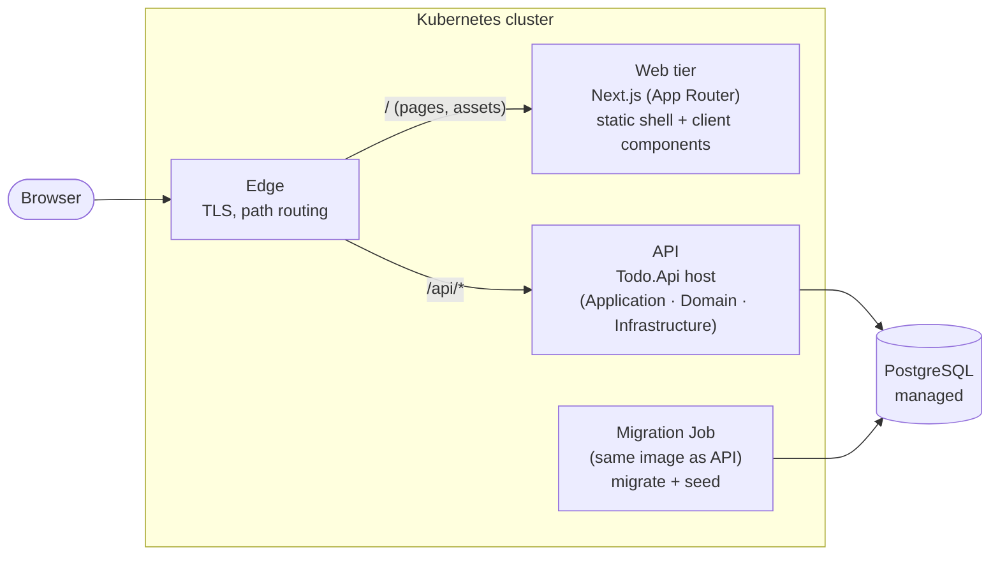
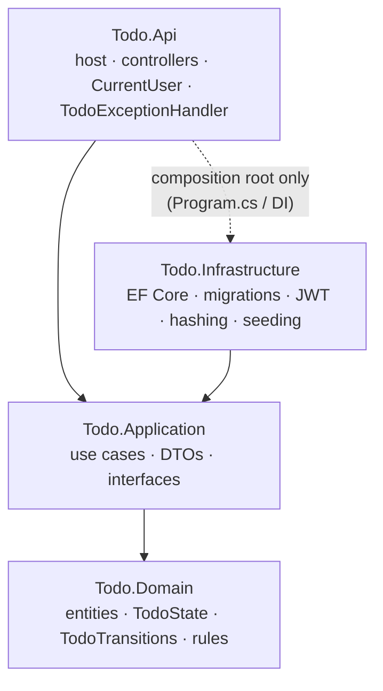

# ADR-0007: Component and structural design — containers, layers, modules and code layout

| | |
|---|---|
| **Status** | Proposed (revised, see the change log) |
| **Date** | 2026-09-29 |
| **Decision area** | **Component & Structural** |
| **Method** | Attribute-Driven Design; C4 model views (containers, components); analysed with ATAM concepts |
| **Supersedes** | **ADR-0005 §3.2** (code organisation), which rejected project-per-layer. The rest of ADR-0005 stands |
| **Related** | `docs/requirements.md` Q5, Q2, P-2, P-3, NFR-1; ADR-0001 (auth, `ICurrentUser`, owner filter); ADR-0002 (Next.js, .NET); ADR-0003 (one API service, CQRS level 1, client-side data); ADR-0004 (modular monolith); ADR-0005 (no MediatR/AutoMapper/repository, four seams, transition table); ADR-0006 (EF Core, migration Job, seeding) |

---

## 1. Context

### 1.1 What is already decided, and what this ADR decides

| Already decided (not reopened) | Where |
|---|---|
| **Modular monolith:** one API deployable with the modules `Auth` and `Todos` | ADR-0004 §3.5 |
| **No MediatR, no AutoMapper, no repository over EF Core** | ADR-0005 §3.2 (rejections kept), ADR-0006 §3.1 |
| **Four seams:** time, current user, options, outbound HTTP | ADR-0005 §3.3 |
| **Transition table** as the single source of state rules; `allowedTransitions` returned by the API | ADR-0005 §3.6 |
| **Command/query separation in code** (CQRS level 1) | ADR-0003 §3.7 |
| EF Core, migration bundle Job, seeding from secrets | ADR-0006 |

**Decided here:**
- the containers
- the backend layering and projects
- what each layer owns, and the dependency rule
- how modules sit across the layers
- API style (controllers)
- where domain rules live
- how the rules are enforced
- the front-end structure

**Changed from ADR-0005:** ADR-0005 §3.2 chose vertical slices in a single project and rejected Clean Architecture with a project per layer. **This ADR reverses that**, and adopts the four projects `Todo.Api`, `Todo.Application`, `Todo.Domain` and `Todo.Infrastructure`, which already exist in the repository. The guardrails ADR-0005 introduced against ceremony (no MediatR, no AutoMapper, no repository) are **kept**, so the layering doesn't bring its usual overhead along with it.

### 1.2 Drivers

| Driver | Structural implication |
|---|---|
| **P-3** Explain the code | A structure reviewers recognise immediately, which maps onto the diagrams |
| **Q2** Correctness | State rules in one pure, framework-free place |
| **NFR-1** Testability | A domain and application logic testable without HTTP, and a domain testable without Docker |
| **Q1** Isolation | Owner filter and current user are central, not repeated per feature |
| **Q5 / P-2** Modifiability without AI | Changes must stay predictable and quick, even with more files per change |
| **ADR-0001 §6** Evolution | Swapping the token issuer (federation) must not touch business logic |

---

## 2. Decision summary

| Concern | Decision | Rejected |
|---|---|---|
| **Macro-structure** | **Tiered + modular monolith** (confirming ADR-0004): edge → Next.js web tier → one .NET API → PostgreSQL; plus a migration Job built from the API image | Microservices; micro-frontends; serverless (C-6) |
| **Backend layering** | **Clean Architecture, with four projects:** `Todo.Domain` ← `Todo.Application` ← `Todo.Infrastructure`, with `Todo.Api` as the host and composition root | Vertical slices in one project (the previous version of this ADR); classic N-layer; hexagonal ports for everything |
| **Dependency rule** | **Enforced by the compiler** (project references), plus architecture tests for what the compiler can't check | Convention only |
| **Pragmatic guardrails** | Application reaches data through **`IAppDbContext`** (an interface over the EF Core context, not a repository); **plain handler classes** (no mediator); **hand-written mapping** | A repository per entity; MediatR; AutoMapper |
| **Modules across layers** | `Auth` and `Todos` are **feature folders inside each layer** (e.g. `Todo.Application/Todos/…`); modules reference each other by id only | A project per module (for now) |
| **Use cases** | **One folder per use case** in Application: `Commands/CreateTodo/`, `Queries/ListTodos/` (command or query + handler) | One large service class per entity |
| **API style** | **Controller-based RESTful API:** `[ApiController]` controllers in `Todo.Api`, one per resource (`TodosController`, `AuthController`), attribute routing, **thin**: bind → call the handler → return the success result | Minimal APIs |
| **Domain model** | **Rich entity** (`TodoItem` enforces BR-1 to BR-5 through guard clauses and methods); rule violations **thrown as specific exceptions**, mapped to ProblemDetails in one place (ADR-0008) | An anemic entity; full DDD |
| **Persistence** | **One `AppDbContext`** in Infrastructure, implementing `IAppDbContext`; configurations, migrations, interceptor and seeder in Infrastructure | A DbContext per module (for now) |
| **Tests** | `Todo.UnitTests` (Domain + Application, no Docker; architecture tests) and `Todo.IntegrationTests` (HTTP + auth + real PostgreSQL) | A test project per layer |
| **Front end** | Next.js App Router: **thin routes in `app/`**, **feature folders in `components/`** (`todos/`, `auth/`, shared `ui/`), shared non-UI code in `lib/` | Grouping by technical type inside `components/` |

---

## 3. Options and trade-offs

### 3.1 Macro-structure (C4 container view)



| Container | Responsibility | Scales |
|---|---|---|
| **Web tier** (Next.js) | Serves the static shell and client bundles; UX-only route guard; security headers | Horizontally (ADR-0004) |
| **API** (.NET) | All business rules, authentication, authorization and data access. **The only enforcement point** (ADR-0001) | Horizontally |
| **Migration Job** | Applies migrations and seeds data once per release (ADR-0006) | Runs once |
| **PostgreSQL** | Persistence | Vertically |

Micro-frontends, a separate BFF container and a service mesh are rejected or deferred for the reasons given in ADR-0001, ADR-0004 and the earlier version of this ADR: one team, one small UI, and no service-to-service calls.

### 3.2 Backend layering: why Clean Architecture projects

| Option | Strengths | Costs | Verdict |
|---|---|---|---|
| **Clean Architecture with four projects** | **The compiler enforces the dependency rule:** Domain *cannot* reference EF Core or ASP.NET Core. A structure most .NET reviewers recognise at a glance (P-3). Infrastructure concerns (hashing, tokens, persistence) sit behind Application interfaces, so federation (ADR-0001 §6) swaps one implementation. Application logic is testable without HTTP | More files per change (§3.10): **about 12 instead of about 8** for a new field. More project references and DI registration | **Chosen** |
| Vertical slices in one project (previous version) | Fewest files per change; one folder per use case | Dependency direction enforced only by tests; less familiar shape to reviewers | Superseded |
| Classic N-layer (controller → service → repository) | Familiar | Pass-through layers; a repository hides EF features (ADR-0006) | Rejected |
| Hexagonal (ports and adapters) for every dependency | Maximum isolation | A port for everything; ceremony without matching benefit | Rejected. The Application interfaces (§3.3) **are** this system's ports, only where needed |

**Why the change is worth its cost.** The choice between these two options is a genuine trade-off: compiler-enforced boundaries and recognisability against change amplification. The deciding factors:
- **P-3:** reviewers must follow the code quickly during the interview, and a standard shape helps.
- **Guaranteed domain purity:** the domain *can't* reference infrastructure, rather than being prevented from doing so by a test.

The cost to Q5 is kept down by the guardrails in §3.4.

### 3.3 Layers, responsibilities and the dependency rule



| Project | Owns | References | Must not reference |
|---|---|---|---|
| **Todo.Domain** | `TodoItem`, `TodoState`, `TodoTransitions`, `User`, value objects (e.g. `GeoPoint`); **guard clauses** (`ArgumentException`); domain exceptions (`InvalidTodoTransitionException`) | Nothing (the .NET base library only) | Any NuGet package; any other project |
| **Todo.Application** | Use cases (commands and queries with their handlers; handlers throw `KeyNotFoundException` when the owner-filtered lookup finds nothing); response DTOs + `ToResponse()` mapping (including `allowedTransitions`); **interfaces**: `IAppDbContext`, `ICurrentUser`, `IPasswordHasher`, `ITokenIssuer`; `AddApplication()` | Domain; EF Core (for `DbSet` and async LINQ, see §3.4) | Infrastructure; ASP.NET Core |
| **Todo.Infrastructure** | `AppDbContext` (implements `IAppDbContext`; global owner filter); EF configurations; migrations; audit interceptor; `UserSeeder`; `PasswordHasher` and `JwtTokenIssuer` implementations; `AddInfrastructure()` | Application (and so Domain); Npgsql; JWT libraries | ASP.NET Core endpoint code |
| **Todo.Api** | `Program.cs` (composition root; migrate/seed entry point for the Job); controllers (`[ApiController]`); `CurrentUser` (implements `ICurrentUser` from the request's claims); authentication and authorization configuration (cookie **or** bearer JWT validation, ADR-0001); exception → ProblemDetails mapping (`Middleware/TodoExceptionHandler`, ADR-0008); rate limiting; health | Application; Infrastructure **only for DI registration** | Infrastructure types in endpoint code |

**Where ADR-0001's security pieces land:**
- **Token issuing:** an `ITokenIssuer` interface in Application, implemented in Infrastructure. Federation replaces this implementation.
- **Token validation:** configured in Api, as part of the ASP.NET Core pipeline.
- **Password hashing:** an `IPasswordHasher` interface, implemented in Infrastructure.
- **Current user:** an interface in Application, implemented in Api.
- **Owner filter:** in `AppDbContext` (Infrastructure), using `ICurrentUser`.

### 3.4 Pragmatic guardrails (keeping ceremony down)

Clean Architecture is often implemented with a stack of patterns that multiply files. ADR-0005 rejected them, and those rejections still stand:

| Common companion | Decision here | Why |
|---|---|---|
| A repository per entity in Application, implemented in Infrastructure | ❌ **Use `IAppDbContext` instead:** an interface in Application exposing `DbSet<TodoItem> Todos`, `DbSet<User> Users` and `SaveChangesAsync` | Keeps the features ADR-0001, ADR-0003 and ADR-0006 depend on: the global owner filter, projection, `AsNoTracking`, concurrency tokens. It avoids the "mocked repository" tests ADR-0005 warns against |
| MediatR to dispatch commands | ❌ **Plain handler classes** (e.g. `CreateTodoHandler`), registered in DI and injected into the controller action (`[FromServices]`) | One click from endpoint to handler, which helps live changes (P-2); no licensing concern |
| AutoMapper between layers | ❌ **Hand-written `ToResponse()`** in Application | Compile-time checked; visible |
| Separate request DTOs in Api that mirror the commands | ❌ **Controller actions bind the Application command or query directly** (route values are merged in, e.g. `command with { Id = id }`) | Removes a whole layer of duplicate types. Commands never contain an owner (ADR-0001 N4): handlers read it from `ICurrentUser` |
| Domain events and a pipeline of behaviours | ❌ Not needed | Nothing reacts to domain events yet (ADR-0004 §3.4) |

**Accepted deviation from "pure" Clean Architecture:** Todo.Application references EF Core, because `IAppDbContext` exposes `DbSet<T>` and handlers use EF's async LINQ. This is a **deliberate trade-off** (T3). Application isn't persistence-ignorant, but the ORM features the security and performance decisions rely on remain available. The Domain project stays completely pure.

### 3.5 Modules across the layers

`Auth` and `Todos` (ADR-0004) appear as **the same feature folders in every layer**:

| Layer | Auth | Todos |
|---|---|---|
| Domain | `Users/User.cs` | `Todos/TodoItem.cs`, `TodoState.cs`, `TodoTransitions.cs`, `GeoPoint.cs` |
| Application | `Auth/Commands/Login/`, `Auth/Queries/Me/` | `Todos/Commands/{CreateTodo,UpdateTodo,ChangeTodoState,DeleteTodo}/`, `Todos/Queries/{ListTodos,GetTodo}/` |
| Infrastructure | `Identity/PasswordHasher.cs`, `Identity/JwtTokenIssuer.cs`, `Persistence/Seeding/UserSeeder.cs` | `Persistence/Configurations/TodoItemConfiguration.cs` |
| Api | `Controllers/AuthController.cs` | `Controllers/TodosController.cs` |

**Module rules** (from the earlier version of this ADR, unchanged):
- **Reference other modules by id only.** `TodoItem.OwnerId` is a `Guid`, with no navigation property to `User`. The database keeps the foreign key (ADR-0006); the code doesn't couple the models.
- **No module reads another module's tables.**
- **No module-to-module calls today.** Todos needs only the current user id, from `ICurrentUser`.
- **One `AppDbContext`,** with each module owning its own entity configuration.

### 3.6 Use-case granularity in Application

Each use case is a folder containing everything for that operation. Validation is not a separate file: it lives in the domain's guard clauses (ADR-0008 §3.7).

```
Todo.Application/Todos/Commands/CreateTodo/
├── CreateTodoCommand.cs     # record: Title, State, LocationAddress, Latitude, Longitude, ScheduledFor (no owner)
└── CreateTodoHandler.cs     # uses IAppDbContext, ICurrentUser, TimeProvider; calls the domain; returns the DTO
                             # (rule violations surface as exceptions; see ADR-0008)
```

Queries follow the same shape (`ListTodosQuery` + `ListTodosHandler`), projecting straight to DTOs with `AsNoTracking` (ADR-0003 CQRS level 1). There is no single `TodoService` holding every operation, so each use case can be read and changed on its own.

### 3.7 API style: controller-based RESTful API, kept thin

**Decision: ASP.NET Core MVC controllers** (`[ApiController]` on `ControllerBase`), one controller per resource, with attribute routing. This replaces minimal APIs, which the earlier version of this ADR chose.

| Criterion | **Controllers (chosen)** | Minimal APIs |
|---|---|---|
| Familiarity to reviewers | ++ The long-standing, conventional ASP.NET Core REST style; instantly recognisable (P-3) | + Now mainstream, but less familiar to some |
| Organisation | ++ One class per resource (`TodosController`, `AuthController`), with the whole HTTP surface for that resource in one place | + Route groups per module |
| Class-level conventions | ++ `[Route]`, `[Authorize]`, `[Produces]` declared once per controller | + Route-group settings |
| Built-in API behaviours | ++ `[ApiController]`: binding-source inference, automatic 400 ProblemDetails for malformed requests | 0 Configured by hand |
| OpenAPI metadata | + `ActionResult<T>` + `[ProducesResponseType]` attributes | ++ `TypedResults` infer response types |
| Ceremony | − A base class, attributes, action results | ++ Lambdas or static methods |
| Fit with this architecture | ++ **With Clean Architecture, the earlier objection falls away.** Controllers don't split a use case, because the use cases live in Application handlers. A controller is only the HTTP adapter | ++ |

Both run on the same runtime pipeline, so the choice has no effect on scalability or performance (ADR-0004 §3.3).

**How controllers stay thin.** Each action does **only** three things: bind, call the handler, return the success result.

```csharp
// Todo.Api/Controllers/TodosController.cs (illustrative)
[ApiController]
[Route("api/todos")]
[Produces("application/json")]
public sealed class TodosController : ControllerBase
{
    [HttpPost]
    [ProducesResponseType<TodoResponse>(StatusCodes.Status201Created)]
    [ProducesResponseType<ProblemDetails>(StatusCodes.Status400BadRequest)]
    public async Task<ActionResult<TodoResponse>> Create(
        CreateTodoCommand command, [FromServices] CreateTodoHandler handler, CancellationToken ct)
    {
        var todo = await handler.Handle(command, ct);                  // throws on rule violations
        return CreatedAtAction(nameof(Get), new { id = todo.Id }, todo); // success path only
    }

    // Get, List, Update, ChangeState, Delete follow the same shape
}
```

**Rules:**

| Rule | Why |
|---|---|
| **Handlers are injected per action with `[FromServices]`,** not through the constructor | Each action pulls only the handler it uses; the controller doesn't grow a long constructor as actions are added |
| **No business logic, no try/catch, and no Infrastructure types in controllers** | Errors propagate to `TodoExceptionHandler` (ADR-0008 §3.5). Architecture tests check the rest |
| **Actions bind Application commands and queries directly** (`[FromBody]` inferred; route values merged in, e.g. `command with { Id = id }`) | No duplicate request DTOs (§3.4). Commands never carry an owner (ADR-0001 N4) |
| **`[ProducesResponseType]` for every success and error status** an action can return | Accurate OpenAPI, and so accurate generated TypeScript types (ADR-0005) |
| **Controllers inherit from `ControllerBase`** (no views) | An API only; no MVC view machinery |
| **Wiring:** `builder.Services.AddControllers()` and `app.MapControllers()` in `Program.cs` | Standard |

**Interaction with ADR-0008:** `[ApiController]` returns an automatic 400 ValidationProblemDetails when a request can't be bound (malformed JSON, wrong types). Those responses must follow the same contract: `code = validation_failed`, and no `traceId`. This is set through the ProblemDetails customisation, and the ADR-0008 "no `traceId`" test covers it.

### 3.8 Domain model

This is unchanged from the previous version.
- **A rich entity:** `TodoItem` has private setters and methods such as `ChangeState(to, scheduledFor)` and `UpdateDetails(...)`. They enforce BR-1, BR-2 / Q2 (through `TodoTransitions`) and BR-3.
- **Rule violations throw specific exceptions:** `InvalidTodoTransitionException` for transitions and edits to `done` items; `ArgumentException` from guard clauses (with `ParamName` matching the request field). They are mapped to 409 and 400 by `TodoExceptionHandler` (ADR-0008).
- **Validation is split two ways:** input validation *and* invariants in the entity (one source of rules); the integrity backstop in database constraints (ADR-0006).

### 3.9 Repository layout

This matches the existing repository, including `Todo.slnx`, `Directory.Build.props` and the `Dockerfile` under `api/`.

```
rush-todo/
├── .github/                         # CI/CD workflows (Deployment ADR)
├── api/
│   ├── Directory.Build.props        # shared settings: nullable, warnings as errors, analysers, LangVersion
│   ├── Dockerfile                   # multi-stage: build → migration bundle → runtime image
│   ├── Todo.slnx
│   ├── src/
│   │   ├── Todo.Domain/
│   │   │   ├── Exceptions/          # InvalidTodoTransitionException
│   │   │   ├── Todos/               # TodoItem, TodoState, TodoTransitions, GeoPoint
│   │   │   └── Users/               # User
│   │   ├── Todo.Application/
│   │   │   ├── Common/Interfaces/   # IAppDbContext, ICurrentUser, IPasswordHasher, ITokenIssuer
│   │   │   ├── Todos/
│   │   │   │   ├── Commands/{CreateTodo,UpdateTodo,ChangeTodoState,DeleteTodo}/
│   │   │   │   ├── Queries/{ListTodos,GetTodo}/
│   │   │   │   └── TodoResponse.cs  # DTO + ToResponse() (includes allowedTransitions)
│   │   │   ├── Auth/{Commands/Login,Queries/Me}/
│   │   │   └── DependencyInjection.cs   # AddApplication()
│   │   ├── Todo.Infrastructure/
│   │   │   ├── Persistence/
│   │   │   │   ├── AppDbContext.cs          # implements IAppDbContext; global owner filter
│   │   │   │   ├── Configurations/          # TodoItemConfiguration, UserConfiguration
│   │   │   │   ├── Interceptors/AuditInterceptor.cs
│   │   │   │   ├── Migrations/
│   │   │   │   └── Seeding/UserSeeder.cs
│   │   │   ├── Identity/                    # PasswordHasher, JwtTokenIssuer, AuthOptions
│   │   │   └── DependencyInjection.cs       # AddInfrastructure()
│   │   └── Todo.Api/
│   │       ├── Program.cs                   # composition root; "migrate" / "seed" entry points for the Job
│   │       ├── Controllers/                 # AuthController.cs, TodosController.cs (thin, [ApiController])
│   │       ├── Identity/CurrentUser.cs      # implements ICurrentUser from claims
│   │       ├── Middleware/TodoExceptionHandler.cs   # exception → ProblemDetails (ADR-0008)
│   │       └── DependencyInjection.cs       # AddApi(): auth (cookie or bearer), rate limiting, health, OpenAPI
│   └── tests/
│       ├── Todo.UnitTests/                  # domain rules and guard clauses; mapping; exception-handler table; architecture tests; no Docker
│       └── Todo.IntegrationTests/           # WebApplicationFactory + Testcontainers PostgreSQL
├── deploy/                                  # Helm chart (Deployment ADR)
├── docs/                                    # requirements, ADRs, architecture, AI log
├── infra/                                   # Terraform (Deployment ADR)
└── web/                                     # §3.11
```

**Repository hygiene:** `api/.vs/`, `api/artifacts/`, `web/.next/` and `web/node_modules/` are build or IDE output. They must be listed in `.gitignore` (and in `.dockerignore` for the build context), and must never be committed.

### 3.10 Change cost with the layers (Q5)

Adding a field (e.g. `notes`) now touches:

| # | File | Layer |
|---|---|---|
| 1 | `TodoItem.cs` (property + `UpdateDetails`) | Domain |
| 2 | `TodoItemConfiguration.cs` | Infrastructure |
| 3 | A new migration (generated; SQL reviewed, ADR-0006) | Infrastructure |
| 4 | `CreateTodoCommand.cs` | Application |
| 5 | `UpdateTodoCommand.cs` | Application |
| 6 | `TodoResponse.cs` (DTO + mapping) | Application |
| 7 | Generated TypeScript types (regenerate) | Web |
| 8–9 | The form component and its schema | Web |
| 10 | The list or detail display | Web |
| 11–12 | Test data builder + tests | Tests |

Any validation rule for the new field is a guard clause in `TodoItem.cs` (row 1), not a separate validator file.

That is **about 12 files**, compared with about 8 before. No change is needed in `Todo.Api` because controller actions bind the commands directly (§3.4). ADR-0005's change-amplification target is updated to match. **The Q5 time budget (under 30 minutes) is unchanged but tighter,** so the drill must be rehearsed (§6).

### 3.11 Front-end structure (Next.js): feature folders

This matches the existing `web/src/{app,components,lib}` layout. **Feature folders live inside `components/`**, and each one is self-contained.

```
web/
├── public/
└── src/
    ├── app/                            # routes only: thin; compose feature components
    │   ├── layout.tsx                  # static shell (ADR-0003)
    │   ├── login/page.tsx
    │   └── todos/page.tsx              # "use client" data view
    ├── components/
    │   ├── todos/                      # feature folder
    │   │   ├── TodoList.tsx, TodoForm.tsx, StatePicker.tsx (renders allowedTransitions), TodoMap.tsx (lazy)
    │   │   ├── useTodos.ts, useChangeState.ts   # TanStack Query hooks; optimistic update
    │   │   ├── todosApi.ts             # typed calls using the generated types
    │   │   ├── todoSchema.ts           # form schema mirroring the API's validation
    │   │   └── *.test.tsx              # co-located tests (MSW)
    │   ├── auth/                       # LoginForm.tsx, useAuth.ts, authApi.ts, tests
    │   └── ui/                         # generic, feature-free components (Button, Dialog, Badge)
    ├── lib/                            # shared, non-UI, feature-free
    │   ├── api/                        # generated OpenAPI types; fetch wrapper (same origin, JSON, error mapping)
    │   └── queryClient.ts              # TanStack Query client setup
    ├── middleware.ts                   # UX redirect only (ADR-0001, ADR-0002)
    └── test-setup.ts                   # Vitest + Testing Library + MSW setup
```

| Rule | Why |
|---|---|
| **A feature folder contains everything for that feature:** components, hooks, API calls, schema and tests | A feature change lives in one folder (Q5), mirroring the backend's `Todos`/`Auth` folders |
| **Routes in `app/` are thin** | Framework conventions stay separate from testable feature code |
| **Features don't import from each other;** shared pieces move to `components/ui/` or `lib/` | The same boundary rule as the backend modules |
| **`components/ui/` and `lib/` stay feature-free** | They must not become dumping grounds (as with Platform/shared code) |
| **Data views are client components;** no Server Actions | ADR-0002 guardrails; ADR-0003 §3.1 |

A top-level `src/features/` folder is an equally valid convention. Keeping feature folders under `components/` matches the existing repository and avoids a restructure.

### 3.12 How the rules are enforced

| Rule | Enforced by |
|---|---|
| Domain → nothing; Application ↛ Infrastructure / ASP.NET Core; Infrastructure ↛ Api | **Compiler** (project references) |
| Domain has **no package references** at all | Architecture test (guards against someone adding one) |
| Controllers don't use Infrastructure types (only `Program.cs` / DI does) | Architecture test |
| `Todos` code doesn't reference `Auth` code (in any layer) | Architecture test (namespaces) |
| `IgnoreQueryFilters()` is not used outside tests (ADR-0006) | Architecture test or a search in CI |
| **`ILogger` is used only in `Todo.Api.Middleware.TodoExceptionHandler`** (ADR-0008 §3.1) | Architecture test |
| Front-end features don't import from each other | ESLint import-restriction rule (Should) |

---

## 4. ATAM analysis

### 4.1 Sensitivity points

| # | Sensitivity point | Attributes affected |
|---|---|---|
| S1 | **The dependency rule between projects** | Testability, Modifiability, Evolution (federation) |
| S2 | **`IAppDbContext` exposing EF Core to Application** | Security and performance features (preserved) vs purity |
| S3 | **Guardrails against ceremony** (§3.4) | Modifiability (Q5) |
| S4 | **Module boundaries across the layers** (id-only references) | Modifiability, Evolution (extraction) |
| S5 | **Thin controllers** (no logic in Api) | Testability, Modifiability |

### 4.2 Trade-offs

| # | Trade-off | Chosen side | Accepted cost |
|---|---|---|---|
| T1 | Four projects vs vertical slices in one project | Compiler-enforced dependency rule; recognisable to reviewers (P-3); infrastructure behind interfaces | About 12 files per new field instead of about 8 (Q5 tighter) |
| T2 | Feature folders inside layers vs a project per module | Fewer projects | Module boundaries enforced by architecture tests, not by the compiler |
| T3 | `IAppDbContext` vs repositories | Keeps the owner filter, projection and concurrency; no mock-heavy tests | Application references EF Core (not persistence-ignorant) |
| T4 | Binding commands directly vs separate Api request DTOs | One fewer layer of types | The HTTP contract is coupled to the Application commands |
| T5 | Plain handlers vs MediatR | Direct navigation; no licence concern | No automatic pipeline behaviours (action filters are used where needed) |
| T7 | Controllers vs minimal APIs | Familiar REST conventions (P-3); class-level routing and authorization; `[ApiController]` behaviours | More ceremony; OpenAPI response types need `[ProducesResponseType]` attributes |
| T6 | Feature folders under `components/` vs `src/features/` | Matches the existing repository | Hooks and API calls live in a folder called `components` |

### 4.3 Risks

| # | Risk | Mitigation |
|---|---|---|
| R1 | The Q5 drill exceeds 30 minutes because of more files | Rehearse the add-a-field drill (§6); the §3.10 checklist; controllers need no change |
| R2 | Ceremony creeps back in (repositories, mappers, a mediator "for consistency") | §3.4 guardrails; ADR-0005 rejections; review |
| R3 | Business logic leaks into controllers or Infrastructure | Architecture tests; thin-controller rule; rules live in the Domain |
| R4 | `components/ui` or `lib` becomes a dumping ground | The feature-free rule; review |

### 4.4 Non-risks

| # | Non-risk | Because |
|---|---|---|
| N1 | The domain accidentally depending on frameworks | Impossible: the Domain project has no references (compiler + test) |
| N2 | Federation requiring business-logic changes | Only the `ITokenIssuer` implementation and the Api validation settings change |
| N3 | Circular dependencies between layers | Project references can't form cycles |

---

## 5. Consequences

**Positive**
- The dependency rule is guaranteed by the compiler, and the structure is immediately recognisable (P-3).
- Domain rules are pure and unit-testable without Docker (NFR-1); use cases are testable without HTTP.
- Infrastructure is swappable where it matters (tokens, hashing).
- The front end mirrors the backend's modules through feature folders.

**Negative / follow-ups**
- More files per change. ADR-0005's change-amplification target is updated (about 12 files; under 30 minutes still), and the drill must be rehearsed.
- ADR-0005 §3.2 is superseded; ADR-0006's impacts table is updated to name the Infrastructure project.

### Impacts on other decision areas

| Decision area | Constraint or input from this decision |
|---|---|
| **Communication & interaction** | A controller per resource with attribute routing (`api/auth`, `api/todos`); commands bound directly as request bodies; exception → status mapping in `TodoExceptionHandler` (ADR-0008); `allowedTransitions` in `TodoResponse` |
| **Cross-cutting concerns** | Validation by domain guard clauses; exception mapping in Api (ADR-0008); auth pipeline configured in Api; token issuing and hashing in Infrastructure; logging conventions |
| **Data architecture** | `AppDbContext`, configurations, migrations, interceptor and seeder in `Todo.Infrastructure`; `IAppDbContext` in Application; no cross-module navigation properties |
| **Deployment & operations** | `api/Dockerfile` builds the API image and the migration bundle (from Infrastructure, with Api as the start-up project); the Job runs the migrate/seed entry point; `.gitignore` and `.dockerignore` exclude `.vs/`, `artifacts/`, `.next/`, `node_modules/` |
| **Technology & tooling** | ASP.NET Core MVC controllers (`[ApiController]`, `ControllerBase`); an architecture-test library (e.g. ArchUnitNET or NetArchTest); two .NET test projects; an ESLint import-restriction rule |
| **Evolution & extensibility** | Extraction path: a project per module → a DbContext per module → a separate service. Federation: replace `JwtTokenIssuer`, update Api validation |

---

## 6. Verification

| Check | How |
|---|---|
| Dependency rules hold | The build (project references) + architecture tests (§3.12) |
| Domain purity | Architecture test: `Todo.Domain` has no package or project references |
| Thin controllers | Architecture test: no Infrastructure types in `Todo.Api/Controllers` |
| Change cost | **Timed Q5 drill:** add a field by hand following §3.10; under 30 minutes; about 12 files |
| Unit tests independent of Docker | Run `Todo.UnitTests` with Docker stopped: all pass |
| Structure matches the diagrams | Walkthrough: every container, layer, module and use case has a matching project, folder or file |

## 7. Revisit when

- There are more than 3 business modules, or more than one team. Split modules into projects (compiler-enforced module boundaries).
- A module's load profile or release cadence diverges. Extract it (ADR-0004), starting with its own DbContext.
- Cross-cutting pipeline needs grow (e.g. auditing every command). Consider a decorator for handlers, still without a mediator.
- The Q5 drill repeatedly misses its budget. Revisit the guardrails, or collapse the Application commands and the Api contract further.

---

## Change log

| Date | Change |
|---|---|
| 2026-09-29 | First version: logical layers inside vertical slices, in a single API project |
| 2026-09-29 | **Revised at the author's decision:** adopted Clean Architecture with four projects (`Todo.Api`, `Todo.Application`, `Todo.Domain`, `Todo.Infrastructure`) to match the repository, keeping ADR-0005's guardrails (no MediatR, AutoMapper or repository). Front end: feature folders under `web/src/components/`. Supersedes ADR-0005 §3.2 |
| 2026-09-29 | Aligned with ADR-0008's revision: rule violations are thrown as specific exceptions and mapped by `TodoExceptionHandler` (`Todo.Api/Middleware`); no result/outcome types; validation by domain guard clauses (no validator files); change cost about 12 files |
| 2026-09-29 | **Revised at the author's decision:** controller-based RESTful API (`[ApiController]` controllers, one per resource) instead of minimal APIs; handlers injected per action with `[FromServices]`; added T7 |
