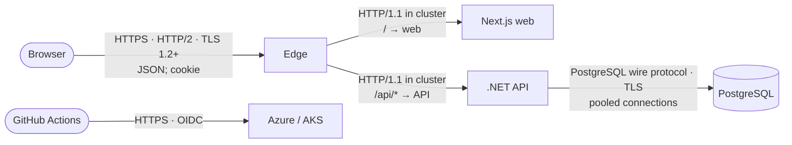
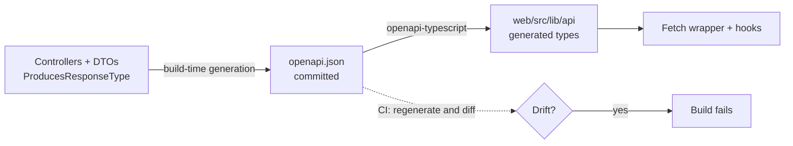

# ADR-0009: Communication and interaction — protocols, API contract and request/response consistency

| | |
|---|---|
| **Status** | Proposed |
| **Date** | 2026-09-29 |
| **Decision area** | **Communication & Interaction** |
| **Method** | Attribute-Driven Design; analysed with ATAM concepts |
| **Related** | `docs/requirements.md`: C-3, FR-1 to FR-10, Q1, Q2, Q3, Q4, Q6, NFR-2, NFR-3; ADR-0001 (same origin, cookie or bearer, no CORS, JSON-only writes); ADR-0003 (paging, dedicated state operation, mutations return the item, `no-store`); ADR-0004 (REST, synchronous only, idempotent PUT/DELETE); ADR-0005 (OpenAPI as the source of truth, `allowedTransitions`); ADR-0006 (`version` = `xmin`, UUID v7, `date`); ADR-0007 (controllers, commands bound directly); ADR-0008 (ProblemDetails, `TodoExceptionHandler`, no `traceId`) |

---

## 1. Context

### 1.1 What is already decided, and what this ADR decides

| Already decided (not reopened) | Where |
|---|---|
| REST over HTTP/JSON; synchronous request/response; no GraphQL, gRPC or messaging | ADR-0004 §3.3–§3.4 |
| One public origin; the edge routes `/api/*` straight to the API; no CORS | ADR-0001 §1.3, ADR-0003 §3.9 |
| Cookie (browser) **or** bearer token (other clients); JSON-only state-changing requests | ADR-0001 §4.3 |
| Controllers, one per resource; commands and queries bound directly | ADR-0007 §3.4, §3.7 |
| ProblemDetails via `TodoExceptionHandler`; `code`; no `traceId` | ADR-0008 §3.5–§3.6 |
| Offset paging (≤ 100); mutations return the updated item; `Cache-Control: no-store` | ADR-0003 |

**Decided here:**
- the protocol on each link
- the level of REST maturity
- the resource model and URLs
- the full endpoint catalogue with its status codes
- the representation rules: naming, enums, dates, nulls and envelopes
- how the concurrency token travels
- idempotency and retries
- content negotiation
- API versioning and evolution
- how the contract is produced and kept consistent between the API and the UI
- the client-side interaction patterns

### 1.2 Drivers

| Driver | Implication |
|---|---|
| **C-3** | A CRUD API consumed by the UI |
| **Consistency** (NFR-3 and the UI's needs) | Every endpoint must follow the same rules, so the UI can rely on one fetch wrapper and generated types |
| **Q2** Correctness | State changes go through one operation that enforces the transition rules |
| **Q6** Data integrity | The concurrency token must travel on every update |
| **Q4** Availability | During a rolling deployment the old UI talks to the new API, so the contract must evolve compatibly |
| **Q1 / ADR-0001** | Same origin; no information leakage in responses |
| **Q5** Modifiability | Adding a field must flow automatically from the API into the UI's types |

---

## 2. Decision summary

| Concern | Decision | Rejected / deferred |
|---|---|---|
| **Protocols** | Browser ↔ edge: **HTTPS (TLS 1.2+; HTTP/2)**. Edge ↔ pods: HTTP/1.1 inside the cluster. API ↔ database: PostgreSQL wire protocol over TLS. Pipeline ↔ Azure: HTTPS with OIDC. All synchronous | WebSockets, SSE, gRPC, messaging (ADR-0004); mTLS in the cluster (deferred, ADR-0001 R3) |
| **REST maturity** | **Level 2** (resources + HTTP methods + status codes), plus one hypermedia-style affordance: `allowedTransitions` | Full HATEOAS (level 3); RPC-style endpoints |
| **Resource model** | `todos` (collection and item), `todos/{id}/state` (a sub-resource for lifecycle changes), `auth` (session operations) | A generic `PATCH` on the item for everything |
| **Details vs lifecycle** | `PUT /todos/{id}` changes **details only** (title, address, coordinates). **State and scheduled date change only through `PUT /todos/{id}/state`** | Changing state through the general update |
| **Representation** | JSON; `camelCase` properties; enums as lowercase strings; ids as UUID strings; dates `YYYY-MM-DD`; timestamps RFC 3339 in UTC; **every field always present** (explicit `null`) | Envelopes for single items; omitted fields |
| **Collections** | An envelope: `{ items, page, pageSize, totalCount }`; fixed server-side sort | Bare arrays; client-chosen sort (deferred) |
| **Concurrency token** | **`ETag` / `If-Match`**: the item's `version` is returned in the body *and* as an `ETag` header; **`If-Match` is required** on both `PUT` operations. A missing header → **428**; a stale one → **409** (ADR-0008) | The version in the request body only |
| **Errors** | RFC 9457 ProblemDetails (`application/problem+json`) with `code` for **every** non-2xx response, including 401, 415, 428 and 429 (ADR-0008) | — |
| **Idempotency** | GET safe; PUT and DELETE idempotent by definition; POST not. No idempotency keys in the MVP | An `Idempotency-Key` header (deferred) |
| **Content negotiation** | JSON only. Requests with a body must be `application/json` (else 415); unknown JSON properties are **ignored** (tolerant reader) | XML; strict rejection of unknown fields |
| **Versioning** | **No version in the URL for now.** Only backward-compatible (additive) changes; the API deploys before the web; `/api/v2/…` if a breaking change is ever needed | `/api/v1` now; header or media-type versioning |
| **Contract** | **OpenAPI generated from the controllers at build time**, committed, and turned into TypeScript types; CI fails on drift | Hand-written clients or types |
| **Client interaction** | One fetch wrapper: same origin, cookies automatic, JSON, `If-Match` from the item's `version`, timeouts, ProblemDetails → `ApiError`. TanStack Query retries GETs only; optimistic state changes | Retrying mutations; clients in each component |

---

## 3. Options and trade-offs

### 3.1 Protocols on each link



| Link | Protocol | Why |
|---|---|---|
| Browser ↔ edge | **HTTPS, HTTP/2** (HTTP/3 if the edge offers it) | TLS is required (ADR-0001, NFR-10); HTTP/2 multiplexes the static assets and API calls over one connection |
| Edge ↔ pods | **HTTP/1.1, plain, inside the cluster** | TLS terminates at the edge; network policies restrict who can connect (ADR-0001 layer 2); mTLS is deferred (R3) |
| **Web tier ↔ API** | **None** | Next.js never calls the API server-side (ADR-0002 guardrails). The browser calls the API through the edge, so the web tier needs no internal API URL |
| API ↔ database | PostgreSQL protocol over TLS, pooled | ADR-0001 layer 3; ADR-0004 §3.6 |
| Push to the browser | **None** (polling on focus via TanStack Query) | ADR-0004 §3.4 |

### 3.2 API style and REST maturity

| Level | Meaning | Decision |
|---|---|---|
| 0–1 | One endpoint, or resources but no HTTP semantics | Rejected |
| **2** | Resources, HTTP methods with their standard semantics, and meaningful status codes | **Chosen** |
| 3 (HATEOAS) | Responses carry links that drive all navigation | Rejected in general: the one client is built together with the API, so links add payload and code without value |

**The one exception, adopted on purpose:** `allowedTransitions` on each item (ADR-0005 §3.6) is a small hypermedia affordance. It tells the client which state changes are legal *now*, so the transition rules live only on the server.

### 3.3 Resource model and endpoint catalogue

| # | Method and path | Purpose | Request | Success | Errors (ADR-0008 `code`) | Auth |
|---|---|---|---|---|---|---|
| 1 | `POST /api/auth/login` | Sign in | `{ username, password }` | **200** `{ id, username }` + `Set-Cookie` | 400 `validation_failed`; 401 `auth.invalid_credentials`; 429 `rate_limited` | Anonymous |
| 2 | `POST /api/auth/logout` | Sign out | — | **204** + an expiring `Set-Cookie` | 401 | Required |
| 3 | `GET /api/auth/me` | Current user | — | **200** `{ id, username }` | 401 `auth.unauthenticated` | Required |
| 4 | `GET /api/todos?state=&date=&page=&pageSize=` | List my items | Query | **200** `{ items, page, pageSize, totalCount }` | 400 `validation_failed` | Required |
| 5 | `GET /api/todos/{id}` | One item | — | **200** item + `ETag` | 404 `todo.not_found` | Required |
| 6 | `POST /api/todos` | Create | `{ title, state, locationAddress, latitude, longitude, scheduledFor }` | **201** item + `Location` + `ETag` | 400 `validation_failed`; 415 | Required |
| 7 | `PUT /api/todos/{id}` | Update **details** | `{ title, locationAddress, latitude, longitude }` + `If-Match` | **200** item + `ETag` | 400; 404; 409 `todo.version_conflict` / `todo.invalid_transition` (a `done` item is read-only, BR-3); 415; 428 `precondition_required` | Required |
| 8 | `PUT /api/todos/{id}/state` | Change **state** (and the date when scheduling or rescheduling) | `{ state, scheduledFor }` + `If-Match` | **200** item + `ETag` | 400 (e.g. scheduled without a date); 404; 409 `todo.invalid_transition` / `todo.version_conflict`; 415; 428 | Required |
| 9 | `DELETE /api/todos/{id}` | Delete | — | **204** | 404 | Required |
| — | `GET /health/live`, `GET /health/ready` | Probes | — | 200 / 503 | — | Anonymous; **not routed by the edge** |

**Paths:** plural nouns, lowercase, no verbs, no trailing slash. Ids are UUID v7 strings (ADR-0006). A second `DELETE` of the same id returns 404, which is standard and harmless.

**Why state has its own sub-resource**

| Option | Assessment | Verdict |
|---|---|---|
| **`PUT /todos/{id}/state`** (state as a sub-resource) | One place for Q2 / BR-1 / BR-3 rules; a tiny payload for the most frequent action (ADR-0003); a clear intent; idempotent semantics | **Chosen** |
| `PATCH /todos/{id}` with `{ "state": … }` | Mixes lifecycle and detail changes in one operation; PATCH isn't idempotent by definition | Rejected (ADR-0003's "`PATCH …/state`" example is superseded; its intent, a dedicated small operation, is kept) |
| `POST /todos/{id}/transition` (or `/transitions`), command style | Names an *action* (a verb or event) rather than a *resource*: an RPC flavour. POST isn't idempotent, so a retried request could apply a transition twice. There is no resource to `GET` back | Rejected |
| Changing state through `PUT /todos/{id}` | Transition rules would have to be checked in the general update as well | Rejected |

**Why `/state` rather than `/transition`:** `state` is a *noun*, a resource that has a current value. The client `PUT`s the state it wants, and the server decides whether moving there from the current state is a legal transition (Q2). `transition` is a *verb or event*: it describes the change, not the resource. A transition is therefore the server's **internal concept** (`TodoTransitions`, `InvalidTodoTransitionException`, `allowedTransitions`), while the URL exposes the resource.

Setting the state an item **already has** (with the same date) is a no-op that returns 200. Only moves *between* states, and rescheduling, are transitions. This keeps the operation idempotent.

**Login failure** is not an exception. `AuthController` returns a 401 ProblemDetails directly through `Problem(...)`, with code `auth.invalid_credentials` and a generic message (ADR-0001 N5). This is the one controller action that returns an error itself.

### 3.4 Representation rules (request/response consistency)

| Aspect | Rule | Example |
|---|---|---|
| Media type | `application/json` for requests and responses; `application/problem+json` for errors | — |
| Property names | `camelCase` in both directions; binding is case-insensitive | `locationAddress` |
| Enums | **Lowercase strings** (a string-enum converter with a camelCase policy); an unknown value → 400 | `"scheduled"` |
| Ids | UUID strings | `"01928f3e-…"` |
| Dates | `YYYY-MM-DD` (`DateOnly`) | `"2026-10-01"` |
| Timestamps | RFC 3339, UTC | `"2026-09-29T21:04:11+00:00"` |
| Numbers | JSON numbers (coordinates as decimals) | `-36.8485` |
| **Optional fields** | **Always present, with an explicit `null`** when empty | `"scheduledFor": null` |
| **Single resource** | The object itself, **no envelope** | `{ "id": …, … }` |
| **Collection** | Always an envelope | `{ "items": [], "page": 1, "pageSize": 50, "totalCount": 0 }` |
| Unknown request properties | **Ignored** (tolerant reader) | An extra `ownerId` is ignored; the owner is still the caller (ADR-0001 N4) |
| Missing required values | 400 with `errors[field]` (guard clauses; ADR-0008 §3.7) | `errors.title` |

**The item representation** (identical in every response that returns an item):

```json
{
  "id": "01928f3e-7c1a-7b2e-9f10-2b5d7a9c1e44",
  "title": "Mow lawn and trim hedges",
  "state": "scheduled",
  "locationAddress": "12 Example Street, Springfield",
  "latitude": -36.8485,
  "longitude": 174.7633,
  "scheduledFor": "2026-10-01",
  "allowedTransitions": ["todo", "scheduled", "done"],
  "createdAt": "2026-09-29T21:04:11+00:00",
  "updatedAt": "2026-09-29T21:04:11+00:00",
  "version": "845210"
}
```

`version` is a **string**, so clients treat it as opaque and never do arithmetic on it.

**Collections:**
- `state` filters by state; `date` matches `scheduledFor` exactly.
- `page` is 1-based; `pageSize` defaults to 50, with a maximum of 100 (ADR-0003).
- The sort is fixed: `scheduledFor` ascending with nulls last, then `createdAt`, then `id`. A client-chosen sort is deferred.
- Out-of-range values → 400.

**Headers:**

| Header | When |
|---|---|
| `Location` | On 201 (the new item's URL) |
| `ETag: "<version>"` | On every single-item response (GET, POST, both PUTs) |
| `Cache-Control: no-store` | On every API response (ADR-0003) |
| `Set-Cookie` | Login and logout (ADR-0001 §4.3) |
| `Retry-After` | On 429 |

### 3.5 Optimistic concurrency on the wire (Q6)

| Option | Pros | Cons | Verdict |
|---|---|---|---|
| **`ETag` + `If-Match` headers** (with `version` also in the body) | The HTTP standard for conditional requests; keeps commands free of transport concerns; works for any client | Two places carry the version (body for list items, header for single items) | **Chosen** |
| `version` in the request body only | Simple; one place | Non-standard; mixes a precondition into the payload | Rejected |
| No concurrency token | — | Lost updates (fails Q6) | Rejected |

**How it works:**
- The ETag value is the item's `version` (the `xmin` token, ADR-0006), as a strong ETag `"845210"`.
- List items carry `version` in the body, because a list response has no per-item headers. The client builds `If-Match` from it, so a state change can be made straight from the list.
- **`If-Match` is required** on `PUT /todos/{id}` and `PUT /todos/{id}/state`. A missing header gets **428 Precondition Required** (code `precondition_required`), returned by a small `[RequireIfMatch]` action filter in `Todo.Api`. The controller merges the header into the command (`command with { Id = id, Version = … }`).
- **A stale `If-Match` → 409** (`todo.version_conflict`). The conflict is detected at write time by the database, which raises `DbUpdateConcurrencyException`, mapped by `TodoExceptionHandler` (ADR-0008).
  - **Deliberate deviation:** HTTP's own status for a failed precondition is **412**. 409 is kept so that all conflicts share one status and one path through the exception handler (T3).
- `DELETE` doesn't require `If-Match` in the MVP: deletion is idempotent, and deleting an item that was just edited elsewhere is an acceptable outcome.

```mermaid
sequenceDiagram
    participant U as UI (TanStack Query)
    participant A as API
    participant D as PostgreSQL
    U->>U: optimistic update: show "done"
    U->>A: PUT /api/todos/{id}/state<br/>If-Match: "845210"<br/>{ "state": "done", "scheduledFor": null }
    A->>D: UPDATE … WHERE id = … AND xmin = 845210
    alt row updated
        A-->>U: 200 item · ETag: "845377"
        U->>U: replace the cached item
    else version changed elsewhere
        D-->>A: 0 rows → DbUpdateConcurrencyException
        A-->>U: 409 problem+json · code todo.version_conflict
        U->>U: roll back; refetch; "changed elsewhere, please retry"
    end
```

### 3.6 Idempotency and retries

| Method | Semantics | Client retry policy |
|---|---|---|
| GET | Safe and idempotent | **Automatic retries** (TanStack Query, with backoff) |
| PUT (details, state) | Idempotent **without** a precondition. With `If-Match`, repeating a request that already succeeded returns 409, because the version has moved on | **No automatic retry.** On 409 the client refetches, and the user decides |
| DELETE | Idempotent (a repeat returns 404) | No automatic retry; a 404 after delete is treated as success |
| POST (create) | Not idempotent | **No automatic retry** (it could create duplicates). `Idempotency-Key` support is deferred (ADR-0004) |

### 3.7 Content negotiation and request limits

| Rule | Why |
|---|---|
| Requests with a body must be `Content-Type: application/json`, otherwise **415** | Part of the CSRF defence: HTML forms can't send JSON cross-site (ADR-0001 §4.3) |
| Only JSON is produced; `Accept` values other than JSON are ignored | One representation |
| **Request body limit ~64 KB** on the API (the largest valid request is under 1 KB) | Limits abuse (ADR-0001 layer 4) |
| Malformed JSON or wrong types → 400 through `[ApiController]`, with `code = validation_failed` (ADR-0008) | One error contract |

### 3.8 Versioning and evolution

| Option | Verdict | Why |
|---|---|---|
| **No version segment; compatible evolution only** | **Chosen** | One client, built and deployed together with the API. A version segment would add routing and documentation without benefit today |
| `/api/v1/…` now | Rejected for now | Cheap, but it commits to a scheme before any second client exists |
| Header or media-type versioning | Rejected | Harder to test and to see in logs; unusual for browser clients |

**Evolution rules** (they matter even without versions, because **during a rolling deployment the old UI talks to the new API**, Q4):

| Rule | Consequence |
|---|---|
| **Additive only:** new optional request fields, new response fields, new endpoints, new enum values | Old clients keep working (they ignore what they don't know) |
| **Never** rename or remove a field, change a type, or change a status code's meaning in place | Such changes need expand/contract across releases, like database migrations (ADR-0006 §3.4) |
| **Deploy order: API first, then web** | The new UI never meets an old API |
| **Clients tolerate the unknown:** unknown fields are ignored; an unknown `state` is shown with its raw name (ADR-0005 §3.6) | Forward compatibility |
| **A breaking change that can't be avoided** → introduce `/api/v2/…` for the affected resources, running both until old clients are gone | The path when a mobile client or a third party exists |

### 3.9 Contract management: keeping the API and the UI consistent



| Step | Decision |
|---|---|
| Source of truth | **The controllers and DTOs** (ADR-0005). The OpenAPI document is generated from them with ASP.NET Core's built-in OpenAPI support, at build time |
| Accuracy | Every action declares its responses with `[ProducesResponseType]`, including ProblemDetails for errors (ADR-0007 §3.7) |
| Commit | `openapi.json` is committed, so contract changes are **visible in code review** |
| Front end | `openapi-typescript` generates the types in `web/src/lib/api`; the fetch wrapper and hooks use only these types |
| Drift check | CI regenerates both and fails if either differs from what was committed |
| Browsing | An API reference UI for the document in Development only |
| Behavioural check | API integration tests assert status codes, headers and representations (§6); the generated types check shapes at compile time |

### 3.10 Client-side interaction patterns

| Pattern | Decision |
|---|---|
| **One fetch wrapper** (`web/src/lib/api`) | Relative URLs (same origin); `credentials: 'same-origin'`; `Content-Type: application/json`; `If-Match` from `version` on PUTs; a **10 s timeout** (`AbortController`); ProblemDetails → typed `ApiError { status, code, fieldErrors }` |
| Server state | TanStack Query (ADR-0003): cache keys from URL filters; invalidate `['todos']` after mutations; replace the cached item with the mutation response |
| **Optimistic state changes** | For `PUT …/state` only (ADR-0003); rolled back on any error |
| Retries | GETs only (§3.6) |
| 401 | Clear the cache and redirect to sign-in |
| 409 | Roll back, refetch the item or list, and show "changed elsewhere" or the transition message |
| Refresh | Refetch on window focus (instead of push, §3.1) |

---

## 4. ATAM analysis

### 4.1 Sensitivity points

| # | Sensitivity point | Attributes affected |
|---|---|---|
| S1 | **Contract stability:** field names, enum strings, `code` values, status meanings | Availability during rollouts (Q4), Modifiability |
| S2 | **Same-origin routing** of `/api/*` (ADR-0001 S4) | Security (CSRF, cookies), Performance (no extra hop) |
| S3 | **The `If-Match` requirement** on updates | Data integrity (Q6), Usability |
| S4 | **The details vs lifecycle split** (`PUT /todos/{id}` vs `/state`) | Correctness (Q2), Modifiability |
| S5 | **The OpenAPI generation and drift check** | Consistency between UI and API, Modifiability (Q5) |
| S6 | **Paging bounds** | Performance (Q3), Scalability |

### 4.2 Trade-offs

| # | Trade-off | Chosen side | Accepted cost |
|---|---|---|---|
| T1 | REST level 2 (+ one affordance) vs HATEOAS | Simplicity; one co-developed client | Clients know URLs by convention |
| T2 | `If-Match` headers vs version in the body | HTTP standards; clean commands | The version appears in two places; a header-merging step in controllers |
| T3 | **409 vs 412 for a failed precondition** | One conflict status and one mapping path (ADR-0008) | Deviates from HTTP's 412; generic tools may expect 412 |
| T4 | A state sub-resource vs PATCH or command endpoints | One place for rules; idempotent; clear intent | One more endpoint |
| T5 | No versioning vs `/v1` now | Less ceremony | A disciplined additive-only policy is required |
| T6 | Tolerant reader vs strict unknown-field rejection | Forward compatibility; N4 behaviour | Typos in field names are silently ignored (caught by tests and generated types) |
| T7 | Explicit `null`s vs omitted fields | A stable shape; simpler types | Slightly larger payloads |
| T8 | Commands bound directly (ADR-0007 T4) | No duplicate DTOs | The HTTP contract changes when a command changes; the drift check makes it visible |

### 4.3 Risks

| # | Risk | Mitigation |
|---|---|---|
| R1 | A breaking contract change slips into a rolling deployment (old UI, new API) | Additive-only rules; API-first deploys; the committed `openapi.json` diff in review; the CI drift check |
| R2 | Tools or reviewers expect **412** for `If-Match` failures | T3 is documented; the 409 carries a distinct `code` (`todo.version_conflict`) |
| R3 | The `ETag` value exposes the database's `xmin` | It reveals only a row-version counter, no data. Hashing it is an option if needed |
| R4 | The login 401 is produced outside `TodoExceptionHandler` | One documented exception (§3.3); a test asserts the same ProblemDetails shape and `code` |
| R5 | A client retries a POST after a timeout and creates a duplicate | No automatic POST retries; `Idempotency-Key` deferred with a trigger (a mobile client or flaky networks) |

### 4.4 Non-risks

| # | Non-risk | Because |
|---|---|---|
| N1 | CORS and pre-flight problems | Same origin; CORS disabled (ADR-0001) |
| N2 | Over- or under-fetching | One client; small, flat items; paged lists |
| N3 | UI and API type drift | Generated types + a CI drift check |
| N4 | Protocol overhead | HTTP/2 at the edge; small JSON payloads; compression at the edge (ADR-0003) |

---

## 5. Consequences

**Positive**
- One consistent contract: every endpoint follows the same representation, status and error rules, so the UI needs one wrapper and generated types.
- The transition rules are reachable through one operation, and the client never duplicates them (`allowedTransitions`).
- Concurrency protection uses HTTP's standard mechanism.
- The contract can evolve safely during rolling deployments.

**Negative / follow-ups**
- A small `[RequireIfMatch]` filter and the header-to-command merge in controllers.
- ADR-0003's `PATCH …/state` example is superseded by `PUT …/state`.
- The 409-vs-412 choice must be explained if asked (T3).

### Impacts on other decision areas

| Decision area | Constraint or input from this decision |
|---|---|
| **Component & structural** | `TodosController` actions per §3.3 (including `PUT {id}/state`); a `[RequireIfMatch]` filter; `ETag` and `Location` headers set in controllers; `ChangeTodoStateCommand` separate from `UpdateTodoCommand` (details only) |
| **Cross-cutting concerns** | New `code` values: `precondition_required` (428), `auth.unauthenticated` (401), `auth.invalid_credentials` (401), `rate_limited` (429), plus 415 as ProblemDetails; the login 401 returned by the controller |
| **Data architecture** | `version` (`xmin`) exposed as a string and as the `ETag` |
| **Deployment & operations** | The edge serves HTTPS with HTTP/2 and routes `/api/*` directly to the API; health endpoints are not routed; a ~64 KB request-body limit; **deploy the API before the web** |
| **Technology & tooling** | ASP.NET Core OpenAPI (build-time document generation); a string-enum JSON converter; `openapi-typescript`; an API reference UI in Development only |
| **Evolution & extensibility** | `/api/v2` when a breaking change is unavoidable; `Idempotency-Key` for POST; client-chosen sorting; push (SSE / WebSockets) if real-time sync is required |

---

## 6. Verification

| Check | How |
|---|---|
| Every row of §3.3 returns its documented status, headers (`Location`, `ETag`, `Cache-Control: no-store`) and body shape | API integration tests |
| Every error is `application/problem+json` with a `code` (400, 401, 404, 409, 415, 428, 429, 500) and no `traceId` | API integration tests (with ADR-0008) |
| Missing `If-Match` → 428; stale → 409 `todo.version_conflict` | API integration tests (Q6) |
| State changes only through `/state`; the details update ignores `state` | API integration tests (Q2, S4) |
| Same-state `PUT …/state` → 200 with no change | API integration test |
| Unknown request fields are ignored (e.g. `ownerId`) | API integration test (ADR-0001 N4) |
| Enums lowercase; dates `YYYY-MM-DD`; timestamps UTC; `null`s explicit | Integration test on the JSON |
| Non-JSON body → 415; oversized body → 413 | API integration tests |
| Committed OpenAPI and generated TS types match the code | CI drift check |
| An old UI build works against a new API build | Manual check before releases that change the contract (Should) |

## 7. Revisit when

- A second client (mobile, partner) appears. Introduce versioning (`/api/v2`) and `Idempotency-Key`, and reconsider GraphQL (ADR-0004).
- Real-time multi-device updates are required. Add server-sent events or WebSockets (with a backplane, ADR-0004).
- Users need custom sorting or richer filtering. Add `sort` and further filter parameters, with index support (ADR-0003).
- Standard HTTP tooling becomes important. Switch failed preconditions to 412 (T3).
