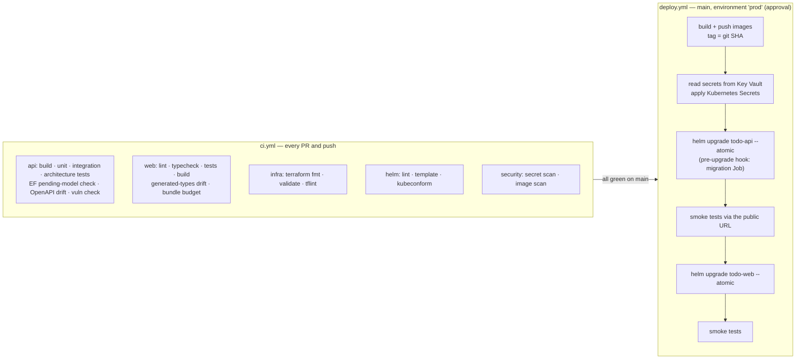

# ADR-0010: Deployment and operations — hosting, edge, CI/CD, environments and release strategy

| | |
|---|---|
| **Status** | Proposed |
| **Date** | 2026-09-29 |
| **Decision area** | **Deployment & Operations** |
| **Method** | Attribute-Driven Design; analysed with ATAM concepts |
| **Related** | `docs/requirements.md`: C-4 to C-7, Q4, Q7, NFR-4, NFR-5, NFR-7, NFR-8, NFR-10, P-1, P-5; ADR-0001 (TLS, network policies, secrets, workload identity federation); ADR-0002 (Azure, AKS, managed PostgreSQL); ADR-0003 (compression, static caching, co-location); ADR-0004 (HPA, graceful shutdown, statelessness); ADR-0006 (migration Job, roles, backups); ADR-0007 (images, repository layout); ADR-0008 (telemetry export, budget alert, fail-fast config); ADR-0009 (edge routing, API-first deploys, OpenAPI contract) |

---

## 1. Context

### 1.1 What is fixed, what is already decided, and what this ADR decides

| Fixed by the brief | Already decided | Decided here |
|---|---|---|
| Terraform (C-5), Kubernetes (C-6), Helm (C-7), AWS or Azure (C-4) | Azure + AKS + managed PostgreSQL (ADR-0002); migrations as a Helm hook Job (ADR-0006); HPA, min 2 (ADR-0004); telemetry export on in Production (ADR-0008); API deploys before web (ADR-0009) | The hosting service (confirmed); the edge (gateway / ingress / APIM); TLS and DNS; CI/CD platform and pipeline design; image build and tagging; Helm chart design; Terraform layout and state; secrets delivery; environment strategy; release strategy; rollback; cluster configuration; operations (runbooks, cost control) |

### 1.2 Drivers

| Driver | Implication |
|---|---|
| **C-5 / C-6 / C-7** | Infrastructure from Terraform; workloads on Kubernetes; deployed with Helm |
| **Q4** Availability | Zero failed requests during a rolling deployment; failed releases roll back automatically |
| **NFR-4** Reproducibility | The whole environment can be rebuilt from code; no portal changes |
| **NFR-5** Security | No stored cloud secrets in CI; no secrets in git, images or Helm history; least privilege |
| **NFR-10** HTTPS (Must, ADR-0001) | TLS at the edge with automatically renewed certificates |
| **P-1** | The system must be running at the start of the interview, and changes must be deployable quickly |
| **P-5 / NFR-8** Cost | Fits the free-trial credit and vCPU quota |
| **Q5 / P-3** | Pipelines and charts simple enough to explain and change live |

---

## 2. Decision summary

| Concern | Decision | Rejected / deferred |
|---|---|---|
| **Hosting** | **AKS** (Free tier control plane in the trial; Standard tier for production) | Azure Container Apps, ACI, App Service (don't meet C-6/C-7); AKS Automatic (considered; heavier quota needs) |
| **Edge** | **Kubernetes `Ingress` + NGINX, configured with `nginx.ingress.kubernetes.io/*` annotations;** controller: the **AKS application routing add-on** (Microsoft-managed NGINX), behind one Azure Load Balancer public IP | APIM; Application Gateway / Application Gateway for Containers (deferred, with WAF); the community ingress-nginx chart (upstream retired); Gateway API (the migration target) |
| **TLS and DNS** | **cert-manager + Let's Encrypt** (a `Certificate` in the platform release, HTTP-01 through the NGINX ingress class); a free Azure DNS label (`<label>.<region>.cloudapp.azure.com`); `force-ssl-redirect`; HSTS | Manually uploaded certificates |
| **CI/CD platform** | **GitHub Actions** with **OIDC workload identity federation** to Azure | Azure Pipelines; stored service-principal secrets |
| **Deployment model** | **Push-based:** the pipeline runs `helm upgrade --install --atomic` | GitOps (Flux / Argo CD) (deferred) |
| **Pipelines** | Four workflows: **CI** (every PR and push), **infra** (Terraform plan / apply), **platform** (cluster add-ons), **deploy** (build, push, migrate, deploy API, smoke, deploy web) | One monolithic workflow |
| **Images** | Multi-stage builds; **chiseled / minimal non-root base images**; **tagged with the git SHA** (immutable, never `latest`); pushed to ACR (Basic) | Mutable tags |
| **Helm** | **Two application charts** (`todo-api`, `todo-web`), so the API rolls out before the web (ADR-0009); platform add-ons as separate releases with pinned versions | One umbrella chart; Terraform managing in-cluster resources |
| **Terraform** | One root module for Azure resources; per-environment `tfvars` and state keys; remote state in Azure Storage with locking; `plan` on PR, **apply the reviewed plan file** on approval | Terraform workspaces for environments; local state |
| **Secrets delivery** | **Terraform writes generated secrets to Key Vault** → the deploy workflow reads them (OIDC identity) → creates Kubernetes Secrets **outside Helm**; charts reference them by name | Secrets in Helm values (stored in release history); GitHub secrets as the source of truth |
| **Environments** | **Local** (Docker Compose), **CI** (ephemeral, Testcontainers), **prod** (the one cloud environment). Structured so **staging** is a new `tfvars` + values file + GitHub environment | A full dev/test/staging/prod set in the trial |
| **Release strategy** | **Rolling update** (`maxUnavailable: 0`, `maxSurge: 1`) + readiness gates + `helm --atomic` + expand/contract migrations + API-first ordering; feature flags decouple release from deploy (ADR-0008) | Blue/green; canary (deferred: NGINX canary annotations make it the next step) |
| **Rollback** | Application: `helm rollback` to the previous SHA. Database: **forward-only** (ADR-0006) | Down-migrations in production |
| **OpenAPI** | **Yes** (ADR-0009): generated in CI, drift-checked, stored as a build artifact; **not served in production** | A public API reference UI in production |
| **Operations** | Runbooks for deploy, rollback, key rotation, restore, scale and teardown; `az aks stop` / PostgreSQL stop when not in use; the budget alert | — |

---

## 3. Options and trade-offs

### 3.1 Hosting: AKS vs Container Apps vs ACI vs App Service

| Option | What it is | Meets C-6 (Kubernetes) and C-7 (Helm)? | Verdict |
|---|---|---|---|
| **AKS** | Managed Kubernetes; we operate the workloads, Azure operates the control plane | ✅ Full Kubernetes API; Helm works natively | **Chosen** |
| AKS Automatic | AKS with opinionated, managed defaults (node provisioning, policies) | ✅ | Considered. Its defaults need more capacity than a trial quota comfortably allows; a good production option later |
| Azure Container Apps (ACA) | Serverless containers **built on** Kubernetes, but the Kubernetes API is hidden | ❌ No `kubectl`, no Helm | Rejected (constraint) |
| Azure Container Instances (ACI) | Single containers or groups, no orchestration | ❌ | Rejected (constraint) |
| App Service (containers) | PaaS web hosting | ❌ | Rejected (constraint) |

**Cluster configuration:**

| Setting | Decision | Why |
|---|---|---|
| Tier | Free (trial); Standard for production (control-plane SLA) | Cost |
| Kubernetes version | Pinned; auto-upgrade channel `patch`; node OS image auto-upgrade; a maintenance window | Security patches without surprise minor upgrades |
| Node pool | One pool, small nodes sized to the quota (ADR-0002 R2); production: separate system and user pools across zones | Quota |
| Networking | **Azure CNI Overlay with the Cilium data plane**, which **enforces network policies** (ADR-0001 layer 2) | Network policies need an engine enabled at cluster creation |
| Identity | Managed identity; **OIDC issuer + workload identity enabled** (the path to Key Vault CSI, ADR-0001 R4); `AcrPull` for the kubelet identity | No image-pull secrets; ready for pod identities |
| Access | Microsoft Entra ID authentication with Azure RBAC for Kubernetes; local accounts disabled (Should) | Operator access through identity (TB4) |

### 3.2 Edge: Ingress with NGINX (`nginx.ingress.kubernetes.io`)

**Decision (the author's choice): Kubernetes `Ingress` resources served by an NGINX ingress controller, configured with `nginx.ingress.kubernetes.io/*` annotations.**
- **Controller: the AKS application routing add-on,** which is Microsoft-managed NGINX. It is enabled through Terraform, uses the ingress class `webapprouting.kubernetes.azure.com`, and understands the same annotations as the community controller.
- **Alternative: the community `ingress-nginx` Helm chart,** which offers full configuration control.

| Option | Strengths | Weaknesses here | Verdict |
|---|---|---|---|
| **Ingress + NGINX via the AKS application routing add-on** | The familiar Ingress API and `nginx.ingress.kubernetes.io` annotations; **Microsoft patches and upgrades the controller as part of AKS**; enabled by Terraform; no extra Azure cost beyond the load balancer | Its configuration surface is narrower than the community chart's; it is based on the ingress-nginx code base (R8) | **Chosen** |
| Ingress + the community `ingress-nginx` Helm chart | The same annotations; full ConfigMap control (compression, HSTS, …) | **The upstream project has been retired** (best-effort maintenance ended in March 2026), so there are no further security fixes; we would run unpatched edge software | Alternative only |
| Gateway API + an in-cluster controller (e.g. Traefik, Envoy Gateway) | The Kubernetes-standard successor to Ingress; route weights for canaries | Different resources and annotations from the chosen style | **The migration target** (§7); `ingress2gateway` can convert Ingress resources |
| Application Gateway for Containers (managed, Gateway API) | Managed L7; WAF | Hourly cost; more Azure set-up | Deferred (production WAF path) |
| **API Management (APIM)** | API products, keys, developer portal, policies | Built for third-party API publishing; there is one first-party client; cost and an extra hop; duplicates the app's auth and rate limiting | **Rejected;** revisit for partner access (it can import the ADR-0009 OpenAPI document) |
| Azure Front Door | Global edge, CDN, WAF | No multi-region or CDN need yet (ADR-0003) | Deferred |

**Edge configuration:**

| Concern | Setting | Source |
|---|---|---|
| Routing | **Two `Ingress` resources on the same host:** `todo-api` (path `/api`, `Prefix`) and `todo-web` (path `/`, `Prefix`). NGINX merges them and the longest prefix wins. **No path for `/health`** | ADR-0009 |
| TLS | Both Ingresses reference one TLS secret (`todo-tls`), produced by a cert-manager **`Certificate`** in the platform release (HTTP-01 solver using the NGINX ingress class). Keeping the `Certificate` separate stops two Ingresses from both trying to own the same certificate | ADR-0001, NFR-10 |
| HTTPS redirect | `nginx.ingress.kubernetes.io/force-ssl-redirect: "true"` | NFR-10 |
| HSTS | The controller's default HSTS header over TLS | ADR-0001 |
| Request body limit | `nginx.ingress.kubernetes.io/proxy-body-size: "64k"` on the API Ingress | ADR-0009 §3.7 |
| Compression | In the controller configuration where the add-on exposes it. Otherwise: Next.js compresses its own responses (its default), and the API's JSON is small | ADR-0003 |
| **Snippets** | **Never** use `configuration-snippet` / `server-snippet` annotations (they stay disabled) | Snippet injection has been the source of serious ingress-nginx vulnerabilities |
| Public IP and DNS | The controller's `LoadBalancer` service carries the Azure DNS-label annotation → `<label>.<region>.cloudapp.azure.com` (set through the add-on's `NginxIngressController` resource, or chart values for the community chart) | Free, stable hostname for Let's Encrypt |
| Replicas | Managed by the add-on (2 where capacity allows) | Q4 |

**The API chart's Ingress template:**

```yaml
# deploy/helm/todo-api/templates/ingress.yaml
apiVersion: networking.k8s.io/v1
kind: Ingress
metadata:
  name: {{ include "todo-api.fullname" . }}
  annotations:
    nginx.ingress.kubernetes.io/force-ssl-redirect: "true"
    nginx.ingress.kubernetes.io/proxy-body-size: {{ .Values.ingress.maxBodySize | quote }}   # "64k"
spec:
  ingressClassName: {{ .Values.ingress.className }}          # webapprouting.kubernetes.azure.com
  tls:
    - hosts: [{{ .Values.ingress.host | quote }}]
      secretName: {{ .Values.ingress.tlsSecretName }}        # todo-tls (from the platform Certificate)
  rules:
    - host: {{ .Values.ingress.host | quote }}
      http:
        paths:
          - path: /api
            pathType: Prefix
            backend:
              service:
                name: {{ include "todo-api.fullname" . }}
                port:
                  number: {{ .Values.service.port }}
```

### 3.3 CI/CD platform: GitHub Actions vs Azure Pipelines

| Criterion | **GitHub Actions** | Azure Pipelines |
|---|---|---|
| Where the code lives | ++ The repository is on GitHub (`.github/` already exists) | + Works with GitHub, but it's a separate system |
| Azure authentication without secrets | ++ OIDC workload identity federation with `azure/login` | ++ Workload identity service connections |
| Environments, approvals and secrets | ++ GitHub environments with required reviewers | ++ Environments and approvals |
| Ecosystem | ++ Official actions for .NET, Node, Terraform, Helm, Azure | + Tasks |
| Cost for this project | ++ Included minutes | + Free tier |
| One place to review code *and* pipelines | ++ | − |

**Decision: GitHub Actions.** Both are capable; the deciding factor is keeping code, pull requests, pipelines and approvals in one place.

**Push-based deployment vs GitOps:**

| Option | Verdict | Why |
|---|---|---|
| **Push:** the pipeline runs `helm upgrade --atomic` | **Chosen** | Simple, visible and easy to demonstrate; one environment |
| GitOps (Flux as an AKS extension, or Argo CD) | Deferred | Drift correction and multi-environment promotion pay off with several environments and teams |

### 3.4 Pipeline design



| Workflow | Trigger | Steps | Identity |
|---|---|---|---|
| **`ci.yml`** | Every PR and push (path filters per area) | Everything that can fail fast without the cloud (above) | None needed |
| **`infra.yml`** | PRs touching `infra/` (plan); `main` (apply, with approval) | `terraform plan -out` → reviewed → **apply that exact plan file** | OIDC identity with rights on the resource group |
| **`platform.yml`** | Changes to `deploy/platform/`; manual | Install or upgrade cert-manager, the `ClusterIssuer` and the `Certificate` (the ingress controller itself is the AKS add-on, enabled by Terraform); bootstrap database roles (once) | OIDC identity with cluster-admin via Azure RBAC |
| **`deploy.yml`** | `main` after CI passes; manual re-run | Build and push SHA-tagged images → secrets → **API release (migration hook runs first)** → smoke → **web release** → smoke | OIDC identity: `AcrPush`, cluster deploy role, Key Vault Secrets User |

**Smoke tests** run against the public URL. They prove the edge, TLS, routing and pods are all wired up, without needing a test account:
- `GET /` returns 200.
- `GET /api/auth/me` returns **401 problem+json**, which proves routing and the API are up.
- The certificate is valid.

Full user journeys (sign in → create → schedule → complete → delete → sign out) are **checked manually** from the release checklist; browser automation is deferred (ADR-0011 D6).

### 3.5 Images

| Decision | Why |
|---|---|
| Multi-stage Dockerfiles (`api/Dockerfile`, `web/Dockerfile`) | Small runtime images; the SDK and build tools never ship |
| **API:** a chiseled .NET runtime image; contains the app **and the EF migration bundle** (ADR-0006) | Minimal attack surface; non-root by default; one image for the app and the migration Job |
| **Web:** Next.js `standalone` output on a minimal Node image, as non-root (ADR-0002) | Small image |
| **Tag = git SHA,** never `latest`; images are immutable | Every deployment and rollback is exact and traceable |
| Image scan (e.g. Trivy) in CI; fail on critical vulnerabilities (Should) | Supply chain (ADR-0001 layer 8) |
| ACR Basic; periodic purge of old tags (Should) | Cost |

### 3.6 Helm chart design

| Decision | Why |
|---|---|
| **Two charts:** `deploy/helm/todo-api`, `deploy/helm/todo-web` | Separate releases give **API-first ordering** (ADR-0009) and independent rollback |
| **Platform add-ons as separate releases,** with pinned chart versions and values in `deploy/platform/` | The application lifecycle stays separate from the platform lifecycle |
| Per-environment values: `values.yaml` (defaults) + `values-prod.yaml` | Staging becomes one more values file |

**Templates in `todo-api`** (and the equivalents in `todo-web`):

| Template | Contents | Source |
|---|---|---|
| `Deployment` | Rolling update `maxUnavailable: 0`, `maxSurge: 1`; **startup, readiness and liveness probes** (`/health/ready`, `/health/live`); resource requests and limits from observed usage; `securityContext` (non-root, read-only root filesystem, drop all capabilities, `RuntimeDefault` seccomp); `terminationGracePeriodSeconds` + a short `preStop` delay so the edge stops routing before shutdown | ADR-0001, ADR-0004 |
| `Service` | ClusterIP only | ADR-0001 |
| `Ingress` | `/api` → this service; `ingressClassName` + `nginx.ingress.kubernetes.io` annotations (§3.2) | ADR-0009 |
| `HorizontalPodAutoscaler` | Min 2, bounded max (ADR-0004 rule), CPU ~70% | ADR-0004 |
| `PodDisruptionBudget` | `minAvailable: 1` | Q4 |
| `NetworkPolicy` | Ingress traffic only from the ingress controller's namespace; egress only to PostgreSQL, DNS and the telemetry endpoint | ADR-0001 |
| `ConfigMap` | Non-secret settings (ADR-0008) | — |
| Migration `Job` | `helm.sh/hook: pre-install,pre-upgrade`; runs the migration bundle + seed with the **migration role's** secret | ADR-0006 |
| Secrets | **Referenced by name only** (`existingSecret`), never templated from values | Helm stores values in its release history; secrets must not be there |

### 3.7 Terraform layout and state

```
infra/
├── bootstrap/                # one-off script: state storage account + CI identity + federated credentials
└── terraform/
    ├── versions.tf           # pinned Terraform and provider versions
    ├── main.tf               # resource group, naming, tags
    ├── network.tf            # (Should) VNet for private PostgreSQL access later
    ├── aks.tf                # AKS: CNI Overlay + Cilium, OIDC issuer, workload identity, Entra RBAC
    ├── acr.tf                # container registry + AcrPull for the kubelet identity
    ├── postgres.tf           # Flexible Server, database, firewall, backup retention
    ├── keyvault.tf           # Key Vault + generated secrets (DB passwords, JWT signing key, seed passwords)
    ├── monitoring.tf         # Log Analytics workspace + Application Insights; budget + alerts (ADR-0008)
    ├── outputs.tf
    └── env/prod.tfvars       # environment values; staging = env/staging.tfvars + its own state key
```

| Decision | Why |
|---|---|
| **Terraform manages Azure resources only;** Helm manages everything inside the cluster | Avoids Terraform needing cluster credentials at plan time; each tool does what it's best at |
| Remote state in Azure Storage (blob lease locking), a **separate state key per environment** | Safe concurrent runs; isolated environments |
| Per-environment `tfvars` + state keys, **not** Terraform workspaces | Explicit and reviewable |
| **Bootstrap** (the state storage and CI identity) is a documented one-off script | Terraform can't create the identity it runs as |
| `plan` on PR; **apply the saved plan file** after approval | What was reviewed is exactly what is applied |
| Provider versions pinned; `fmt`, `validate`, `tflint` in CI | Reproducibility (NFR-4) |
| Generated secrets (`random_password`) go into **Key Vault**; state storage is private and RBAC-protected | Secrets in state are unavoidable for generated values, so the state is protected like a secret |

### 3.8 Secrets delivery

```
Terraform ──generates──> Key Vault ──read by deploy.yml (OIDC, Key Vault Secrets User)──> kubectl apply Secret ──> pods (env vars)
```

| Decision | Why |
|---|---|
| **Key Vault is the source of truth** for runtime secrets, written by Terraform | No manual copying; one place to rotate |
| The deploy workflow creates the **Kubernetes Secrets itself** (`kubectl apply` from a dry-run manifest), **before** `helm upgrade` | Secret values never enter Helm values or release history |
| Separate secrets: `todo-api-runtime` (runtime DB role, JWT key, telemetry), `todo-api-migrations` (migration role, seed passwords) | Runtime pods never see migration or admin credentials (ADR-0006) |
| **Database role bootstrap** (ADR-0006 §3.9): an idempotent Job run once by `platform.yml`, with the admin credential from Key Vault; the admin credential never becomes a standing cluster Secret | Least privilege |
| Later: the Key Vault CSI driver with workload identity mounts secrets directly into pods | Removes Kubernetes Secrets altogether (ADR-0001 R4) |

### 3.9 Environment strategy

| Environment | Purpose | Where | Status |
|---|---|---|---|
| **Local** | Development and the fallback demo | Docker Compose: API, web, PostgreSQL, Aspire dashboard (NFR-7, ADR-0008) | ✅ |
| **CI (ephemeral)** | Automated tests on every change | GitHub runners; Testcontainers PostgreSQL | ✅ |
| **prod** | The deployed system (the interview demo) | AKS + managed PostgreSQL | ✅ |
| **staging** | Pre-production verification; migration rehearsal on production-like data | A second resource group (or a namespace in a shared cluster, to save cost) | **Deferred.** Adding it is a new `env/staging.tfvars`, `values-staging.yaml` and GitHub environment |
| Per-PR preview environments | Review changes live | Namespace per PR | Deferred |

**Why not dev / test / staging / prod now:**
- With one developer and a trial quota, extra environments cost money and time.
- **Local + CI already cover the "dev" and "test" purposes.**
- The design keeps **promotion by the same artifact**: the same SHA-tagged images and chart move between environments, with only values differing ("build once, deploy many", ADR-0008).

### 3.10 Release strategy

| Strategy | How it works | Fit | Verdict |
|---|---|---|---|
| **Rolling update** | Pods are replaced a few at a time; readiness gates traffic | Zero downtime with `maxUnavailable: 0`; no extra infrastructure | **Chosen** |
| Blue/green | Two full environments; switch traffic at the edge | Needs double capacity (the trial quota can't afford it). The shared database still requires compatible migrations, so it doesn't remove the expand/contract discipline | Rejected for now |
| Canary | Send a small share of traffic to the new version, then analyse its metrics | Needs traffic splitting + automated analysis (e.g. Flagger / Argo Rollouts). **NGINX already supports splitting** through `nginx.ingress.kubernetes.io/canary` + `canary-weight` annotations | **Deferred:** the natural next step once there is real traffic to analyse |
| Feature flags | Deploy dark; release by configuration | Complements any strategy (ADR-0008) | ✅ When needed |

**What makes the rolling update safe:**

| Safeguard | Source |
|---|---|
| Readiness includes a database check; a pod gets traffic only when it can serve it | ADR-0004 |
| Fail-fast configuration validation: a misconfigured pod never becomes ready | ADR-0008 |
| `helm upgrade --atomic --wait --timeout`: if new pods don't become ready, **the release rolls back automatically** | NFR-5 in requirements |
| Migrations run first (hook) and are **backward-compatible** (expand/contract) | ADR-0006 |
| **API before web;** additive-only contract changes | ADR-0009 |
| Graceful shutdown + `preStop` delay + PDB | ADR-0004 |

**Rollback:** `helm rollback todo-api <revision>` (and the same for web) restores the previous SHA. The database is never rolled back. This is safe because every migration is compatible with the previous application version (ADR-0006 §3.4).

### 3.11 OpenAPI in deployment

OpenAPI is used (ADR-0009). In the delivery pipeline:
- **CI** generates the document and fails if the committed `openapi.json` or the generated TypeScript types have drifted.
- **The document is stored as a build artifact** for each SHA.
- **It is not served in production.** The API reference UI exists only in Development, to reduce the public surface.
- If APIM or an external consumer ever appears, the document is the import source.

### 3.12 Operations

| Runbook (`docs/runbook.md`) | Contents |
|---|---|
| Deploy | Merge to `main` → approve the `prod` environment → watch smoke tests |
| Rollback | `helm history` → `helm rollback` (API and/or web); never roll back the database |
| Emergency sign-out of all users | Rotate the JWT signing key in Key Vault → redeploy (ADR-0001 R1) |
| Restore the database | Point-in-time restore to a new server → switch the connection secret (ADR-0006) |
| Scale | Change HPA bounds or node count in values / `tfvars` (never by hand) |
| Certificate problems | Check the cert-manager `Certificate` and `Order` status |
| **Pause to save cost** | `az aks stop` / `az postgres flexible-server stop` between demos; start them well before the interview (P-1). A stopped PostgreSQL server restarts automatically after about 7 days |
| Teardown | `terraform destroy` after the interview (NFR-8) |
| **Rebuild from zero** | Bootstrap → infra → platform → deploy; timed once to prove NFR-4 |

---

## 4. ATAM analysis

### 4.1 Sensitivity points

| # | Sensitivity point | Attributes affected |
|---|---|---|
| S1 | **Readiness probes + `--atomic`.** Automatic rollback is only as good as the readiness signal | Availability (Q4) |
| S2 | **Migration hook ordering and compatibility** | Availability, Data integrity |
| S3 | **Surge capacity.** `maxSurge: 1` needs room for one extra pod per deployment, which is tight on a single small node | Availability, Cost |
| S4 | **Secrets flow** (Key Vault → Kubernetes Secrets, outside Helm) | Security |
| S5 | **Certificate issuance and renewal** (cert-manager, Let's Encrypt, DNS label) | Availability, Security (NFR-10) |
| S6 | **Trial quota** | Availability, Scalability |

### 4.2 Trade-offs

| # | Trade-off | Chosen side | Accepted cost |
|---|---|---|---|
| T1 | Ingress + NGINX (AKS add-on) vs Gateway API, a managed gateway (AGC / App Gateway) or APIM | Familiar annotations; Microsoft-managed patching; no extra Azure cost | Built on a retired upstream code base (R8); a narrower configuration surface than the community chart; no managed WAF |
| T2 | GitHub Actions vs Azure Pipelines | One place for code, pipelines and approvals | Coupled to GitHub |
| T3 | Push deploys vs GitOps | Simplicity; easy to demonstrate | No automatic drift correction in the cluster |
| T4 | Rolling vs blue/green / canary | Zero downtime with no extra capacity | No gradual exposure to real traffic before full rollout |
| T5 | One cloud environment vs dev/test/staging/prod | Cost and time within the trial | Changes reach prod after CI only (R2) |
| T6 | Two app charts vs one umbrella chart | Enforced API-first ordering; independent rollback | Two releases to manage |
| T7 | Secrets created outside Helm vs Helm values | No secrets in release history | An extra pipeline step |
| T8 | Public PostgreSQL endpoint (firewalled, TLS) vs private access | Simpler networking for the MVP | Broader exposure (ADR-0001 R5) |

### 4.3 Risks

| # | Risk | Mitigation |
|---|---|---|
| R1 | Trial quota prevents surge pods or 2 ingress controller replicas | Small requests; measure; document the achieved replica counts; `maxSurge` is still honoured with `maxUnavailable: 0` if capacity exists |
| R2 | **No staging:** a change is exercised in production after passing only CI | Strong CI (integration tests against real PostgreSQL, drift checks); `--atomic`; smoke tests; staging is one values file away |
| R3 | A single ingress controller replica or single node is a point of failure | Accepted for the trial; production: 2+ ingress controllery replicas, multi-node, zones |
| R4 | Let's Encrypt rate limits or a challenge failure block TLS | Use the staging issuer while testing; switch to production once; monitor certificate status (ADR-0008 alert) |
| R5 | `helm rollback` after a migration that isn't backward-compatible breaks the old version | The expand/contract rules (ADR-0006) and generated-SQL review |
| R6 | A stopped cluster isn't ready at interview time | Start it well ahead; the local Docker Compose fallback (P-1) |
| R7 | The OIDC federation or RBAC is misconfigured, blocking deploys on the day | Exercise the full pipeline end to end before the interview |
| R8 | **The NGINX ingress code base is retired upstream.** The community chart receives no security fixes, and the add-on's long-term support depends on Microsoft | Use the Microsoft-managed add-on (patched with AKS) rather than the community chart; confirm the add-on's current support window; no snippet annotations; plan the migration to Gateway API (`ingress2gateway` converts Ingress resources) |

### 4.4 Non-risks

| # | Non-risk | Because |
|---|---|---|
| N1 | Stored cloud credentials leaking from CI | There are none: OIDC federation |
| N2 | "Works on my machine" differences | The same images run locally (Compose), in CI and in prod |
| N3 | Ambiguous deployments or rollbacks | Immutable SHA tags; Helm revision history |
| N4 | Secrets in git, images or Helm history | Key Vault → Kubernetes Secrets outside Helm; secret scanning in CI |

---

## 5. Consequences

**Positive**
- Every hard constraint is met: Terraform for Azure, Helm for everything in the cluster, AKS for hosting.
- Deployments are automated, keyless, traceable to a commit, and self-rolling-back.
- The whole environment can be rebuilt from code.
- Every deferred item (staging, canary, GitOps, managed WAF, private networking, Key Vault CSI) has a defined path.

**Negative / follow-ups**
- cert-manager is ours to patch; the ingress controller is patched by Microsoft through the add-on.
- The edge is built on a retired upstream code base (R8), so a migration to Gateway API is planned.
- No staging environment in the trial (R2).
- A bootstrap script and a runbook must be written and tested.

### Impacts on other decision areas

| Decision area | Constraint or input from this decision |
|---|---|
| **Security (ADR-0001)** | TLS at the ingress controller with cert-manager; no snippet annotations; Cilium enforces network policies; Key Vault holds the runtime secrets (partly addresses R4); Entra ID + RBAC for operator access |
| **Performance (ADR-0003)** | Compression at the ingress controller where available, otherwise by Next.js; static-asset caching headers; API and database in the same region |
| **Scalability (ADR-0004)** | HPA and PDB in the charts; surge capacity vs quota (S3); cluster autoscaler for production |
| **Data (ADR-0006)** | The migration Job hook; the role bootstrap Job; backup retention and restore drill in the runbook |
| **Cross-cutting (ADR-0008)** | Application Insights and the budget in Terraform; the connection string delivered as a secret; Aspire dashboard in Compose |
| **Communication (ADR-0009)** | Two `Ingress` resources on one host implement the same-origin routing; `/health` isn't routed; the body limit at the edge; API-first releases |
| **Technology & tooling** | GitHub Actions; Terraform `azurerm` (+ `random`); Helm; AKS application routing add-on (NGINX Ingress, `nginx.ingress.kubernetes.io` annotations); cert-manager; Let's Encrypt; Trivy; kubeconform; tflint; gitleaks |
| **Evolution & extensibility** | Staging; canary (NGINX canary annotations + Flagger / Argo Rollouts); migrate Ingress → Gateway API; GitOps (Flux); Application Gateway for Containers or Front Door with WAF; private networking; Key Vault CSI; AKS Standard tier, zones, cluster autoscaler |

---

## 6. Verification

| Check | How | Driver |
|---|---|---|
| Infrastructure has no drift | `terraform plan` after apply shows no changes | NFR-4 |
| Rebuild from zero | Run bootstrap → infra → platform → deploy on a fresh subscription or resource group; record the time | NFR-4 |
| A failing release rolls back | Deploy an image whose readiness fails → `--atomic` restores the previous revision; the app keeps serving | NFR-5, Q4 |
| Zero failed requests during a rollout | **Manual drill:** a simple request loop (e.g. `curl` in a shell loop) during `helm upgrade`, counting non-2xx responses (load tooling deferred, ADR-0011 D7) | Q4 |
| API-first ordering | The pipeline log shows the API release and smoke tests before the web release | ADR-0009 |
| TLS | A valid certificate; HTTP redirects to HTTPS; HSTS present | NFR-10 |
| No secrets in Helm history | `helm get values todo-api` shows no secret values | NFR-5 |
| Keyless CI | The workflows contain no Azure client secrets; login uses OIDC | NFR-5 |
| Health endpoints not public | `GET /health/ready` through the public URL → not found | ADR-0009 |

## 7. Revisit when

- There is more than one team or real users. Add staging and GitOps; consider canary releases.
- A managed WAF or partner API access is needed. Adopt Application Gateway for Containers or Front Door (WAF), and APIM for partners.
- Real customer data is stored. Move PostgreSQL to private access; mount secrets with Key Vault CSI; use the AKS Standard tier with zones.
- Deployment frequency grows. Add per-PR preview environments.
- The add-on's support window ends, or Gateway API features are needed (e.g. richer traffic splitting). Migrate the Ingress resources to Gateway API (R8).

---

## Change log

| Date | Change |
|---|---|
| 2026-09-29 | First version: Gateway API with Traefik at the edge |
| 2026-09-29 | **Revised at the author's decision:** Kubernetes `Ingress` with NGINX (`nginx.ingress.kubernetes.io` annotations), using the Microsoft-managed AKS application routing add-on as the controller; a cert-manager `Certificate` shared by the two Ingresses; canary via NGINX canary annotations; added R8 (retired upstream) and the Gateway API migration path |
