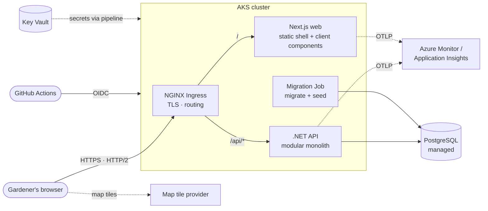
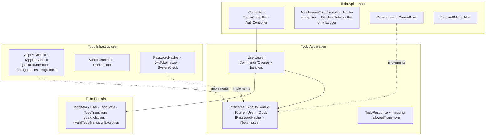
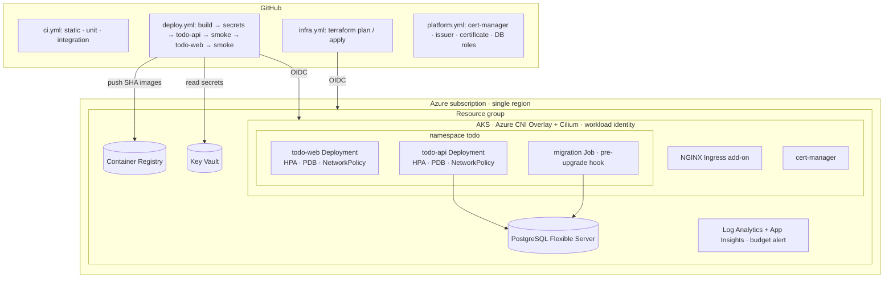
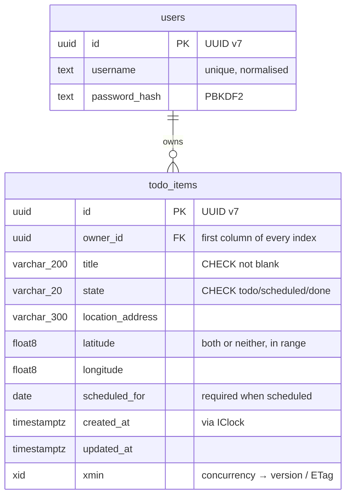
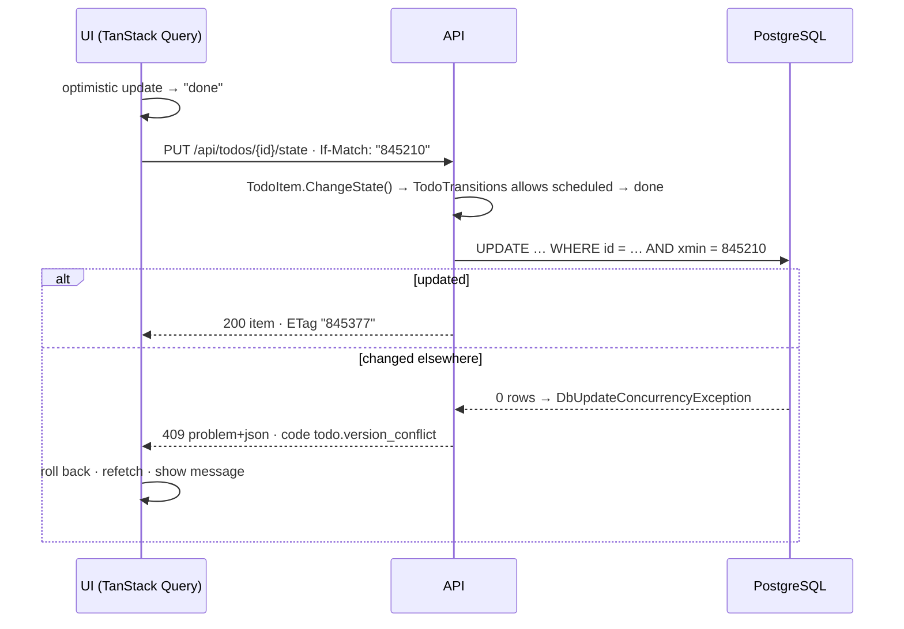
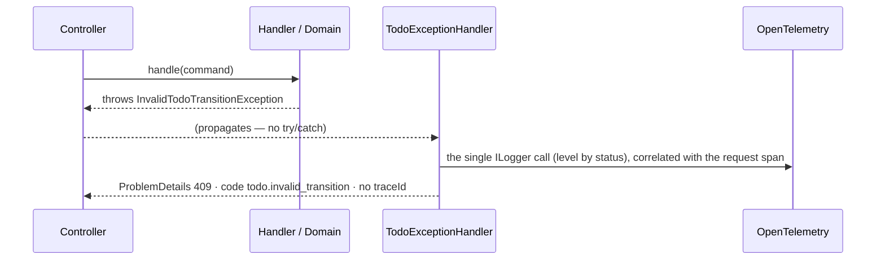
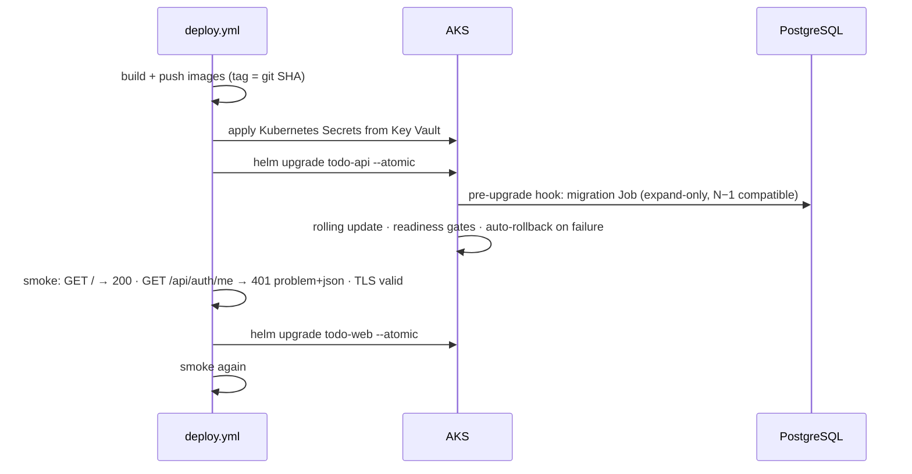

# Architecture: Location-aware Todo App (rush-todo)

| | |
|---|---|
| **Status** | Baselined: all decision areas have a Proposed ADR |
| **Last updated** | 2026-09-29 |
| **Inputs** | [`requirements.md`](requirements.md) (drivers), [`adr/`](adr/README.md) (ADR-0001 to ADR-0012) |
| **Method** | Attribute-Driven Design (ADD) to make decisions driver by driver; ATAM concepts (sensitivity points, trade-offs, risks, non-risks) to analyse them. This document consolidates the results |

> **How to read this document.** Sections 1–3 give the big picture in ten minutes. Section 4 shows the views. Sections 5–7 explain *why*, and section 8 is the consolidated ATAM analysis. Every statement links to the ADR that decided it. **If this document and an ADR disagree, the ADR wins, and this document should be corrected.**

---

## 1. The system at a glance

**What it is:** an API-driven web application in which gardeners record jobs (Todo items) at customer locations and plan each day's work. Each item has a title, a state (`todo`, `scheduled`, `done`) and a location (an address plus an optional map point).

**Shape:** a **Next.js (React) web tier** and a **.NET API**, organised as a **modular monolith with Clean Architecture layers**, backed by **managed PostgreSQL**. It runs on **AKS**, is provisioned by **Terraform**, and is deployed by **Helm** from **GitHub Actions**.

| Aspect | Choice | ADR |
|---|---|---|
| Front end | Next.js (React), static shell + client-side data fetching, TanStack Query; no Server Actions | [0002](adr/0002-technology-stack.md), [0003](adr/0003-performance.md) |
| API | ASP.NET Core (.NET LTS), **controller-based REST**, Clean Architecture (Api / Application / Domain / Infrastructure) | [0002](adr/0002-technology-stack.md), [0007](adr/0007-component-and-structural.md), [0009](adr/0009-communication-and-interaction.md) |
| Data | PostgreSQL (Azure Flexible Server), EF Core code-first, `xmin` optimistic concurrency | [0006](adr/0006-data-architecture.md) |
| Security | Username + password → **JWT in an `HttpOnly` cookie** (or bearer); deny by default; **owner filter on every query**; defence in depth | [0001](adr/0001-security-authentication-and-authorization.md) |
| Errors | Built-in **ProblemDetails** (RFC 9457) via one `TodoExceptionHandler`; stable `code`; no `traceId` | [0008](adr/0008-cross-cutting-concerns.md) |
| Observability | **OpenTelemetry instrumentation first**; the only `ILogger` call is in `TodoExceptionHandler` | [0008](adr/0008-cross-cutting-concerns.md) |
| Hosting | AKS (Cilium network policies, workload identity), **NGINX Ingress** (AKS application routing add-on), cert-manager + Let's Encrypt | [0010](adr/0010-deployment-and-operations.md) |
| Delivery | GitHub Actions (OIDC, no stored cloud secrets); SHA-tagged images; **API released before web**; rolling updates with `helm --atomic` | [0010](adr/0010-deployment-and-operations.md) |
| Testing | xUnit v3 + Testcontainers (real PostgreSQL, real login); Vitest + Testing Library (stubbed `fetch`); **no browser or load-test automation for now:** full-stack journeys checked manually | [0011](adr/0011-testability-strategy-and-testing-tooling.md) |
| Evolution | The N / N−1 compatibility rule; additive API enforced by `oasdiff`; forward-only migrations | [0012](adr/0012-evolution-and-extensibility.md) |

---

## 2. Architectural drivers

### 2.1 Constraints (from the brief)

React web UI (C-1) · an allowed backend language (C-2) · a CRUD API (C-3) · AWS or Azure (C-4) · **Terraform (C-5) · Kubernetes (C-6) · Helm (C-7)** · production-ready, including tests (C-8).

Process constraints from the interview notes (P-1 to P-7):
- the system must run at the start of the interview
- changes will be made live **without AI**
- the architecture and code must be explained
- the free-trial budget applies

### 2.2 Quality attribute utility tree

The priority is *business importance / technical risk*. High/high scenarios were decided first (ADD).

| Priority | Scenario | Measure | Realised mainly in |
|---|---|---|---|
| **H/H** | **Q1 Isolation:** user A can't read or change user B's items | Cross-user access is indistinguishable from "not found" | ADR-0001, 0006, 0009 |
| **H/H** | **Q2 State rules:** illegal transitions are rejected | Every matrix pair is correct | ADR-0005, 0007, 0008 |
| H/M | **Q3 Performance:** list 1,000+ items, filtered and paged | p95 < 200 ms | ADR-0003, 0006 |
| H/L | **Q7 Scalability:** 10× load by adding replicas | Near-linear from 1 to 3 replicas, with Q3 still met | ADR-0004 |
| H/L | **Q8 Authentication:** unauthenticated or invalid credentials are rejected | 100% rejected | ADR-0001 |
| M/M | **Q4 Availability:** zero failed requests during rolling deploys | 0 failures; failed releases roll back | ADR-0004, 0010, 0012 |
| M/M | **Q6 Data integrity:** concurrent edits aren't lost | 0 silent overwrites | ADR-0006, 0009 |
| M/L | **Q5 Modifiability:** add a field end to end, by hand, without AI | < 30 min (about 12 files) | ADR-0005, 0007 |

### 2.3 Design principles

These principles recur across the ADRs. They are the shortest way to explain *why* the system looks the way it does.

| # | Principle | Where it shows |
|---|---|---|
| P1 | **Right-sizing:** does an abstraction solve a problem that exists *here*, or add indirection for its own sake? | No repository, MediatR, CQRS read models, microservices or caches; one `IClock` port; MSW deferred (0003, 0004, 0005, 0011) |
| P2 | **The API is the only enforcement point** for authentication, authorization and rules | UI checks are UX only; no Server Actions (0001, 0002) |
| P3 | **Defence in depth, deny by default** | Eight security layers; database constraints back up validation (0001, 0006) |
| P4 | **Everything survives N / N−1 overlap:** API, schema, tokens, configuration | Expand/contract, additive contract, API-first deploys, `kid` rotation (0006, 0009, 0010, 0012) |
| P5 | **Build once, deploy many** | Immutable SHA images; configuration per environment; no environment values baked into the bundle (0008, 0010) |
| P6 | **Instrumentation first; one log call at the one chokepoint** | OpenTelemetry for requests and database calls; one `ILogger` in `TodoExceptionHandler` (0008) |
| P7 | **Test against the real thing, at the right level** | Real PostgreSQL, real login, real HTTP pipeline; no mocked ORM. Automation stops at the component and integration levels; full-stack journeys are checked by hand (0005, 0011) |
| P8 | **Make foreseeable change cheap; defer the rest behind observable triggers** | Nine extension points; the evolution register (0012) |

---

## 3. Solution overview



- **The browser sees one origin.** `/api/*` goes straight to the API and everything else to the web tier (ADR-0001 S4, ADR-0003, ADR-0009).
- **The web tier never calls the API server-side.** All data flows browser → API, so authorization lives in one place (P2).
- The API holds **all business rules and the only authorization logic.** PostgreSQL enforces integrity as a backstop.

---

## 4. Views

### 4.1 Container view

| Container | Technology | Responsibility | Scales | ADR |
|---|---|---|---|---|
| **Web** | Next.js (App Router), standalone Node server | Serves the static shell and client bundles; UX-only route guard; security headers | Horizontally (HPA, min 2) | 0002, 0003, 0007 |
| **API** | ASP.NET Core, controllers | Authentication, authorization, business rules, data access, ProblemDetails | Horizontally (HPA, min 2, max bounded by DB connections) | 0004, 0007, 0009 |
| **Migration Job** | The API image, migrate/seed entry point | Applies EF migrations + idempotent seeding, **once per release**, before the API rolls out | Runs once (Helm hook) | 0006, 0010 |
| **Database** | Azure Database for PostgreSQL – Flexible Server | Persistence; constraints; `xmin` concurrency | Vertically (single primary) | 0002, 0004, 0006 |
| **Ingress** | NGINX Ingress (AKS application routing add-on) + cert-manager | TLS, HTTPS redirect, path routing, body-size limit | Managed by the add-on | 0010 |
| **Supporting services** | ACR, Key Vault, Log Analytics / Application Insights | Images; secrets (the pipeline's source); telemetry | Managed | 0008, 0010 |

### 4.2 Component view: API (Clean Architecture)



| Rule | Enforced by | ADR |
|---|---|---|
| Domain depends on nothing; Application doesn't depend on Infrastructure | Compiler (project references) | 0007 |
| Controllers are thin (bind → handler → success result), with no Infrastructure types | ArchUnitNET | 0007 |
| `Todos` and `Auth` reference each other by id only | ArchUnitNET | 0007 |
| `ILogger` is used only in `TodoExceptionHandler`; no direct `UtcNow` | ArchUnitNET | 0008, 0011 |
| No repository, MediatR or AutoMapper; the EF context through `IAppDbContext` | Review; ADR guardrails | 0005, 0007, 0011 |
| `IgnoreQueryFilters()` is never used outside tests | ArchUnitNET / CI search | 0006 |

**Modules:** `Auth` (users, login, logout, me, tokens, seeding) and `Todos` (items, transitions, all operations) appear as feature folders in every layer (ADR-0004 §3.5, ADR-0007 §3.5).

### 4.3 Component view: web

| Folder | Contents | Rule |
|---|---|---|
| `src/app/` | Thin routes: `layout.tsx` (static shell), `login/`, `todos/` | No feature logic |
| `src/components/todos/`, `src/components/auth/` | **Feature folders:** components, TanStack Query hooks, API calls, form schema, co-located tests | Features don't import from each other |
| `src/components/ui/` | Generic presentational components | Feature-free |
| `src/lib/api/` | **Generated OpenAPI types**; one fetch wrapper (same origin, JSON, `If-Match`, ProblemDetails → `ApiError`) | Feature-free |
| `src/middleware.ts` | UX redirect to sign-in only | Never authorization |

### 4.4 Deployment view



| Topic | Decision | ADR |
|---|---|---|
| Environments | Local (Docker Compose), CI (ephemeral), **prod**; staging is one values file away | 0010 |
| Release strategy | Rolling (`maxUnavailable: 0`), readiness gates, `helm --atomic`, API before web, migration hook first | 0010 |
| Rollback | `helm rollback` (application); database forward-only | 0006, 0010, 0012 |
| Secrets | Terraform → Key Vault → pipeline → Kubernetes Secrets (outside Helm history) | 0010 |
| Infrastructure as code | Terraform for Azure; Helm for everything in the cluster; plan on PR, apply the saved plan | 0010 |
| Cost control | Trial-sized tiers; budget alert; stop AKS and PostgreSQL between demos | 0008, 0010 |

### 4.5 Data view



| Concern | Decision | ADR |
|---|---|---|
| Access | EF Core + Npgsql; reads project with `AsNoTracking`; writes go through the entity | 0006 |
| Isolation | Global owner filter bound to `ICurrentUser`; row-level security deferred | 0001, 0006 |
| Integrity | Rules in the domain (guard clauses, transition table) **and** in the database (`CHECK`, `NOT NULL`, foreign key) | 0005, 0006 |
| Concurrency | `xmin` → `version` / `ETag`; `If-Match` required on updates; conflict → 409 | 0006, 0009 |
| Schema change | Code-first; generated SQL reviewed; **expand/contract**; forward-only; migration Job | 0006, 0012 |
| Roles | Admin (break-glass) · migration (DDL) · runtime (DML only) | 0006, 0010 |
| Personal data | Addresses and coordinates: minimised, TLS in transit, encrypted at rest, never logged | 0006, 0008 |

### 4.6 Runtime views

**(a) Sign-in and an isolated read (Q1, Q8)**

```mermaid
sequenceDiagram
    participant B as Browser
    participant I as Ingress
    participant A as API
    participant D as PostgreSQL
    B->>I: POST /api/auth/login {username, password}
    I->>A: route /api/*
    A->>A: rate limit · verify PBKDF2 hash (dummy hash if unknown)
    A-->>B: 200 {id, username} + Set-Cookie (JWT; HttpOnly; Secure; SameSite=Strict)
    B->>A: GET /api/todos?state=scheduled (cookie sent automatically)
    A->>A: validate JWT (iss, aud, exp, alg pinned) → ICurrentUser.sub
    A->>D: SELECT … WHERE owner_id = sub AND state = … ORDER BY … LIMIT 50
    A-->>B: 200 {items, page, pageSize, totalCount} · Cache-Control: no-store
```

**(b) An optimistic state change with a concurrency conflict (Q2, Q6)**



**(c) The error path: one mapping, one log record**



| Exception | Status | `code` |
|---|---|---|
| `KeyNotFoundException` (missing, or not yours) | 404 | `todo.not_found` |
| `InvalidTodoTransitionException` | 409 | `todo.invalid_transition` |
| `DbUpdateConcurrencyException` | 409 | `todo.version_conflict` |
| `ArgumentException` (guard clauses) | 400 | `validation_failed` + `errors[field]` |
| Anything else | 500 | `server_error` (generic) |

**(d) A release**



---

## 5. How the quality attributes are achieved

| Scenario | Tactics | Key mechanisms | Verified by | ADRs |
|---|---|---|---|---|
| **Q1 Isolation** | Authorize by default; limit exposure; no leakage | Deny-by-default fallback policy; **global owner filter**; owner only from the token; 404 not 403; UUID v7 ids; no `IgnoreQueryFilters` | Integration tests (alice/bob) through the real login; ArchUnitNET | 0001, 0006, 0009, 0011 |
| **Q2 State rules** | A single source of rules | `TodoTransitions` table in Domain; `allowedTransitions` served to the UI; `PUT …/state` only | `[Theory]` over every pair + a completeness test | 0005, 0007, 0009 |
| **Q3 Performance** | Reduce demand; efficient queries; client caching | Owner-first indexes; paging ≤ 100; projection + no tracking; static shell; TanStack Query cache; no server caches | Query-plan integration test (deterministic); observed p95 in telemetry | 0003, 0006, 0011 |
| **Q4 Availability** | Redundancy; health monitoring; safe change | Min 2 replicas; readiness/liveness; PDB; graceful shutdown; rolling + `--atomic`; expand/contract; API first; fail-fast config | Manual drill: a request loop during `helm upgrade`; a deliberately failing release | 0004, 0008, 0010, 0012 |
| **Q5 Modifiability** | Cohesion; limited ceremony; foreseen extension points | Clean Architecture with guardrails; controllers bind commands; generated TS types; transition table | Timed drills: add a field (~12 files), add a status (~5) | 0005, 0007, 0012 |
| **Q6 Data integrity** | Optimistic concurrency; integrity backstop | `xmin` + `If-Match`; `CHECK` constraints; 409 on conflict | Integration tests against real PostgreSQL | 0006, 0009, 0011 |
| **Q7 Scalability** | Stateless horizontal scaling | JWT sessions; no per-instance state; HPA (CPU 70%, max bounded by DB connections); async I/O | HPA configuration review; manual scale drill (throughput measurement deferred) | 0003, 0004 |
| **Q8 Authentication** | Authenticate actors | PBKDF2; JWT (HS256, `kid`, 8 h); `HttpOnly` / `Secure` / `SameSite=Strict` cookie; rate-limited login | Integration tests (no, expired or tampered token, `alg: none`) | 0001, 0012 |
| **NFR-3 Errors** | One contract | Built-in ProblemDetails; `TodoExceptionHandler`; `code`; no `traceId` | Integration tests for every status | 0008, 0009 |
| **NFR-6 Observability** | Instrumentation first | OpenTelemetry (ASP.NET Core, Npgsql, HttpClient, runtime); a single `ILogger` call; export required in Production | `FakeLogger` tests; the Aspire dashboard locally | 0008, 0011 |
| **NFR-10 HTTPS** | Encrypt data in transit | NGINX Ingress TLS; cert-manager + Let's Encrypt; HSTS; forced redirect | Smoke test: certificate valid, redirect works | 0001, 0010 |

---

## 6. Decision summary

| ADR | Area | Decision in one line |
|---|---|---|
| [0001](adr/0001-security-authentication-and-authorization.md) | Security | App-managed passwords (PBKDF2) → JWT in an `HttpOnly` cookie (or bearer); deny by default; owner filter; eight defence layers; federation path designed in |
| [0002](adr/0002-technology-stack.md) | Core stack | Next.js (with guardrails), .NET LTS, Azure, managed PostgreSQL |
| [0003](adr/0003-performance.md) | Performance | Static shell + client data; TanStack Query; no server caches; async I/O; one service; no CQRS read models |
| [0004](adr/0004-scalability.md) | Scalability | X-axis scaling of stateless tiers; a vertical database with a bounded replica rule; REST; synchronous only; modular monolith |
| [0005](adr/0005-testability-and-maintainability.md) | Testability, maintainability | Pragmatic SOLID; built-in DI; real collaborators first; declarative transition table (code organisation superseded by 0007; time seam and front-end mocking superseded by 0011) |
| [0006](adr/0006-data-architecture.md) | Data | EF Core code-first; migration Job; expand/contract; UUID v7; `xmin`; database constraints; three database roles |
| [0007](adr/0007-component-and-structural.md) | Structure | Clean Architecture with four projects; feature folders per layer; `IAppDbContext`; plain handlers; controllers; rich entity; web feature folders |
| [0008](adr/0008-cross-cutting-concerns.md) | Cross-cutting | Built-in ProblemDetails + `TodoExceptionHandler`; guard-clause validation; no `traceId`; OpenTelemetry + one `ILogger` call; fail-fast config; no flags yet |
| [0009](adr/0009-communication-and-interaction.md) | Communication | REST level 2; endpoint catalogue; `PUT /todos/{id}/state`; `ETag` / `If-Match` (428 / 409); additive evolution; OpenAPI contract + drift check |
| [0010](adr/0010-deployment-and-operations.md) | Deployment | AKS; NGINX Ingress (add-on); cert-manager; GitHub Actions (OIDC); two charts; Key Vault secrets; local / CI / prod; rolling + `--atomic` |
| [0011](adr/0011-testability-strategy-and-testing-tooling.md) | Testing | No repository layer; Testcontainers; real login; one `IClock`; `fetch` mocks (MSW deferred); tool selection and CI stages |
| [0012](adr/0012-evolution-and-extensibility.md) | Evolution | The N / N−1 rule; `oasdiff`; URL versioning when needed; deprecation policy; `kid` rotation; nine extension points; evolution register |

---

## 7. Technology summary

| Layer | Technologies |
|---|---|
| Web | Next.js (App Router, standalone), React, TypeScript `strict`, TanStack Query, Leaflet, generated OpenAPI types |
| API | ASP.NET Core (.NET LTS) controllers, EF Core + Npgsql, built-in DI, ProblemDetails, OpenTelemetry |
| Data | PostgreSQL (Azure Flexible Server) |
| Platform | AKS (Azure CNI Overlay + Cilium), NGINX Ingress (application routing add-on), cert-manager, Let's Encrypt, ACR, Key Vault, Azure Monitor / Application Insights |
| Delivery | Terraform (`azurerm`), Helm (two app charts), GitHub Actions (OIDC), Docker multi-stage (chiseled / minimal images) |
| Testing | xUnit v3, Shouldly, Testcontainers, Respawn, `FakeLogger`, `FakeClock`, ArchUnitNET, Vitest, Testing Library, vitest-axe, size-limit. **Deferred:** Playwright, k6, Lighthouse CI, MSW |
| Quality and security | Analysers + warnings as errors, ESLint, Prettier, `oasdiff`, gitleaks, Trivy, Dependabot, CodeQL (where available), tflint, kubeconform |

Full list with sources: [ADR index → Technology summary](adr/README.md).

---

## 8. Consolidated ATAM analysis

### 8.1 Key sensitivity points

| # | Sensitivity point | Attributes affected | Source |
|---|---|---|---|
| SP1 | **The global owner filter** and the ban on bypassing it | Security (Q1), correctness | 0001 S3, 0006 S1 |
| SP2 | **Same-origin routing** of `/api/*` | Security (CSRF, cookies), performance | 0001 S4, 0003 S4, 0009 S2 |
| SP3 | **The JWT signing keys** (shared by replicas, rotated with `kid`) | Security, scalability | 0001 S1, 0012 S4 |
| SP4 | **The database connection limit × API replicas × pool size** | Scalability, availability | 0003 S2, 0004 S2 |
| SP5 | **N / N−1 compatibility** of the schema and contract | Availability (Q4), modifiability | 0006 S2, 0009 S1, 0012 S1 |
| SP6 | **Readiness probes + `--atomic`** | Availability | 0010 S1 |
| SP7 | **Telemetry export being on** (the only view of normal traffic) | Observability | 0008 S8 |
| SP8 | **The exception types mapped in `TodoExceptionHandler`** | Correctness of error responses, observability | 0008 S7 |
| SP9 | **Owner-first index definitions** | Performance (Q3) | 0003 S1, 0006 S3 |
| SP10 | **The trial vCPU quota** | Availability, scalability, cost | 0002 S3, 0004 S6, 0010 S6 |

### 8.2 Key trade-offs

| # | Trade-off | Chosen side | Accepted cost | Source |
|---|---|---|---|---|
| TO1 | App-managed credentials vs an external IdP | Simplicity; testability; no demo dependency | We own passwords; no MFA | 0001 T1 |
| TO2 | Stateless JWT vs server sessions | Scalability; IdP readiness | No immediate revocation (bounded by 8 h; emergency key rotation) | 0001 T2, T5 |
| TO3 | Clean Architecture projects vs vertical slices | Compiler-enforced dependency rule; recognisability | About 12 files per new field instead of about 8 | 0007 T1 |
| TO4 | Exceptions + one handler vs result types | Framework-native; one mapping table; thin code | Broad exception types can misclassify bugs | 0008 T4 |
| TO5 | Instrumentation first + one `ILogger` call vs application logging | No duplicate signal; less personal-data exposure | No business-event or per-user sign-in logs; depends on export | 0008 T10 |
| TO6 | A vertical database + horizontal application tiers | Consistency; simplicity | The database is the ceiling | 0004 T1 |
| TO7 | No caches, no CQRS read models | Freshness (read-your-writes); simplicity | Every list request hits the database (index-served) | 0003 T2, T8 |
| TO8 | Real PostgreSQL in tests vs in-memory | Honest tests (`xmin`, filters, constraints) | Docker needed; slower | 0011 T2 |
| TO9 | 409 vs HTTP's 412 for a stale `If-Match` | One conflict status and path | Deviates from the standard | 0009 T3 |
| TO10 | NGINX Ingress (add-on) vs Gateway API or a managed WAF | Familiar annotations; Microsoft-managed patching | A retired upstream code base; no managed WAF | 0010 T1 |
| TO11 | One cloud environment vs a full dev/test/staging/prod set | Cost and time in the trial | Changes reach prod after CI only | 0010 T5 |
| TO12 | Rolling vs blue/green or canary | Zero downtime without extra capacity | No gradual exposure before full rollout | 0010 T4 |

### 8.3 Risk themes

Individual risks recorded across the ADRs cluster into **eight themes**. A theme is where one root cause appears in several places, so it deserves one coordinated response.

| Theme | Root cause | Contributing risks | Response |
|---|---|---|---|
| **RT1: Trial-budget constraints** | Free-trial quota, credit and burstable tiers | Quota blocks surge or replicas (0002 R2, 0004 R2, 0010 R1); burstable throttling skews latency (0003 R1, 0004 R4); single node / single ingress replica (0010 R3); stopped cluster on the day (0010 R6) | Small resource requests; document achieved numbers honestly; short load tests; start the cluster early; **local Docker Compose fallback** |
| **RT2: MVP simplifications that production would remove** | Deliberate scope cuts | Single database primary (0004 R1); public PostgreSQL endpoint (0001 R5); no staging (0010 R2); unencrypted in-cluster traffic (0001 R3) | Each has a named path in the evolution register (0012 V2, V12, V16) |
| **RT3: Controls that depend on discipline** | Rules that code could break silently | Filter bypass (0001 S3); broad exception types (0008 R6); personal data in logs (0008 R2); breaking contract changes (0009 R1, 0012 R1); destructive or incompatible migrations (0006 R1, R2); ceremony creep (0007 R2); direct `UtcNow` (0011 R4) | **Automated where possible:** ArchUnitNET rules, `oasdiff`, the `FakeLogger` test, the EF pending-model check, generated-SQL review, CI drift checks |
| **RT4: Deferred security hardening** | An MVP identity and secrets model | No MFA or reset (0001 R2); 8 h token exposure (0001 R1); Kubernetes Secrets (0001 R4); privileged DB user (0001 R6, resolved by the three roles in 0006); no sign-in audit log (0008 R10) | Federation + BFF, Key Vault CSI, RLS and an auth audit log: evolution register V1, V2, V18. Triggered by real users or data |
| **RT5: Observability gaps** | Instrumentation-first with alerts deferred | No active alerting except cost (0008 R1); blind if export is off (0008 R9); no user-facing trace id (0008 R8) | Export required in Production (fail fast); alert rules defined and ready (V17); search telemetry by time, user and route |
| **RT6: Ageing or retired dependencies and licences** | Third-party lifecycle | The retired ingress-nginx upstream (0010 R8); Next.js server-side surface (0002 R1); licence changes (0011 R6); platform end-of-support (0012 R4) | Managed add-on; no snippets; Gateway API migration (V15); Dependabot; the quarterly platform calendar |
| **RT8: Verification by hand, not by CI** | Deliberately deferred browser and load-test automation (ADR-0011 D6, D7) | Full-stack regressions found only by manual checks (0011 R7); performance regressions unnoticed until felt (0011 R8) | Post-deploy `curl` smoke checks; a manual release checklist; the deterministic Q3 query-plan test; telemetry p95 and the defined latency alert; triggers V21 (Playwright) and V22 (k6) |
| **RT7: Live-change and demo readiness** | The interview format (P-1, P-2) | More files per change with layering (0007 R1); Docker unavailable (0011 R1); pipeline or OIDC misconfigured on the day (0010 R7) | Rehearse the drills (add a field, add a status); unit tests run without Docker; run the full pipeline end to end beforehand; `Todo.Api.http` for manual checks |

### 8.4 Selected non-risks

| Non-risk | Because | Source |
|---|---|---|
| SQL injection | Parameterised LINQ / `FromSql` only | 0001 N1, 0006 N1 |
| Token theft by XSS | `HttpOnly` cookie | 0001 N2 |
| CSRF | `SameSite=Strict` + JSON-only + no CORS | 0001 N3 |
| Session affinity or cache coherence problems when scaling | No server sessions; no server caches | 0004 N1, N2 |
| Tests passing while production fails | Real PostgreSQL, real login, real pipeline | 0011 N1, N2 |
| UI / API type drift | Generated types + CI drift check | 0009 N3 |
| Rollback breaking the schema | N / N−1 compatibility | 0012 N2 |

---

## 9. Open items and follow-ups

These are decisions recorded as open in the ADRs or the AI log, and document updates they imply. Each needs an owner decision before or during the build.

| # | Item | Where |
|---|---|---|
| O1 | **Update `requirements.md`:** NFR-10 (HTTPS) from *Could* to **Must**; remove the plain-HTTP risk; narrow the §10.3 deferral to dashboards and alerts (export is now on) | ADR-0001 §8, ADR-0008 §3.3 |
| O2 | BR-1 semantics for `done` items (keep the scheduled date? add `completed_at`?) | ADR-0006 §3.6 |
| O3 | Can `todo` go straight to `done`? Can a `done` item be deleted only (A9)? Scheduling by date or time (A2)? | Requirements A2, A3, A9 |
| O4 | Token lifetime: 8 hours (T5), or shorter with refresh | ADR-0001 |
| O5 | Keep 409 for a stale `If-Match`, or switch to 412 | ADR-0009 T3 |
| O6 | Narrow `TodoExceptionHandler` to domain subclasses (e.g. `TodoNotFoundException`)? | ADR-0008 R6 |
| O7 | Confirm the support window of the AKS application routing add-on | ADR-0010 R8 |
| O8 | Confirm CodeQL availability for the repository's plan; confirm the licence claims used in tool selection | ADR-0011 R5 |
| O9 | ADR-0011's filename (restore the original `0011-testing-and-quality-tooling.md`?) | ADR index |
| O10 | Fill in the traceability matrix's *Design ref* column in `requirements.md` from §10 below | requirements §12 |

---

## 10. Requirements → design traceability

| Requirement | Designed in | Verified by |
|---|---|---|
| FR-1 sign in / out | 0001 §4.1; 0009 §3.3 (rows 1–3) | Integration tests (real login) |
| FR-2 to FR-6 CRUD | 0007 (use cases); 0009 §3.3 (rows 4–9) | Integration tests |
| FR-7 state changes from the list | 0005 §3.6; 0009 `PUT …/state`; 0003 optimistic UI | Unit + component tests |
| FR-8 / BR-1 to BR-6 business rules | 0005 §3.6; 0006 §3.6; 0007 §3.8; 0008 §3.7 | `[Theory]` domain tests; constraint tests |
| FR-9 filters + paging | 0003 §3.8; 0009 §3.4 | Integration tests; the Q3 query-plan test |
| FR-10 / FR-11 maps | 0003 (lazy map); 0011 D6 | Manual release checklist |
| Q1–Q8 | §5 of this document | §5 of this document |
| NFR-1 testability | 0005, 0011 | CI stages (0011 §3.6) |
| NFR-2 / NFR-3 validation and errors | 0008 §3.5–§3.7 | Integration tests |
| NFR-4 reproducibility | 0010 §3.7 | `terraform plan` shows no drift; rebuild drill |
| NFR-5 security baseline | 0001 §4.5; 0010 §3.8 | gitleaks, Trivy, review |
| NFR-6 observability | 0008 §3.1–§3.4 | `FakeLogger` tests; Aspire dashboard |
| NFR-7 one-command local run | 0010 §3.9 | `docker compose up` |
| NFR-8 cost | 0008 (budget alert); 0010 §3.12 | Budget in `terraform plan` |
| NFR-9 accessibility | 0011 (axe) | vitest-axe; manual keyboard check |
| NFR-10 HTTPS | 0001; 0010 §3.2 | Smoke test (TLS, redirect) |

---

## 11. Evolution in one paragraph

The system evolves under **one rule: everything survives N / N−1 overlap** (ADR-0012 §1.3).
- **The API** changes additively, enforced by `oasdiff`, and moves to `/api/v2` only when a break is unavoidable.
- **The schema** changes by expand/contract, forward-only.
- **Tokens** rotate with `kid` without signing users out.
- **Configuration** renames are read under both names for one release.

**Nine extension points** make the foreseeable changes cheap: a new status, federated sign-in, tenancy and partitioning, new modules, new clients, location features, integrations, and the edge migration. **Everything else waits in the evolution register** (ADR-0012 §4) behind an observable trigger. The first items worth doing after the MVP are federated sign-in with a BFF (V1), security hardening (V2) and enabling the defined alerts (V17).

---

## 12. Related documents

| Document | Purpose |
|---|---|
| [`requirements.md`](requirements.md) | Drivers: constraints, assumptions, requirements, quality attribute scenarios |
| [`adr/README.md`](adr/README.md) | ADR index, decision map, technology summary |
| [`adr/0001` … `0012`](adr/) | The decisions, with options, trade-offs and ATAM analysis |
| [`ai-usage.md`](ai-usage.md) | How AI was used, what was changed or rejected, and how output was verified |
| `runbook.md` *(to be written)* | Operations: deploy, rollback, key rotation, restore, scale, pause, teardown, platform calendar (ADR-0010 §3.12, ADR-0012 §3.7) |
