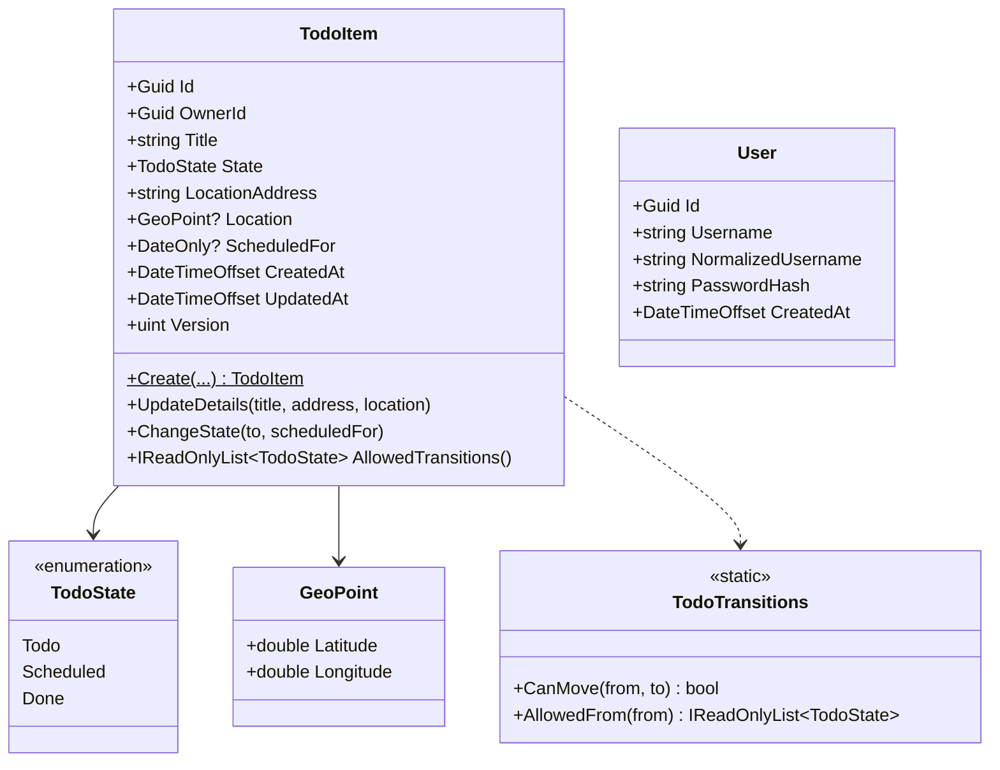

# Detailed Design: Location-aware Todo App (rush-todo)

| | |
|---|---|
| **Status** | Baselined for the MVP build |
| **Last updated** | 2026-09-29 |
| **Derived from** | [`requirements.md`](requirements.md) (what and why) · [`architecture.md`](architecture.md) (structure and decisions) · [`adr/`](adr/README.md) (rationale) |

> **Scope.** This document turns the architecture into buildable design: domain types and rules, use cases, the API contract, the physical schema, security and configuration details, front-end structure, deployment resources, and the test design.
> - It **does not re-argue decisions**. Each section cites the ADR that made them.
> - **Precedence:** ADRs → `architecture.md` → this document. If this document disagrees with either, fix this document.
> - **Values marked *(initial)*** are starting values for the build, to be tuned by measurement. They are not requirements.

---

## 1. Design overview

```
web (Next.js)                         api (.NET, Clean Architecture)                      PostgreSQL
─────────────                         ──────────────────────────────                      ──────────
app/ routes ──▶ components/<feature>  Todo.Api          controllers · TodoExceptionHandler
                 hooks (TanStack Q.)   │  CurrentUser · RequireIfMatch · auth pipeline
                 lib/api fetch ───────▶ Todo.Application use cases · DTOs · interfaces
                                       │        │
                                       ▼        ▼
                                      Todo.Domain       TodoItem · TodoTransitions · rules
                                      Todo.Infrastructure AppDbContext · JWT · hashing ─────▶ users, todo_items
```

| Concern | Section |
|---|---|
| Domain model and rules (BR-1 to BR-6, Q2) | §2 |
| Use cases (FR-1 to FR-9) | §3 |
| HTTP API contract | §4 |
| Database schema | §5 |
| Authentication and authorization (Q1, Q8) | §6 |
| Configuration, observability and errors | §7 |
| Front end (FR-7, FR-9 to FR-11, NFR-9) | §8 |
| Deployment resources | §9 |
| Test design | §10 |
| Traceability and open items | §11–§12 |

---

## 2. Domain design (`Todo.Domain`)

**Rules:**
- No package references (ADR-0007).
- Domain methods receive times as parameters; they never read the clock (ADR-0008, ADR-0011 D4).

### 2.1 Types



| Type | Notes |
|---|---|
| `TodoItem` | Private setters and a private parameterless constructor (for EF). Created only through `Create`; changed only through its methods |
| `GeoPoint` | A value object. The constructor guards the ranges (BR-5): latitude −90..90, longitude −180..180. Mapped to two columns (§5) |
| `TodoState` | Serialised as lowercase strings everywhere (`todo`, `scheduled`, `done`) (ADR-0009) |
| `User` | Username, the normalised (lower-case) username, and the password hash. No domain behaviour beyond construction guards |
| `InvalidTodoTransitionException` | In `Todo.Domain/Exceptions`; mapped to **409** `todo.invalid_transition` (ADR-0008) |

### 2.2 The state machine (Q2, BR-2)

The single source of truth (ADR-0005 §3.6):

```csharp
// Todo.Domain/Todos/TodoTransitions.cs
private static readonly Dictionary<TodoState, TodoState[]> Allowed = new()
{
    [TodoState.Todo]      = [TodoState.Scheduled],
    [TodoState.Scheduled] = [TodoState.Todo, TodoState.Scheduled, TodoState.Done], // Scheduled → Scheduled = reschedule
    [TodoState.Done]      = [],                                                     // terminal
};
```

| From \ To | todo | scheduled | done |
|---|---|---|---|
| **todo** | no-op | ✅ (needs a date) | ❌ 409 |
| **scheduled** | ✅ (the date is cleared) | ✅ reschedule (needs a date) / no-op if the same date | ✅ |
| **done** | ❌ 409 | ❌ 409 | no-op |

**Creation is not a transition.** `Create` accepts any initial state, subject to BR-1 (requirements §3.3).

### 2.3 Behaviour and invariants

| Method | Guards (→ `ArgumentException`, 400, `ParamName` = request field) | Rules (→ `InvalidTodoTransitionException`, 409) | Effects |
|---|---|---|---|
| `Create(id, ownerId, title, state, address, location, scheduledFor, now)` | `title` / `locationAddress` not blank and ≤ 200 / 300 characters (BR-5); `scheduledFor` present iff `state == Scheduled` (BR-1) | — | Trims text; sets `CreatedAt = UpdatedAt = now` |
| `UpdateDetails(title, address, location, now)` | As `Create` for text and location | **A `done` item is read-only** (BR-3) | Updates the details only; never the state or date |
| `ChangeState(to, scheduledFor, now)` | `to == Scheduled` ⇒ `scheduledFor` required; otherwise `scheduledFor` must be null (BR-1) | `TodoTransitions.CanMove(State, to)` unless it's a no-op (§2.2) | `Scheduled`: sets the date. `Todo` / `Done`: clears the date *(per BR-1 as written, see O2)* |
| `AllowedTransitions()` | — | — | `TodoTransitions.AllowedFrom(State)`; serialised as `allowedTransitions` |

**Guard style:** use .NET's built-in helpers, e.g. `ArgumentException.ThrowIfNullOrWhiteSpace(title)`. Parameter names match the request's camelCase fields (`title`, `locationAddress`, `scheduledFor`, `latitude`, `longitude`), so `TodoExceptionHandler` can key `errors` by field (ADR-0008 §3.7).

---

## 3. Application design (`Todo.Application`)

### 3.1 Ports (interfaces)

| Interface | Members | Implemented in | Why it exists |
|---|---|---|---|
| `IAppDbContext` | `DbSet<TodoItem> Todos`, `DbSet<User> Users`, `SaveChangesAsync(ct)` | Infrastructure (`AppDbContext`) | The dependency rule; **not a repository** (ADR-0011 D1) |
| `ICurrentUser` | `Guid Id`, `bool IsAuthenticated` | Api (`CurrentUser`, from claims) | Owner resolution (ADR-0001) |
| `IClock` | `DateTimeOffset UtcNow` | Infrastructure (`SystemClock`) | The only testability port (ADR-0011 D4) |
| `IPasswordHasher` | `Hash(password)`, `Verify(hash, password)` | Infrastructure (wraps `PasswordHasher<T>`, PBKDF2) | Security (ADR-0001) |
| `ITokenIssuer` | `IssuedToken Issue(User user)` | Infrastructure (`JwtTokenIssuer`) | Federation seam (ADR-0001 §6, ADR-0012 E2) |

### 3.2 Use cases

Each is a folder with a command or query record and a handler (ADR-0007 §3.6). Handlers take `IAppDbContext`, `ICurrentUser` and `IClock` as needed. They **throw** on rule violations and **return the DTO** on success.

| Use case | Input | Steps | Output | FR |
|---|---|---|---|---|
| `Login` | `LoginCommand(username, password)` | Normalise the username → find the user → verify the hash (**verify against a dummy hash when the user doesn't exist**, to equalise timing) → issue a token | `LoginResult(MeResponse, IssuedToken)`, or `null` → the controller returns 401 | FR-1 |
| `Me` | — | Load the user by `ICurrentUser.Id` | `MeResponse(id, username)` | FR-1 |
| `ListTodos` | `ListTodosQuery(state?, date?, page = 1, pageSize = 50)` | Validate `page ≥ 1` and `1 ≤ pageSize ≤ 100` → `AsNoTracking` → filter → **fixed sort** → count + page → project | `PagedResponse<TodoResponse>` | FR-3, FR-9 |
| `GetTodo` | `GetTodoQuery(id)` | Find (owner-filtered) → **`KeyNotFoundException`** if absent | `TodoResponse` | FR-4 |
| `CreateTodo` | `CreateTodoCommand(title, state, locationAddress, latitude?, longitude?, scheduledFor?)` | `TodoItem.Create(Guid.CreateVersion7(), currentUser.Id, …, clock.UtcNow)` → add → save | `TodoResponse` | FR-2 |
| `UpdateTodo` | `UpdateTodoCommand(id, version, title, locationAddress, latitude?, longitude?)` | Find → set the original `Version` → `UpdateDetails` → save (`DbUpdateConcurrencyException` propagates) | `TodoResponse` | FR-5 |
| `ChangeTodoState` | `ChangeTodoStateCommand(id, version, state, scheduledFor?)` | Find → set the original `Version` → `ChangeState` → save | `TodoResponse` | FR-7 |
| `DeleteTodo` | `DeleteTodoCommand(id)` | Find → remove → save (allowed in any state, A9) | — | FR-6 |

**Notes:**
- **Commands never carry an owner** (ADR-0001 N4). `id` and `version` are merged in by the controller from the route and `If-Match` (ADR-0009 §3.5).
- **The list sort** is `scheduled_for ASC NULLS LAST, created_at ASC, id ASC` (ADR-0009 §3.4). The `date` filter matches `scheduled_for` exactly.
- **Concurrency:** the handler sets `Entry(item).Property(x => x.Version).OriginalValue = version`, so EF includes `xmin = @version` in the `UPDATE` (ADR-0006 §3.7).

### 3.3 DTOs

```csharp
public sealed record TodoResponse(
    Guid Id, string Title, TodoState State, string LocationAddress,
    double? Latitude, double? Longitude, DateOnly? ScheduledFor,
    IReadOnlyList<TodoState> AllowedTransitions,
    DateTimeOffset CreatedAt, DateTimeOffset UpdatedAt,
    string Version);                                  // xmin as an opaque string (ADR-0009)

public sealed record PagedResponse<T>(IReadOnlyList<T> Items, int Page, int PageSize, int TotalCount);
public sealed record MeResponse(Guid Id, string Username);
```

Mapping is hand-written (`TodoItem.ToResponse()`), with no AutoMapper (ADR-0005).

---

## 4. API design (`Todo.Api`)

### 4.1 Endpoint catalogue

This restates ADR-0009 §3.3 as the build reference.

| Method and path | Controller action | Body | `If-Match` | Success | Errors (`code`) |
|---|---|---|---|---|---|
| `POST /api/auth/login` | `AuthController.Login` | `{ username, password }` | — | **200** `MeResponse` + `Set-Cookie` | 400 `validation_failed` · 401 `auth.invalid_credentials` · 429 `rate_limited` |
| `POST /api/auth/logout` | `AuthController.Logout` | — | — | **204** + an expired cookie | 401 `auth.unauthenticated` |
| `GET /api/auth/me` | `AuthController.Me` | — | — | **200** `MeResponse` | 401 |
| `GET /api/todos` | `TodosController.List` | Query: `state`, `date`, `page`, `pageSize` | — | **200** `PagedResponse<TodoResponse>` | 400 |
| `GET /api/todos/{id}` | `TodosController.Get` | — | — | **200** item + `ETag` | 404 `todo.not_found` |
| `POST /api/todos` | `TodosController.Create` | `CreateTodoCommand` | — | **201** item + `Location` + `ETag` | 400 · 415 |
| `PUT /api/todos/{id}` | `TodosController.Update` | `{ title, locationAddress, latitude, longitude }` | **Required** | **200** item + `ETag` | 400 · 404 · 409 `todo.version_conflict` / `todo.invalid_transition` (a `done` item) · 415 · 428 `precondition_required` |
| `PUT /api/todos/{id}/state` | `TodosController.ChangeState` | `{ state, scheduledFor }` | **Required** | **200** item + `ETag` | 400 · 404 · 409 · 415 · 428 |
| `DELETE /api/todos/{id}` | `TodosController.Delete` | — | — | **204** | 404 |

**All controllers use:**
- `[ApiController]`, `[Route("api/…")]`, `[Produces("application/json")]`
- `[ProducesResponseType]` for every status listed above (ADR-0007 §3.7)
- handlers injected per action with `[FromServices]`

### 4.2 Representations

```json
// TodoResponse
{
  "id": "01928f3e-7c1a-7b2e-9f10-2b5d7a9c1e44",
  "title": "Mow lawn and trim hedges",
  "state": "scheduled",
  "locationAddress": "12 Example Street, Springfield",
  "latitude": -36.8485,
  "longitude": 174.7633,
  "scheduledFor": "2026-10-01",
  "allowedTransitions": ["todo", "scheduled", "done"],
  "createdAt": "2026-09-29T21:04:11+00:00",
  "updatedAt": "2026-09-29T21:04:11+00:00",
  "version": "845210"
}
```

| Rule | Detail |
|---|---|
| JSON options | `camelCase`; `JsonStringEnumConverter` with a camelCase policy; case-insensitive binding; **unknown properties ignored**; nulls written explicitly |
| Dates | `DateOnly` → `YYYY-MM-DD`; `DateTimeOffset` in UTC |
| Collections | `{ "items": [...], "page": 1, "pageSize": 50, "totalCount": 123 }` |
| Headers | `ETag: "<version>"` on single items; `Location` on 201; `Cache-Control: no-store` on all API responses; `Retry-After` on 429 |
| Request limits | Body ≤ 64 KB; `Content-Type: application/json` for bodies (else 415) |

### 4.3 Errors (ADR-0008)

```json
// 400 from a guard clause
{
  "type": "https://tools.ietf.org/html/rfc9110#section-15.5.1",
  "title": "Invalid request",
  "status": 400,
  "detail": "One or more fields are invalid.",
  "code": "validation_failed",
  "errors": { "scheduledFor": ["A scheduled item needs a date."] }
}
```

| Source | Status | `code` | Produced by |
|---|---|---|---|
| `KeyNotFoundException` | 404 | `todo.not_found` | `TodoExceptionHandler` |
| `InvalidTodoTransitionException` | 409 | `todo.invalid_transition` | `TodoExceptionHandler` |
| `DbUpdateConcurrencyException` | 409 | `todo.version_conflict` | `TodoExceptionHandler` |
| `ArgumentException` | 400 | `validation_failed` (+ `errors[ParamName]`) | `TodoExceptionHandler` |
| Anything else | 500 | `server_error` | `TodoExceptionHandler` |
| Model binding failure | 400 | `validation_failed` | `[ApiController]` + ProblemDetails customisation |
| Missing `If-Match` | 428 | `precondition_required` | `[RequireIfMatch]` filter |
| Failed sign-in | 401 | `auth.invalid_credentials` | `AuthController` (`Problem(...)`) |
| Not authenticated | 401 | `auth.unauthenticated` | The auth pipeline + status code pages |
| Rate limited | 429 | `rate_limited` | The rate limiter + status code pages |
| Wrong content type | 415 | `unsupported_media_type` | MVC + status code pages |

**Rules:**
- No `traceId` in any response. The framework adds one by default, so it's removed in `CustomizeProblemDetails`.
- `detail` never comes from framework exception messages.

### 4.4 Controller shape (example)

```csharp
[HttpPut("{id:guid}/state")]
[RequireIfMatch]
[ProducesResponseType<TodoResponse>(StatusCodes.Status200OK)]
[ProducesResponseType<ProblemDetails>(StatusCodes.Status409Conflict)]
public async Task<ActionResult<TodoResponse>> ChangeState(
    Guid id, ChangeTodoStateBody body, [FromHeader(Name = "If-Match")] string ifMatch,
    [FromServices] ChangeTodoStateHandler handler, CancellationToken ct)
{
    var todo = await handler.Handle(new(id, ETag.Parse(ifMatch), body.State, body.ScheduledFor), ct);
    Response.Headers.ETag = ETag.Format(todo.Version);
    return Ok(todo);
}
```

---

## 5. Data design (PostgreSQL)

### 5.1 Schema (initial migration)

EF Core code-first with the snake_case naming convention (ADR-0006). The DDL below is what the migration should produce; review the generated SQL against it.

```sql
CREATE TABLE users (
  id                  uuid PRIMARY KEY,
  username            varchar(50)  NOT NULL,
  normalized_username varchar(50)  NOT NULL,
  password_hash       text         NOT NULL,
  created_at          timestamptz  NOT NULL,
  CONSTRAINT ux_users_normalized_username UNIQUE (normalized_username)
);

CREATE TABLE todo_items (
  id               uuid PRIMARY KEY,                          -- UUID v7, app-generated
  owner_id         uuid         NOT NULL REFERENCES users(id) ON DELETE RESTRICT,
  title            varchar(200) NOT NULL,
  state            varchar(20)  NOT NULL,
  location_address varchar(300) NOT NULL,
  latitude         double precision NULL,
  longitude        double precision NULL,
  scheduled_for    date         NULL,
  created_at       timestamptz  NOT NULL,
  updated_at       timestamptz  NOT NULL,
  CONSTRAINT ck_todo_state        CHECK (state IN ('todo','scheduled','done')),
  CONSTRAINT ck_todo_scheduled    CHECK (state <> 'scheduled' OR scheduled_for IS NOT NULL),   -- BR-1 (the enforced direction)
  CONSTRAINT ck_todo_point_pair   CHECK ((latitude IS NULL) = (longitude IS NULL)),            -- BR-5
  CONSTRAINT ck_todo_latitude     CHECK (latitude  BETWEEN -90  AND 90),
  CONSTRAINT ck_todo_longitude    CHECK (longitude BETWEEN -180 AND 180),
  CONSTRAINT ck_todo_title        CHECK (length(trim(title)) > 0),
  CONSTRAINT ck_todo_address      CHECK (length(trim(location_address)) > 0)
);
-- xmin (system column) is mapped as the concurrency token → Version

CREATE INDEX ix_todo_owner_state_sched ON todo_items (owner_id, state, scheduled_for, created_at, id);
CREATE INDEX ix_todo_owner_sched       ON todo_items (owner_id, scheduled_for, created_at, id);
```

| Index | Serves |
|---|---|
| `ix_todo_owner_state_sched` | The list filtered by state (optionally by date), sorted (Q3) |
| `ix_todo_owner_sched` | The list unfiltered or filtered by date only, sorted |

The **Q3 query-plan test** (§10.2) asserts that the list query uses one of these indexes (ADR-0011 D7).

### 5.2 EF Core configuration

| Item | Configuration |
|---|---|
| `TodoItem.State` | `HasConversion<string>()` with the lowercase value converter; `HasMaxLength(20)` |
| `TodoItem.Location` | An owned / complex type → `latitude`, `longitude` columns |
| `TodoItem.Version` | `IsRowVersion()` → Npgsql maps it to `xmin` |
| The global query filter | `HasQueryFilter(t => t.OwnerId == _currentUser.Id)` on `AppDbContext` (ADR-0001) |
| The audit interceptor | Sets `created_at` / `updated_at` from `IClock` |
| Connection | `SSL Mode=Require`; `Maximum Pool Size` from the ADR-0004 rule; `Include Error Detail=false`; retrying execution strategy; command timeout 5 s *(initial)* |

### 5.3 Roles, migrations and seeding

| Item | Design | ADR |
|---|---|---|
| Roles | `todo_admin` (break-glass), `todo_migrator` (owns the schema), `todo_app` (DML on `users` and `todo_items`) | 0006 |
| Migration run | The EF migration bundle in the API image; a Helm pre-install / pre-upgrade Job; `todo_migrator` credentials | 0006, 0010 |
| Seeding | The same Job runs `seed` after `migrate`. It upserts the users listed in the `SEED_USERS` secret (JSON `[{ "username", "password" }]`) and hashes the passwords at seed time. It is idempotent | 0001, 0006 |
| Demo data | Seed items only when `Seed:DemoItems=true` (Development and demo environments) | 0006 |

---

## 6. Security design

### 6.1 Authentication

| Item | Design *(initial values)* | ADR |
|---|---|---|
| Password hashing | `PasswordHasher<User>` (PBKDF2); verify against a dummy hash for unknown users | 0001 |
| Token | JWT (JWS), **HS256**; claims `sub`, `name`, `iat`, `exp`, `iss`, `aud`; header `kid` | 0001, 0012 |
| Lifetime | 8 hours, with no refresh token *(open item O4)* | 0001 |
| Signing keys | `Auth:SigningKeys` = a list of `{ kid, key }` (≥ 256-bit); `Auth:CurrentKid` signs; **all listed keys validate** (current + previous) | 0012 §3.4 |
| Validation | Issuer, audience, lifetime (1 min skew), signature; `ValidAlgorithms = [HS256]`; the token is read from the cookie **or** `Authorization: Bearer` (`JwtBearerEvents.OnMessageReceived`) | 0001 |
| Cookie | Name `__Host-todo_session` over HTTPS (`todo_session` on local HTTP); `HttpOnly`; `Secure`; `SameSite=Strict`; `Path=/`; expires with the token | 0001 |
| Logout | Expires the cookie (the token stays valid until `exp`; ADR-0001 R1) | 0001 |
| Rate limiting | Fixed window on `POST /api/auth/login`: **10 requests / minute / client IP** *(initial)*, per instance | 0001, 0004 |

### 6.2 Authorization

| Control | Implementation |
|---|---|
| Deny by default | `AuthorizationOptions.FallbackPolicy = RequireAuthenticatedUser()`; `[AllowAnonymous]` only on `Login` and the health endpoints |
| Owner isolation | The global query filter (§5.2) + the owner set only from `ICurrentUser` in `CreateTodo`. A not-found or not-yours item → `KeyNotFoundException` → 404 |
| No bypass | `IgnoreQueryFilters()` is banned outside tests (an ArchUnitNET rule) |
| CSRF | `SameSite=Strict` + JSON-only bodies + **no CORS configured** |

### 6.3 Security headers

| Where | Headers |
|---|---|
| Web (Next.js `headers()`) | `Content-Security-Policy` (`default-src 'self'`; `img-src 'self'` plus the map tile host; `connect-src 'self'`), `X-Content-Type-Options: nosniff`, `Referrer-Policy: strict-origin-when-cross-origin`, `frame-ancestors 'none'` |
| Ingress | HTTPS redirect; HSTS (ADR-0010) |
| API | `Cache-Control: no-store` |

---

## 7. Configuration, observability and error plumbing

### 7.1 Options (validated at start-up, ADR-0008)

| Section | Class | Keys *(initial defaults)* | Source |
|---|---|---|---|
| `ConnectionStrings:Todos` | — | The runtime connection string | Secret `todo-api-runtime` |
| `Auth` | `AuthOptions` | `Issuer`, `Audience`, `TokenLifetime = 08:00:00`, `CurrentKid`, `SigningKeys[]`, `CookieName` | ConfigMap + Secret |
| `RateLimit` | `RateLimitOptions` | `LoginPermitLimit = 10`, `LoginWindow = 00:01:00` | ConfigMap |
| `Database` | `DatabaseOptions` | `CommandTimeoutSeconds = 5`, `MaxRetryCount = 3` | ConfigMap |
| `Telemetry` | `TelemetryOptions` | `ServiceName`; the exporter (OTLP endpoint or Azure Monitor connection string). **Required in Production** | ConfigMap + Secret |
| `Seed` | `SeedOptions` | `Users` (JSON, migration Job only), `DemoItems = false` | Secret `todo-api-migrations` |

**Environment variables** use .NET's `__` separator, e.g. `Auth__CurrentKid`, `Auth__SigningKeys__0__Key`.

### 7.2 `Program.cs` pipeline

```csharp
builder.Services
    .AddProblemDetails(o => o.CustomizeProblemDetails = ctx =>
    {
        ctx.ProblemDetails.Extensions.Remove("traceId");
        if (ctx.ProblemDetails.Status == 400) ctx.ProblemDetails.Extensions.TryAdd("code", "validation_failed");
    })
    .AddExceptionHandler<TodoExceptionHandler>()
    .AddControllers().AddJsonOptions(/* §4.2 */);
builder.Services.AddApplication().AddInfrastructure(builder.Configuration).AddApi(builder.Configuration);
// AddApi: authentication (JWT cookie/bearer), authorization (fallback policy), rate limiter,
//         health checks (live; ready = DbContext check), OpenTelemetry (ASP.NET Core, HttpClient, Npgsql, runtime)

app.UseExceptionHandler();
app.UseStatusCodePages();
app.UseRateLimiter();
app.UseAuthentication();
app.UseAuthorization();
app.MapControllers();
app.MapHealthChecks("/health/live",  new() { Predicate = _ => false }).AllowAnonymous();
app.MapHealthChecks("/health/ready").AllowAnonymous();
```

**Entry points:** `dotnet Todo.Api.dll migrate` and `dotnet Todo.Api.dll seed`, for the migration Job (ADR-0006).

### 7.3 Observability (ADR-0008)

| Item | Design |
|---|---|
| Logging | **The only `ILogger` call** is in `TodoExceptionHandler`: `Log(level, ex, "Request failed: {Status} {Code} on {Route}", …)`, with the level by status (500 → Error; 409 concurrency → Warning; other 4xx → Information). Handled-exception diagnostics are suppressed (`SuppressDiagnosticsCallback`) |
| Framework logs | `Microsoft.AspNetCore` and `Microsoft.EntityFrameworkCore` at Warning in Production; `EnableSensitiveDataLogging` only in Development |
| Telemetry | OpenTelemetry traces, metrics and logs → OTLP (the Aspire dashboard locally) / Azure Monitor (cloud), unsampled at MVP volume |
| Health | `/health/live` (process), `/health/ready` (database), not routed by the ingress |

---

## 8. Front-end design (`web/`)

### 8.1 Routes and pages

| Route | Component type | Content |
|---|---|---|
| `/login` | Client | The sign-in form; on success → `/todos` |
| `/todos` | Client (the static shell is pre-rendered) | The list or map view with filters in the URL: `?state=&date=&page=&view=list|map` |
| `/` | — | Redirects to `/todos` |
| `middleware.ts` | Edge middleware | If there's no session cookie → redirect to `/login` (**UX only**) |

### 8.2 Feature folders

| Path | Contents |
|---|---|
| `components/todos/` | `TodoList.tsx`, `TodoFilters.tsx`, `TodoForm.tsx` (create / edit dialog), `StatePicker.tsx` (renders **`allowedTransitions` only**), `DeleteConfirm.tsx`, `LocationPicker.tsx` + `TodoMap.tsx` (Leaflet, **lazy-loaded, client-only**), `useTodos.ts`, `useTodoMutations.ts`, `todosApi.ts`, `todoSchema.ts`, tests |
| `components/auth/` | `LoginForm.tsx`, `useSession.ts` (`GET /api/auth/me`), `authApi.ts`, tests |
| `components/ui/` | `Button`, `Dialog`, `Badge` (state shown by label **and** colour, NFR-9), `Pagination`, `Toast`, `ErrorBoundary` |
| `lib/api/` | `schema.d.ts` (**generated** from `openapi.json`), `client.ts` (the fetch wrapper), `errors.ts` (`ApiError`) |
| `lib/queryClient.ts` | TanStack Query defaults |
| `test-setup.ts` | Testing Library + jest-dom + vitest-axe; `jsonResponse()` / `problemResponse()` helpers for `vi.stubGlobal("fetch", vi.fn())` |

### 8.3 Data layer

| Item | Design *(initial values)* | ADR |
|---|---|---|
| Fetch wrapper | Relative URLs; `credentials: 'same-origin'`; JSON; a 10 s timeout (`AbortController`); `If-Match` from `version` on PUTs; ProblemDetails → `ApiError { status, code, fieldErrors }` | 0009 |
| Query keys | `['me']`, `['todos', { state, date, page }]`, `['todo', id]` | 0003 |
| Defaults | `staleTime: 30_000`; refetch on window focus; `retry` for GETs only; no mutation retries | 0003, 0009 |
| Paging | `placeholderData: keepPreviousData` | 0003 |
| State change | **Optimistic:** update the cached item → `PUT …/state` → replace it with the response; on error, roll back + a toast (`409` → refetch + "changed elsewhere") | 0003 |
| Create / edit / delete | Not optimistic; invalidate `['todos']` on success | 0003 |
| 401 anywhere | Clear the cache → `/login` | 0009 |
| Stale chunk after a deploy | `ErrorBoundary` reloads the page once on a chunk-load failure | 0012 |

### 8.4 Forms

- **Form library:** react-hook-form with a zod schema per form, mirroring the domain guards (`todoSchema.ts`). This is a design-level choice implementing ADR-0005 §3.7.
- **Instant feedback:** the client reports **all** invalid fields at once, even though the server returns the first one.
- **Server field errors** (`fieldErrors`) are mapped onto the matching inputs.
- **Create form:** title, state, address, optional map point (`LocationPicker`), and a date input that appears and is required when the state is `scheduled`.
- **Edit form:** details only. A `done` item opens read-only, with delete available.

### 8.5 UI states and accessibility

| Aspect | Design |
|---|---|
| Loading, empty and error states | A list skeleton (no layout shift); an empty-state message with a "Create" action; an error panel |
| Accessibility (NFR-9) | Labelled controls; keyboard-operable dialogs (focus trapped and returned); state shown as text + colour; axe checks in component tests; a manual keyboard pass (ADR-0011 D6) |
| Performance | Initial JS ≤ 250 KB gzipped (size-limit in CI); the map excluded from the initial bundle |

---

## 9. Deployment design

### 9.1 Images

| Image | Build | Runtime |
|---|---|---|
| `todo-api:<sha>` | `api/Dockerfile`: restore → publish → **EF migration bundle** | A chiseled .NET runtime; non-root; port 8080 |
| `todo-web:<sha>` | `web/Dockerfile`: `npm ci` → `next build` (`output: 'standalone'`) | A minimal Node runtime; non-root; port 3000 |

### 9.2 Kubernetes resources (Helm)

| Chart | Resources |
|---|---|
| `deploy/helm/todo-api` | Deployment (2 replicas, `maxUnavailable: 0`, `maxSurge: 1`, probes, `securityContext`, `preStop`), Service (ClusterIP :80 → 8080), **Ingress** (`/api`, `nginx.ingress.kubernetes.io/force-ssl-redirect`, `proxy-body-size: 64k`, TLS `todo-tls`), HPA (min 2, max from the connection rule, CPU 70%), PDB (`minAvailable: 1`), NetworkPolicy, ConfigMap, the migration Job (hook), **`existingSecret` references only** |
| `deploy/helm/todo-web` | Deployment, Service, Ingress (`/`), HPA, PDB, NetworkPolicy, ConfigMap |
| `deploy/platform/` | cert-manager values, `ClusterIssuer` (Let's Encrypt staging + production), `Certificate` → `todo-tls`, the DB role bootstrap Job |

### 9.3 Azure resources (Terraform, `infra/terraform`)

| Resource | Key settings |
|---|---|
| Resource group | One per environment |
| AKS | Free tier (trial); Azure CNI Overlay + Cilium; OIDC issuer + workload identity; Entra ID + Azure RBAC; **application routing add-on** (NGINX); one small node pool |
| ACR | Basic; `AcrPull` for the kubelet identity |
| PostgreSQL Flexible Server | Burstable tier (trial); a pinned major version; TLS required; backups with the default retention; firewall (MVP) |
| Key Vault | Secrets: `db-admin-password`, `db-migrator-password`, `db-app-password`, `jwt-signing-keys`, `seed-users`, `appinsights-connection-string` |
| Monitoring | Log Analytics workspace + Application Insights; a **consumption budget** with 50 / 80 / 100% alerts |
| State | An Azure Storage backend; a separate state key per environment |

### 9.4 Kubernetes Secrets (created by `deploy.yml` from Key Vault, outside Helm)

| Secret | Keys | Used by |
|---|---|---|
| `todo-api-runtime` | `ConnectionStrings__Todos` (`todo_app`), `Auth__SigningKeys__*`, `Telemetry__AzureMonitorConnectionString` | API pods |
| `todo-api-migrations` | The migrator connection string, `Seed__Users` | The migration Job |

### 9.5 Workflows (ADR-0010, ADR-0011)

| Workflow | Jobs |
|---|---|
| `ci.yml` | **static** (build, analysers, format, `tsc`, ESLint, tflint, `helm lint` + kubeconform, gitleaks, Trivy config, `oasdiff`) → **unit** (`Todo.UnitTests`, Vitest, size-limit) → **integration** (`Todo.IntegrationTests`, EF pending-model check, OpenAPI and TS drift) |
| `infra.yml` | `plan` (PR) → `apply` of the saved plan (`main`, approval) |
| `platform.yml` | cert-manager, issuers, certificate, DB role bootstrap |
| `deploy.yml` | build + push (SHA) → Trivy image scan → secrets → `helm upgrade todo-api --atomic` → `curl` smoke → `helm upgrade todo-web --atomic` → `curl` smoke |

---

## 10. Test design

### 10.1 Unit tests (`Todo.UnitTests`, no Docker)

| Area | Cases |
|---|---|
| Transitions (Q2) | A `[Theory]` over all 9 (from, to) pairs vs the expected matrix; a completeness test (every enum value has an entry); same-state no-ops |
| `Create` guards (BR-1, BR-5) | Blank title or address; over-length text; scheduled without a date; a date with a non-scheduled state; point half-set; out-of-range coordinates → `ArgumentException` with the right `ParamName` |
| `UpdateDetails` (BR-3) | A `done` item → `InvalidTodoTransitionException` |
| `ChangeState` (BR-1) | Scheduling sets the date; unscheduling and completing clear it (per O2) |
| `TodoExceptionHandler` | The exception → (status, `code`) table; `errors` keyed by `ParamName`; generic `detail` for 404 / 500 |
| Architecture (ArchUnitNET) | Domain purity; controllers free of Infrastructure types; `Todos` ↛ `Auth`; `ILogger` only in the handler; no direct `UtcNow`; no `IgnoreQueryFilters` |

### 10.2 Integration tests (`Todo.IntegrationTests`, Testcontainers)

| Scenario | Cases |
|---|---|
| **Q8** authentication | No cookie or token → 401; expired (issued with a `FakeClock` in the past); tampered signature; wrong `iss` / `aud`; `alg: none`; a previous `kid` still valid; a removed `kid` rejected |
| **Q1** isolation | `bob` GET / PUT / state / DELETE on `alice`'s item → 404, and `alice`'s item is unchanged; `bob`'s list excludes it; `ownerId` in a create body is ignored |
| Sign-in | Wrong password and unknown user → the same 401; the rate limit → 429; cookie flags set |
| CRUD + contract | Each §4.1 row: status, headers (`Location`, `ETag`, `no-store`), body shape, lowercase enums, explicit nulls |
| **Q2** via the API | Illegal transition → 409 `todo.invalid_transition`; editing a `done` item → 409 |
| **Q6** concurrency | Two updates with the same `If-Match` → the second gets 409 `todo.version_conflict`; missing `If-Match` → 428 |
| Errors | Guard-clause 400 with `errors[field]`; malformed JSON → 400 `validation_failed`; 415; **no `traceId` in any error**; a 500 has no exception text |
| **Q3** query plan | Seed 1,000+ items for one user → `EXPLAIN` the list query → it uses `ix_todo_owner_*`; the page is bounded |
| Logging | `FakeLogger`: exactly one record per exception; no password, token, cookie or address in the captured logs |
| Database constraints | Invalid rows inserted directly (bypassing the domain) are rejected by the `CHECK` constraints |

### 10.3 Front-end component tests (Vitest, stubbed `fetch`)

| Component | Cases |
|---|---|
| `LoginForm` | Success → navigation; 401 → a generic message; field validation |
| `TodoList` + `TodoFilters` | Renders items; filter changes update the URL and the request; pagination; empty and error states |
| `StatePicker` | Offers only `allowedTransitions`; the optimistic update and rollback on 409; sends `If-Match` |
| `TodoForm` | The date appears and is required for `scheduled`; server `fieldErrors` map onto inputs; a `done` item is read-only |
| Accessibility | axe on each component; controls queryable by role and label |

### 10.4 Manual checks (ADR-0011 D6, D7)

| Checklist | When |
|---|---|
| Sign in → list → create → schedule → complete → delete → sign out; two-user isolation; map picker; keyboard-only pass; an open tab across a deploy | After deploys that change the UI or the flows |
| Q4 drill (a request loop during `helm upgrade`; a failing release rolls back) · Q7 drill (scale to 3; delete a pod) · a manual Lighthouse run | When the deployment or scaling set-up changes |
| Q5 drills: add a field (< 30 min, ~12 files); add a status (< 30 min, ~5 files) | Before the interview |

---

## 11. Traceability (requirements → design)

| Requirement | Design elements |
|---|---|
| FR-1 | §3.2 `Login` / `Me`; §4.1 auth rows; §6.1 |
| FR-2 to FR-6 | §3.2 use cases; §4.1 todos rows; §2.3 |
| FR-7 | §2.2; §3.2 `ChangeTodoState`; §4.1 `PUT …/state`; §8.3 optimistic flow; `StatePicker` |
| FR-8 / BR-1 to BR-6 | §2.3 guards and rules; §5.1 constraints; §6.2 owner filter; §3.2 concurrency |
| FR-9 | §3.2 `ListTodos`; §5.1 indexes; §8.1 URL filters |
| FR-10 / FR-11 | §8.2 `LocationPicker`, `TodoMap` (lazy); §6.3 CSP for map tiles |
| Q1, Q8 | §6; §10.2 |
| Q2 | §2.2; §10.1 |
| Q3 | §3.2 sort and paging; §5.1 indexes; §10.2 query-plan test |
| Q4, Q7 | §9.2 (probes, PDB, HPA, rolling); §10.4 drills |
| Q5 | §2–§4 structure; §10.4 drills |
| Q6 | §3.2 concurrency; §4.1 `If-Match`; §10.2 |
| NFR-2 / NFR-3 | §2.3 guards; §4.3 errors |
| NFR-5 / NFR-6 | §6; §7.3; §9.4 |
| NFR-7 | Docker Compose (API, web, PostgreSQL, Aspire dashboard) |
| NFR-9 | §8.5 |
| NFR-10 | §9.2 Ingress TLS; §6.3 |

---

## 12. Open items affecting the design

These are carried from [`architecture.md` §9](architecture.md). Each lists the design impact.

| # | Item | Design impact if it changes |
|---|---|---|
| O1 | Update `requirements.md` (NFR-10 → Must; §10.3 export wording) | Documentation only |
| O2 | BR-1 for `done` items: keep the scheduled date? | `ChangeState(Done)` stops clearing the date (one line), plus a unit test. No migration (the `CHECK` enforces only the scheduled direction) |
| O3 | `todo → done` directly; date vs time slot (A2) | O3a: one table row + a test. O3b: the ADR-0012 §3.3 expand/contract plan |
| O4 | Token lifetime | `Auth:TokenLifetime` (configuration only), unless refresh tokens are added |
| O5 | 409 vs 412 for a stale `If-Match` | The mapping in `TodoExceptionHandler`, the OpenAPI response types, and front-end handling |
| O6 | Narrow the exception types (e.g. `TodoNotFoundException`) | New exception types + the handler's mapping table |
| O7 | The ingress add-on's support window | Deployment only (ADR-0012 V15) |
| O8 | CodeQL availability; licence checks | CI only |
| O9 | ADR-0011's filename | Links only |
| **O11** | **A "register" flow was mentioned in manual checks, but A10 / FR-13 say users are pre-seeded** | If registration is in scope: a `Register` use case, `POST /api/auth/register`, rate limiting, username rules, and updates to A10 / FR-13 and ADR-0001. This design assumes **no registration** |
