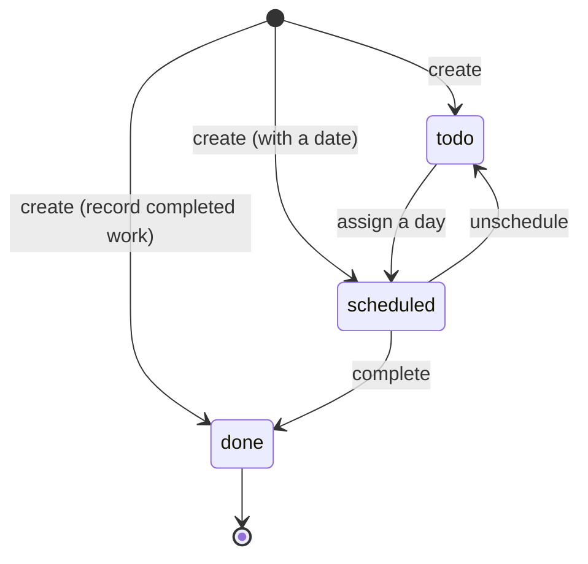

# Requirements Analysis: Location-aware Todo App

| | |
|---|---|
| **Status** | Baselined for MVP; assumptions pending product-owner confirmation |
| **Last updated** | 2026-09-29 |
| **Sources** | `1. Business requirements.docx`, `2. Interview notes.docx` |

> **Scope of this document:** *what* the system must do and *why*. *How* it is built (technology selection, API contract, physical data model, authentication mechanism, deployment design) is covered in the design documents under `docs/design/` and `docs/adr/`.

---

## 1. Purpose

Build an API-driven application that tracks Todo items, each with an associated location. The reference scenario is a gardener planning each day's services across multiple customers.

The brief is deliberately larger than the time available, so this document does four things:
1. It separates **hard constraints** from **open choices**.
2. It resolves ambiguities with explicit, revisitable **assumptions**.
3. It states the important quality attributes as **measurable scenarios**.
4. It defines a prioritised **MVP scope** and traces each requirement to how it will be verified.

---

## 2. Constraints

### 2.1 Technical constraints (from the business requirements)

| ID | Constraint | Options allowed | Source |
|---|---|---|---|
| C-1 | User interface | A website written in React (plus supporting libraries), **or** a mobile app in React Native or Flutter | Business requirements |
| C-2 | Backend language | .NET; **or** Java if the role specifies it; **or** Node.js, Python or Ruby on Rails if the role is not backend-focused | Business requirements |
| C-3 | Backend interface | An API providing CRUD operations on Todo items, consumed by the UI | Business requirements |
| C-4 | Cloud platform | AWS **or** Azure | Business requirements |
| C-5 | Infrastructure provisioning | Terraform (mandatory) | Business requirements |
| C-6 | Hosting | Kubernetes (mandatory) | Business requirements |
| C-7 | Deployment | Helm (mandatory) | Business requirements |
| C-8 | Quality bar | Production-ready; tests are required even though they are not listed as a task | Business requirements |

Selecting among the allowed options for C-1, C-2 and C-4 is a design decision, recorded in the ADRs. The allowed options for C-2 depend on the role type (A0).

### 2.2 Process constraints (from the interview notes)

These are not product requirements, but they create requirements of their own.

| ID | Constraint | Resulting requirement |
|---|---|---|
| P-1 | The solution must compile and run at the start of the interview | NFR-7 (one-command local run); a working cloud deployment |
| P-2 | Back-end and front-end changes will be made live **without AI** | Q5 (modifiability) |
| P-3 | Must explain the architecture and the code | Documented design decisions; code structure that matches the documented architecture |
| P-4 | Must demonstrate good AI-enabled engineering practice | A log of AI usage and verification (`docs/ai-usage.md`) |
| P-5 | Free-trial cloud budget and quotas | NFR-8 (cost) |
| P-6 | Scope intentionally exceeds the time available | Explicit prioritisation (section 9) |
| P-7 | Demo via Google Meet screen-share | The UI must be demonstrable from a single desktop screen |

---

## 3. Domain analysis

### 3.1 Scenario reading

"A gardener planning each day's services for multiple customers" implies:
- A **Todo item is a job or service visit**, for example "Mow lawn and trim hedges".
- The **location is where the job happens**: the customer's address.
- **`scheduled` only makes sense with a date.** Planning *each day* means items must be assignable to a day.
- The primary workflow is **"what am I doing today, and where?"**
- Each gardener's jobs are **their own** (A4). One user must never see or change another user's jobs.

### 3.2 Glossary

| Term | Meaning |
|---|---|
| User | A person who signs in and manages their own Todo items |
| Owner | The user a Todo item belongs to |
| Todo item | A unit of work at a location, such as a service visit |
| State | `todo` (captured, not yet planned), `scheduled` (assigned to a day), `done` (completed) |
| Location | Where the work happens: a human-readable address, optionally with a point on a map |
| Scheduled date | The day the item is planned for |

### 3.3 State model

The brief says items are **created** with any of the three states, so creation is not treated as a transition and any initial state is valid (subject to BR-1). After creation, the allowed transitions are those in A3.

**Allowed transitions**

| From \ To | todo | scheduled | done |
|---|---|---|---|
| **todo** | — | ✅ | ❌ (must be scheduled first) |
| **scheduled** | ✅ | ✅ (change the date) | ✅ |
| **done** | ❌ | ❌ | — |

`done` is terminal: nothing moves out of it. That keeps completed work trustworthy and gives a clear, testable rule (Q2).

---

## 4. Assumptions

All assumptions are **proposed** and need product-owner confirmation. Each has a condition under which it should be revisited.

| # | Question | Assumption | Reason | Revisit if |
|---|---|---|---|---|
| A0 | Which role type applies? | The chosen backend option is permitted for this role | C-2 restricts the options by role | The role specifies Java |
| A1 | What is "location"? | A free-text address, plus an optional map point (latitude/longitude); address search (geocoding) is deferred | Matches "gardener planning services" without depending on a geocoding service for the MVP | Users need to search for addresses |
| A2 | Does "scheduled" carry a date? | Yes. A scheduled date is required when the state is `scheduled`, and is otherwise absent | "Plan each day's services" is meaningless without one | Time-of-day slots are needed |
| A3 | Which state transitions are legal? | `todo → scheduled → done`, plus `scheduled → todo` (unschedule) and rescheduling to another date. No transition out of `done` | The simplest model that supports the domain story; a clear rule to defend | Users need to reopen work or complete ad-hoc jobs directly |
| A4 | Single-user or multi-user? | Multi-user from day one: every item has an owner, and users can only access their own items | Cheap to build in now, expensive to retrofit; also provides a real security scenario (Q1) | — |
| A5 | Mobile or web UI? | Web, per the brief's "OR" | Demonstrable over a screen-share without emulators | A mobile client is requested (the API is client-agnostic) |
| A6 | How do users prove who they are? | Users sign in with credentials issued by the application for this assessment (pre-seeded users); integration with an external identity provider is deferred | Full integration with an external identity provider is disproportionate to the time box | The app goes beyond the assessment |
| A7 | Offline support? | Out of scope | Not implied by the brief; adds significant complexity for no stated benefit | Field use without connectivity becomes a need |
| A8 | Is "customer" a thing in its own right? | No. The customer is captured in the title or address | Keeps the model to one concept | Customer reporting or reuse is needed |
| A9 | Can a `done` item be edited or deleted? | It can be deleted (to remove mistakes), but its details cannot be edited | Consistent with `done` being terminal, while still allowing a mistaken entry to be removed | Users need to correct completed records |
| A10 | Can users register themselves? | No. Users are pre-seeded for the assessment | Follows from A6 | A6 is revisited |

---

## 5. Functional requirements (MoSCoW)

| ID | Requirement | Priority | Source |
|---|---|---|---|
| FR-1 | Sign in and sign out | **Must** | A4, A6 |
| FR-2 | Create a Todo item with a title, state and location | **Must** | Explicit |
| FR-3 | List my Todo items | **Must** | Explicit (CRUD), A4 |
| FR-4 | View one of my Todo items | **Must** | Explicit (CRUD), A4 |
| FR-5 | Edit one of my Todo items (except `done` items, A9) | **Must** | Explicit (CRUD), A9 |
| FR-6 | Delete one of my Todo items | **Must** | Explicit (CRUD) |
| FR-7 | Change an item's state from the list, offering only legal transitions | **Must** | Derived (daily workflow), A3 |
| FR-8 | Enforce the business rules BR-1 to BR-6 | **Must** | A2, A3, A4, A9 |
| FR-9 | Filter my items by state and by scheduled date, with paged results | **Should** | Derived ("plan each day"), Q3 |
| FR-10 | Set a location's position by picking a point on a map | **Should** | A1 |
| FR-11 | See a day's items on a map | **Could** | Derived (scenario) |
| FR-12 | Address search (geocoding) | **Won't (this iteration)** | A1 |
| FR-13 | Self-registration and sign-in with an external identity provider | **Won't (this iteration)** | A6, A10 |
| FR-14 | Manage customers separately from jobs | **Won't (this iteration)** | A8 |
| FR-15 | Offline use | **Won't (this iteration)** | A7 |
| FR-16 | Suggest the best order to visit a day's jobs | **Won't (this iteration)** | Scope |

---

## 6. User stories and acceptance criteria

**US-1: Sign in** (FR-1)
As a gardener, I want to sign in, so that only I can see and manage my jobs.
- *Given* valid credentials, *when* I sign in, *then* I see my own jobs, and nobody else's.
- *Given* invalid credentials, *when* I sign in, *then* I am refused access, without being told which part was wrong.
- *Given* I am not signed in, *when* I try to open the job list, *then* I am asked to sign in.

**US-2: Capture a job** (FR-2, FR-8)
As a gardener, I want to record a job with where it is, so that I don't forget it.
- *Given* a valid title and address, *when* I save, *then* the item appears in my list with the state I chose.
- *Given* the state is `scheduled` and no date is set, *when* I save, *then* I am told a scheduled item needs a date, and nothing is saved.
- *Given* an empty title or address, *when* I save, *then* I am told which field is required.

**US-3: Plan my day** (FR-7, FR-9)
As a gardener, I want to assign jobs to a day and see a day's jobs, so that I can plan my work.
- *Given* an item in `todo`, *when* I set a date and change the state to `scheduled`, *then* it appears when I filter by that date.
- *Given* a scheduled item, *when* I unschedule it, *then* it returns to `todo` and no longer appears under that date.
- *Given* many items, *when* I filter by state and date, *then* only matching items are shown, earliest date first, one page at a time.

**US-4: Complete a job** (FR-7, FR-8)
As a gardener, I want to mark a job done from the list, so that I can track progress during the day.
- *Given* a scheduled item, *when* I mark it `done`, *then* its new state is shown straight away.
- *Given* a `todo` item, *then* "done" is not offered as an option.
- *Given* a `done` item, *then* no state change is offered, and any attempt to change it is rejected with an explanation.

**US-5: Correct or remove a job** (FR-5, FR-6)
As a gardener, I want to fix or remove jobs, so that my list stays accurate.
- *Given* an item that is not `done`, *when* I edit its title or location and save, *then* the changes are kept.
- *Given* any of my items, *when* I delete it and confirm, *then* it no longer appears.
- *Given* the item was changed elsewhere after I opened it, *when* I save, *then* I am told it has changed, and the other change is not overwritten (Q6).

**US-6: Place a job on the map** (FR-10, FR-11)
As a gardener, I want to mark exactly where a job is, so that I can find it.
- *Given* the job form is open, *when* I pick a point on the map, *then* that position is attached to the job and shown with a marker.

---

## 7. Quality attribute scenarios

The key quality attributes are stated as testable scenarios. **Priority** is written as *business importance / technical risk* (H = high, M = medium, L = low). High/high scenarios get attention first.

| # | Attribute | Stimulus (and environment) | Required response | Response measure | Priority | Verified by |
|---|---|---|---|---|---|---|
| Q1 | Security (isolation) | Signed-in user A reads, edits or deletes user B's item using a guessed or known identifier (normal operation) | The request is treated exactly as if the item did not exist; B's item is unchanged; A's list never includes B's items | 100% of cross-user attempts are indistinguishable from "not found"; no existence is leaked | H/H | API integration tests covering read, edit, delete and list |
| Q2 | Correctness (state rules) | A client attempts an illegal transition, e.g. `done → scheduled` or `todo → done` (normal operation) | The request is rejected with an error explaining the rule; the item's state is unchanged | All illegal transitions in the section 3.3 matrix are rejected; all legal ones succeed | H/H | Unit tests over every from/to pair; API integration test |
| Q3 | Performance | A user with 1,000+ items lists them, filtered by state, one page at a time (normal load, local environment) | Results are returned, correctly filtered and paged | p95 response time under 200 ms | H/M | Deterministic query-plan integration test with seeded data + observed p95 in telemetry (load-test automation deferred, ADR-0011 D7) |
| Q4 | Availability (deployment) | A new version is deployed while the API is receiving steady traffic | The service stays available throughout; a failed release is rolled back automatically | Zero failed requests during a successful rollout; the previous version is restored after a failed one | M/M | Manual deployment drill: a request loop during an upgrade, plus a deliberately failing release |
| Q5 | Modifiability | A developer adds a new field to Todo items end to end (storage, API, UI, tests) | The change is completed without AI assistance, and all tests pass | Under 30 minutes | M/L | Timed manual drill |
| Q6 | Data integrity | Two clients update the same item concurrently | The first write is kept; the second is rejected, and that user is told the item changed | 0 silently lost updates | M/M | API integration test |
| Q7 | Scalability | Request volume grows to 10× normal (e.g. many users planning their day at the same morning peak) | Capacity is increased by running more API instances, with no code change and no user-visible errors | Throughput scales roughly linearly from 1 to 3 instances, while Q3's p95 target is still met | H/L | HPA configuration review + manual scale drill; throughput measurement deferred (ADR-0011 D7) |
| Q8 | Security (authentication) | An unauthenticated caller, or one with an expired or invalid credential, calls any Todo operation | The request is rejected, and no data is returned or changed | 100% of such requests are rejected | H/L | API integration tests without, and with invalid, credentials |

---

## 8. Other non-functional requirements

These are baseline qualities that are better stated as rules than as scenarios.

| ID | Category | Requirement | Evidence | Priority |
|---|---|---|---|---|
| NFR-1 | Testability | Automated tests cover the business rules, API behaviour and UI behaviour, and run automatically on every change | All tests pass in the pipeline on every push | Must |
| NFR-2 | Validation | The server is the authority for all validation; the UI gives immediate feedback using the same rules | Invalid requests are rejected by the API even when the UI is bypassed | Must |
| NFR-3 | Error handling | Errors use one consistent, machine-readable, standards-based format, with field-level detail for validation failures; internal details are never exposed | Tests assert the error format | Must |
| NFR-4 | Reproducibility | All cloud infrastructure can be recreated from code, with no manual console changes (C-5) | Re-applying the code shows no drift | Must |
| NFR-5 | Security baseline | No secrets in source control; credentials are stored securely (never in plain text); least-privilege runtime; automation uses short-lived credentials; protected against injection | Repository and configuration review | Must |
| NFR-6 | Observability | Structured logs and health signals are available from the running system; logs never contain credentials or tokens | Inspect the running logs | Must |
| NFR-7 | Portability | The full system runs locally with a single command | A fresh clone runs with one command | Should |
| NFR-8 | Cost | Runs within free-trial credit; can be torn down in one step | Cost review; teardown tested | Should |
| NFR-9 | Accessibility | Form controls are labelled and keyboard-operable; state is not conveyed by colour alone | Manual check; tests query by role or label | Should |
| NFR-10 | Transport security | All traffic is encrypted with HTTPS | — | Could (deferred) |

---

## 9. Conceptual data model and business rules

This model describes the business information only. Physical details (identifiers, types, indexes, concurrency mechanism, credential storage) are design concerns.

**User**

| Attribute | Meaning | Required |
|---|---|---|
| Username | How the user identifies themselves at sign-in | Yes |
| Credential | What proves who they are (stored securely, never readable) | Yes |

**Todo item**

| Attribute | Meaning | Required |
|---|---|---|
| Owner | The user the item belongs to | Yes (set automatically, never chosen by the client) |
| Title | A short description of the work | Yes |
| State | `todo`, `scheduled` or `done` | Yes |
| Location address | Where the work happens, as a human-readable address | Yes |
| Location point | A position on the map (latitude and longitude) | No |
| Scheduled date | The day the work is planned for | Only when `scheduled` |

**Business rules**

| ID | Rule |
|---|---|
| BR-1 | An item in the `scheduled` state must have a scheduled date; items in other states have none. |
| BR-2 | State changes follow the matrix in section 3.3; nothing leaves `done`. |
| BR-3 | A `done` item's details cannot be edited; it can only be deleted (A9). |
| BR-4 | An item is visible to, and changeable by, its owner only. The owner is the signed-in user who created it and cannot be changed. |
| BR-5 | The title and location address must not be blank. A location point, if given, has both a valid latitude and a valid longitude. |
| BR-6 | An edit based on out-of-date information must not overwrite a newer change. |

---

## 10. Scope and prioritisation

### 10.1 Principles

1. **Build a thin vertical slice through every layer, finished to a production standard**, rather than a wide feature set that only runs locally. The brief assesses the whole path (UI, API, data, infrastructure, Kubernetes, Helm) and says that production readiness matters.
2. **Prioritise by risk.** The high/high scenarios (Q1 isolation, Q2 state rules) are built and tested first, because they are the easiest to get subtly wrong and the most expensive to retrofit.
3. **Keep the solution small and conventional**, because it will be changed live without AI (P-2, Q5).

### 10.2 In scope (MVP)

- FR-1 to FR-10, with FR-11 if time allows.
- Q1 to Q8. Q3 is verified by a deterministic query-plan test and telemetry; Q4 and Q7 by manual drills rather than load-test automation (ADR-0011 D7).
- The NFRs marked Must, and as many of those marked Should as time allows.
- Local run, cloud infrastructure from code, Kubernetes hosting via Helm, and an automated test-and-deploy pipeline.

### 10.3 Deferred

| Deferred item | Why deferred |
|---|---|
| External identity provider and self-registration (FR-13) | Integration effort is disproportionate to the time box; application-issued sign-in proves the security model (Q1, Q8) |
| HTTPS (NFR-10) | Requires a domain and certificate management. **Note:** without it, credentials travel unencrypted, so the deployed demo must use test accounts only |
| Address search (FR-12) | Depends on a third-party service, with usage policies and key management |
| Customer management (FR-14) | Adds a second business concept without new technical learning |
| Offline use (FR-15) | Not implied by the brief; significant complexity |
| Route suggestion (FR-16) | A separate problem domain |
| Private network isolation of the database | Adds significant networking setup time |
| Advanced monitoring (tracing, metrics) | Logs and health signals cover the basics for the MVP |
| Automated end-to-end browser tests (Playwright) | Lower value per hour than component and API-level tests; full-stack journeys are checked manually (ADR-0011 D6) |
| Load and performance test automation (k6, Lighthouse CI) | Q3, Q4 and Q7 are verified by deterministic checks, telemetry and manual drills for the MVP (ADR-0011 D7) |

How each deferred item would be added is covered in the architecture document.

---

## 11. Project risks

| Risk | Likelihood | Impact | Mitigation |
|---|---|---|---|
| Multi-user sign-in (A4, A6) consumes more time than planned | Medium | High | Keep sign-in minimal (pre-seeded users); build Q1 and Q8 tests first so the security model is proven early |
| Cloud trial quota or resource limits block provisioning | Medium | High | Provision early; smallest viable resources; an alternative region |
| Cloud issue during the live demo | Low | High | A working local run, kept ready as a fallback (NFR-7) |
| Infrastructure work overruns | Medium | Medium | Timebox it; a manual deployment path works even if automation is unfinished |
| Unfamiliar AI-generated code slows live changes | Medium | High | Review every line; rehearse likely changes by hand (Q5) |
| Credentials exposed over plain HTTP in the demo | Medium | Medium | Test accounts only; HTTPS documented as the first production step (NFR-10) |
| Cloud costs exceed the trial credit | Low | Medium | Budget alert; tear down after the interview (NFR-8) |

---

## 12. Traceability matrix

This matrix links each requirement to its source and to how it will be verified. The design reference column is filled in during Phase 1, and the status column as the build progresses; it doubles as a demo checklist.

| Req | Source | Verified by | Design ref | Status |
|---|---|---|---|---|
| FR-1 | A4, A6 | US-1; Q8 tests | *Phase 1* | ☐ |
| FR-2 | Brief | US-2; API and UI tests | *Phase 1* | ☐ |
| FR-3, FR-4 | Brief (CRUD), A4 | API tests; Q1 | *Phase 1* | ☐ |
| FR-5 | Brief (CRUD), A9 | US-5; API tests | *Phase 1* | ☐ |
| FR-6 | Brief (CRUD) | US-5; API tests | *Phase 1* | ☐ |
| FR-7 | Scenario, A3 | US-3, US-4; UI test | *Phase 1* | ☐ |
| FR-8 / BR-1 to BR-6 | A2, A3, A4, A9 | Unit tests per rule; Q1, Q2, Q6 | *Phase 1* | ☐ |
| FR-9 | Scenario | US-3; API test; Q3 | *Phase 1* | ☐ |
| FR-10, FR-11 | A1 | US-6; manual check | *Phase 1* | ☐ |
| Q1 | A4 | API integration tests | *Phase 1* | ☐ |
| Q2 | A3 | Unit tests over all transitions; API test | *Phase 1* | ☐ |
| Q3 | Scenario, C-8 | Query-plan integration test + observed p95 | *Phase 1* | ☐ |
| Q4 | C-6, C-7 | Deployment drill | *Phase 1* | ☐ |
| Q5 | P-2 | Timed manual drill | *Phase 1* | ☐ |
| Q6 | C-8 | API integration test | *Phase 1* | ☐ |
| Q7 | C-6 | HPA review + manual scale drill | *Phase 1* | ☐ |
| Q8 | A4, A6 | API integration tests | *Phase 1* | ☐ |
| NFR-1 to NFR-3 | C-8 | Pipeline test stage; API tests | *Phase 1* | ☐ |
| NFR-4 | C-5 | Re-apply shows no drift | *Phase 1* | ☐ |
| NFR-5, NFR-6 | C-8 | Repository, configuration and log review | *Phase 1* | ☐ |
| NFR-7 | P-1 | Fresh clone, single command | *Phase 1* | ☐ |
| NFR-8 | P-5 | Cost review; teardown | *Phase 1* | ☐ |
